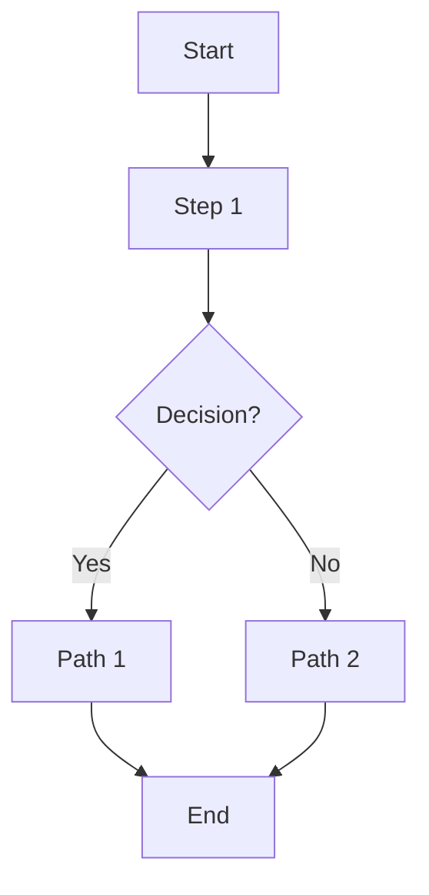

# Workflow Refinement & Maintenance

You are helping maintain and improve the ClickUp Framework development workflows. Use this systematic approach to refine, update, and enhance workflow documentation.

## When to Use This Command

- After completing a project using existing workflows
- When you discover a better approach or pattern
- After encountering issues with current workflows
- When adding new workflow types
- During periodic workflow reviews
- When onboarding needs change

## Phase 1: Identify Improvement Opportunities

### Step 1: Analyze Recent Work
Review what was done recently:
- Which workflows were used?
- What worked well?
- What was confusing or unclear?
- What steps were missed or added?
- What took longer than expected?

### Step 2: Gather Feedback
**From task comments:**
```bash
# Review recent tasks for workflow usage
cum detail <recent-task-id>

# Look for:
# - Steps that were skipped
# - Additional steps added
# - Confusion points
# - Time estimates vs actual
```

**Questions to ask:**
- Were the file locations accurate?
- Were the commands correct?
- Was the checklist complete?
- Did the workflow sequence make sense?
- Were there missing edge cases?

### Step 3: Identify Gaps
Common gaps to check:
- [ ] Missing workflows for common tasks
- [ ] Unclear decision points
- [ ] Outdated file paths or line numbers
- [ ] Missing error handling guidance
- [ ] Incomplete checklists
- [ ] No examples for complex scenarios
- [ ] Missing integration points
- [ ] Role-specific needs not addressed

## Phase 2: Document Proposed Changes

### Step 4: Create Improvement Spec
Document what needs to change:

```markdown
## Workflow: <Name>
**Current Issue:** <What's wrong or missing>
**Proposed Change:** <What should change>
**Rationale:** <Why this improves the workflow>
**Impact:** <Who benefits, what improves>

### Current State
<Copy current workflow section>

### Proposed State
<Show how it should be>

### Examples
<Show before/after examples>
```

### Step 5: Prioritize Changes
Rank improvements by:
1. **Critical**: Blocks work or causes errors
2. **High**: Saves significant time or prevents issues
3. **Medium**: Improves clarity or adds helpful details
4. **Low**: Nice to have, cosmetic improvements

## Phase 3: Implement Changes

### Step 6: Update Slash Commands
**Location:** `.claude/commands/*.md`

For each slash command needing updates:

```bash
# Open the file
vim .claude/commands/investigate-bug.md

# Make changes:
# - Add missing steps
# - Clarify ambiguous instructions
# - Update code examples
# - Enhance checklists
# - Add troubleshooting sections
# - Update file paths
```

**Common updates:**
- Add new phases for discovered steps
- Expand checklists with missed items
- Add code snippets for common operations
- Include troubleshooting for common errors
- Add decision trees for complex choices

### Step 7: Update Local Documentation
**File:** `WORKFLOW_DOCUMENTATION.md`

```bash
# Update sections:
# - Add new workflows
# - Revise existing workflows
# - Update examples
# - Fix broken links
# - Update file locations
# - Enhance diagrams
```

**Sections to maintain:**
- Table of Contents (keep numbered)
- Mermaid diagrams (update with new steps)
- Code examples (verify they work)
- File locations (check accuracy)
- Command references (test commands)

### Step 8: Update ClickUp Doc
**Doc:** Task Management Flows (2kyqhku2-7595)

```bash
# For existing pages:
cum page_update <workspace-id> <doc-id> <page-id> \
  --content "<updated-content>"

# For new pages:
cum page_create <workspace-id> <doc-id> \
  --name "New Workflow: <Name>" \
  --content "<content>"
```

**Organization by role:**
- Developer Workflows page
- Testing Workflows page
- Documentation Workflows page
- DevOps Workflows page
- Project Management Workflows page

## Phase 4: Validate Changes

### Step 9: Test Updated Workflows
Test the updated workflow end-to-end:

```bash
# Simulate using the workflow
# Follow each step exactly as written
# Note any:
# - Unclear instructions
# - Missing information
# - Incorrect commands
# - Broken examples
```

**Validation checklist:**
- [ ] All commands execute successfully
- [ ] File paths are correct
- [ ] Line numbers are accurate
- [ ] Examples work as shown
- [ ] Checklists are complete
- [ ] Decision points are clear
- [ ] Integration points work
- [ ] Mermaid diagrams render correctly

### Step 10: Verify Documentation Consistency
Check consistency across:

```bash
# Local vs ClickUp
diff <(cat WORKFLOW_DOCUMENTATION.md) \
     <(cum doc_export <workspace-id> --doc-id 2kyqhku2-7595)

# Ensure:
# - Same content in both locations
# - Same section numbering
# - Same examples
# - Links work in both
```

## Phase 5: Version & Publish

### Step 11: Update Version History
Add version entry to documentation:

```markdown
## Version History

### Version 2.0 - 2025-11-XX
**Changes:**
- Added `/refine-workflows` command
- Reorganized by role/context
- Updated file paths in 5 workflows
- Added troubleshooting sections
- Enhanced checklists

**Contributors:** <Names>
**Validated:** ✓
```

### Step 12: Commit Changes
```bash
# Stage workflow files
git add .claude/commands/
git add WORKFLOW_DOCUMENTATION.md

# Commit with detailed message
git commit -m "$(cat <<'EOF'
Refine workflows: <brief summary>

## Changes
- Updated workflows: <list>
- New workflows: <list>
- Deprecated workflows: <list>

## Improvements
- <Improvement 1>
- <Improvement 2>
- <Improvement 3>

## Validation
- [ ] All commands tested
- [ ] File paths verified
- [ ] Examples working
- [ ] Documentation synced

## Affected Workflows
- <Workflow 1>: <what changed>
- <Workflow 2>: <what changed>

Version: <X.Y>
EOF
)"

# Push changes
git push -u origin <branch>
```

### Step 13: Announce Updates
Create update announcement:

```bash
cum ca <workflow-task-id> "
## Workflow Updates - Version <X.Y>

### What Changed
- <Major change 1>
- <Major change 2>

### Why
<Rationale for changes>

### Action Required
- [ ] Review updated workflows
- [ ] Test new slash commands
- [ ] Update bookmarks if pages moved
- [ ] Provide feedback

### Resources
- Local: WORKFLOW_DOCUMENTATION.md
- ClickUp: https://app.clickup.com/<workspace>/docs/<doc-id>
- Slash Commands: .claude/commands/

### Migration Guide
<If breaking changes, how to adapt>
"
```

## Phase 6: Continuous Improvement

### Step 14: Establish Review Cycle
Set up periodic review:

**Monthly:**
- Review recent task execution
- Check for repeated issues
- Update file paths if code changed
- Verify all examples still work

**Quarterly:**
- Full workflow audit
- Gather team feedback
- Major version updates
- Add new workflow categories

**As-needed:**
- After major codebase changes
- After team structure changes
- After tool updates
- When pain points emerge

### Step 15: Track Metrics
Monitor workflow effectiveness:

```bash
# Metrics to track:
# - Time to complete tasks (before/after)
# - Number of workflow steps skipped
# - Frequency of workflow usage
# - Error rate in workflow execution
# - Feedback sentiment

# Document in metrics file:
cat >> .claude/workflow-metrics.md <<EOF
## $(date +%Y-%m-%d)
- Workflow used: <name>
- Task: <task-id>
- Time: <duration>
- Issues: <none|list>
- Improvements needed: <notes>
EOF
```

## Workflow Refinement Patterns

### Pattern 1: Adding Missing Steps
When you discover a step was missing:

```markdown
## Before
1. Step A
2. Step C
3. Step D

## After
1. Step A
2. Step B (NEW - discovered during task X)
   - Details about why needed
   - Example of when to use
3. Step C
4. Step D
```

### Pattern 2: Clarifying Ambiguity
When instructions are unclear:

```markdown
## Before (Ambiguous)
"Check the API response"

## After (Clear)
"Check the API response for the following fields:
```python
response = client.get_doc(workspace_id, doc_id)
# Verify these fields exist:
assert 'id' in response
assert 'name' in response
assert 'pages' in response
# Document any missing fields
```"
```

### Pattern 3: Adding Decision Trees
When workflow branches based on conditions:

```markdown
## Decision Point: API Response Structure

### If pages have parent_id field:
1. Build tree structure from flat list
2. Use recursive display
3. Show parent-child relationships

### If pages don't have parent_id field:
1. Research alternative endpoints
2. Check if hierarchy supported
3. Document API limitation
4. Show flat list with warning
```

### Pattern 4: Adding Troubleshooting
When common errors occur:

```markdown
## Troubleshooting

### Error: "Permission denied"
**Cause:** File not readable or API token invalid
**Solution:**
```bash
# Check file permissions
ls -l <file>
# Should show: -rw-r--r--

# Check API token
echo $CLICKUP_API_TOKEN
# Should not be empty
```

### Error: "404 Not Found"
**Cause:** Incorrect endpoint or ID
**Solution:** <specific fix>
```

## New Workflow Creation Template

When creating entirely new workflows:

```markdown
# [Workflow Number]. [Workflow Name]

## Purpose
<1-2 sentences: what this workflow does>

## When to Use
<Specific scenarios when this workflow applies>

## Prerequisites
- <Required tools/access>
- <Required knowledge>
- <Required context>

## Workflow Diagram


## Step-by-Step Process

### Phase 1: <Phase Name>
**Goal:** <What this phase achieves>

#### Step 1: <Step Name>
<Detailed instructions>

```bash
# Example commands
<command>
```

**Expected outcome:** <What should happen>

### Phase 2: <Next Phase>
...

## Checklist
Before completing this workflow:
- [ ] Item 1
- [ ] Item 2

## Deliverables
At completion you should have:
1. Thing 1
2. Thing 2

## Common Issues
### Issue 1
**Symptom:** <What you see>
**Solution:** <How to fix>

## Related Workflows
- <Workflow A>: Use before this
- <Workflow B>: Use after this

## Examples
### Example 1: <Scenario>
<Complete example>

## Metrics
Track these to measure success:
- <Metric 1>
- <Metric 2>
```

## Workflow Organization by Role

### Developer Workflows
- Bug Investigation
- Bug Fix Implementation
- Code Review
- Refactoring

### Testing Workflows
- Manual Testing & Issue Identification
- API Testing & Validation
- Integration Testing
- Performance Testing

### Documentation Workflows
- Spec Documentation Creation
- API Documentation
- User Guide Creation
- Workflow Documentation (this!)

### DevOps Workflows
- Git Development & Commit
- Branch Management
- CI/CD Pipeline
- Deployment

### Project Management Workflows
- Hierarchical Task Creation
- Sprint Planning
- Progress Tracking
- Retrospectives

## Refinement Checklist

Before finalizing workflow updates:

**Content Quality**
- [ ] Instructions are clear and unambiguous
- [ ] Examples are complete and tested
- [ ] Commands are correct and up-to-date
- [ ] File paths are accurate
- [ ] Line numbers are current
- [ ] Checklists are comprehensive

**Structure**
- [ ] Phases are logical
- [ ] Steps are numbered
- [ ] Diagrams are accurate
- [ ] Sections are consistent
- [ ] Table of contents updated

**Usability**
- [ ] Easy to follow without prior knowledge
- [ ] Decision points are clear
- [ ] Error handling is covered
- [ ] Examples cover common cases
- [ ] Integration points documented

**Maintenance**
- [ ] Version number updated
- [ ] Change log updated
- [ ] Both locations synced (local + ClickUp)
- [ ] Git committed and pushed
- [ ] Team notified

## Success Criteria

A well-refined workflow should:
1. ✅ Be completable by someone unfamiliar with the process
2. ✅ Have no missing steps or ambiguous instructions
3. ✅ Include working examples and commands
4. ✅ Cover common error cases
5. ✅ Integrate with other workflows
6. ✅ Have accurate file locations and line numbers
7. ✅ Include comprehensive checklists
8. ✅ Be validated through actual use

## Deliverables

After refining workflows, you should have:

1. ✅ Updated slash command files in `.claude/commands/`
2. ✅ Updated `WORKFLOW_DOCUMENTATION.md` with version bump
3. ✅ Updated ClickUp doc pages (2kyqhku2-7595)
4. ✅ Git commit with detailed change description
5. ✅ Team notification with migration guide (if needed)
6. ✅ Validation that all examples work
7. ✅ Metrics baseline for measuring improvement

Now proceed with workflow refinement!
