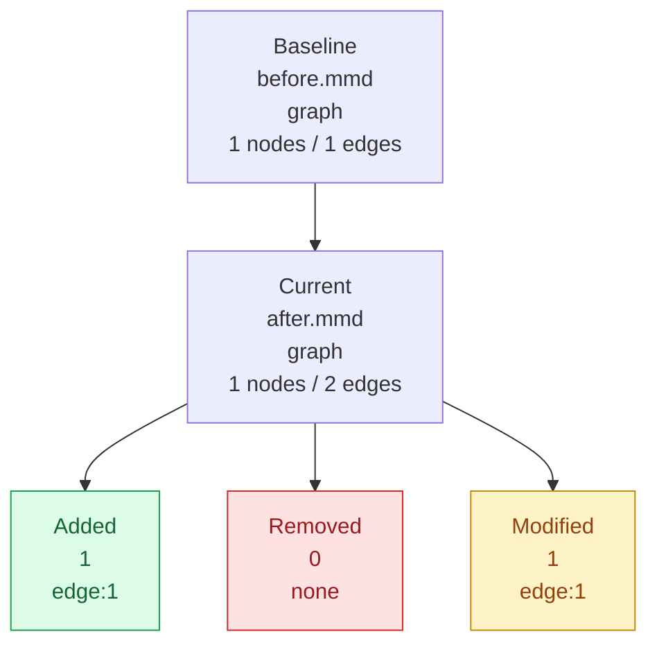

# Diagram Diff Visual Summary

This report renders a Mermaid summary diagram with color-coded change buckets.



## Added Elements

- **Kinds:** edge:1
- `L3` [edge] `B --> C[Added]`

## Modified Elements

- **Kinds:** edge:1
- `L2` `A[Start] --> B[Old]`
  - becomes `L2` `A[Start] --> B[New]`

## Unified Diff

```diff
--- before.mmd
+++ after.mmd
@@ -1,2 +1,3 @@
 graph TD

-    A[Start] --> B[Old]

+    A[Start] --> B[New]

+    B --> C[Added]
```
