# Code Execution Analysis

## Summary Statistics

- **Total Functions Discovered:** 1997
- **Functions Executed:** 141 (7.1%)
- **Dead Code Detected:** 1856 (92.9%)
- **Total Function Calls:** 1,227
- **Unique Call Paths:** 150

## Module Dependencies (High-Level View)

```mermaid
graph LR
    classDef hot fill:#ff6b6b,stroke:#c92a2a,stroke-width:3px,color:#fff;
    classDef warm fill:#ffd43b,stroke:#f59f00,stroke-width:2px;
    classDef cold fill:#339af0,stroke:#1971c2;

    clickup_framework___init__["clickup_framework.__init__"]
    clickup_framework__version["clickup_framework._version"]
    clickup_framework_apis___init__["clickup_framework.apis.__init__"]
    clickup_framework_apis_attachments["clickup_framework.apis.attachments"]
    clickup_framework_apis_auth["clickup_framework.apis.auth"]
    clickup_framework_apis_base["clickup_framework.apis.base"]
    clickup_framework_apis_checklists["clickup_framework.apis.checklists"]
    clickup_framework_apis_comments["clickup_framework.apis.comments"]
    clickup_framework_apis_custom_fields["clickup_framework.apis.custom_fields"]
    clickup_framework_apis_docs["clickup_framework.apis.docs"]
    clickup_framework_apis_folders["clickup_framework.apis.folders"]
    clickup_framework_apis_goals["clickup_framework.apis.goals"]
    clickup_framework_apis_groups["clickup_framework.apis.groups"]
    clickup_framework_apis_guests["clickup_framework.apis.guests"]
    clickup_framework_apis_lists["clickup_framework.apis.lists"]
    clickup_framework_apis_members["clickup_framework.apis.members"]
    clickup_framework_apis_roles["clickup_framework.apis.roles"]
    clickup_framework_apis_search["clickup_framework.apis.search"]
    clickup_framework_apis_spaces["clickup_framework.apis.spaces"]
    clickup_framework_apis_tags["clickup_framework.apis.tags"]
    clickup_framework_apis_tasks["clickup_framework.apis.tasks"]
    clickup_framework_apis_templates["clickup_framework.apis.templates"]
    clickup_framework_apis_time_tracking["clickup_framework.apis.time_tracking"]
    clickup_framework_apis_time_tracking_legacy["clickup_framework.apis.time_tracking_legacy"]
    clickup_framework_apis_users["clickup_framework.apis.users"]
    clickup_framework_apis_views["clickup_framework.apis.views"]
    clickup_framework_apis_webhooks["clickup_framework.apis.webhooks"]
    clickup_framework_apis_workspaces["clickup_framework.apis.workspaces"]
    clickup_framework_cli_error_handler["clickup_framework.cli_error_handler"]
    clickup_framework_client["clickup_framework.client"]
    clickup_framework_commands___init__["clickup_framework.commands.__init__"]
    clickup_framework_commands_base_command["clickup_framework.commands.base_command"]
    clickup_framework_commands_map_command["clickup_framework.commands.map_command"]
    clickup_framework_commands_map_helpers___init__["clickup_framework.commands.map_helpers.__init__"]
    clickup_framework_commands_map_helpers_ctags_utils["clickup_framework.commands.map_helpers.ctags_utils"]
    clickup_framework_commands_map_helpers_mermaid_export["clickup_framework.commands.map_helpers.mermaid_export"]
    clickup_framework_commands_map_helpers_mermaid_generators["clickup_framework.commands.map_helpers.mermaid_generators"]
    clickup_framework_commands_map_helpers_templates___init__["clickup_framework.commands.map_helpers.templates.__init__"]
    clickup_framework_commands_map_helpers_templates_html_template["clickup_framework.commands.map_helpers.templates.html_template"]
    clickup_framework_commands_map_helpers_templates_shader_loader["clickup_framework.commands.map_helpers.templates.shader_loader"]
    clickup_framework_commands_utils["clickup_framework.commands.utils"]
    clickup_framework_components___init__["clickup_framework.components.__init__"]
    clickup_framework_components_container["clickup_framework.components.container"]
    clickup_framework_components_dependency_analyzer["clickup_framework.components.dependency_analyzer"]
    clickup_framework_components_detail_view["clickup_framework.components.detail_view"]
    clickup_framework_components_display["clickup_framework.components.display"]
    clickup_framework_components_doc_formatter["clickup_framework.components.doc_formatter"]
    clickup_framework_components_doc_hierarchy["clickup_framework.components.doc_hierarchy"]
    clickup_framework_components_filters["clickup_framework.components.filters"]
    clickup_framework_components_hierarchy["clickup_framework.components.hierarchy"]
    clickup_framework_components_options["clickup_framework.components.options"]
    clickup_framework_components_task_formatter["clickup_framework.components.task_formatter"]
    clickup_framework_components_tree["clickup_framework.components.tree"]
    clickup_framework_context["clickup_framework.context"]
    clickup_framework_exceptions["clickup_framework.exceptions"]
    clickup_framework_rate_limiter["clickup_framework.rate_limiter"]
    clickup_framework_utils___init__["clickup_framework.utils.__init__"]
    clickup_framework_utils_animations["clickup_framework.utils.animations"]
    clickup_framework_utils_checklist_mapping["clickup_framework.utils.checklist_mapping"]
    clickup_framework_utils_colors["clickup_framework.utils.colors"]
    clickup_framework_utils_datetime["clickup_framework.utils.datetime"]
    clickup_framework_utils_error_formatter["clickup_framework.utils.error_formatter"]
    clickup_framework_utils_image_export["clickup_framework.utils.image_export"]
    clickup_framework_utils_markdown_renderer["clickup_framework.utils.markdown_renderer"]
    clickup_framework_utils_text["clickup_framework.utils.text"]
    clickup_framework_utils_workspace_tree["clickup_framework.utils.workspace_tree"]
    execution_graph_generator["execution_graph_generator"]
    test_trace_map["test_trace_map"]

    clickup_framework_commands_map_helpers_ctags_utils -.->|3| clickup_framework_utils_colors
    clickup_framework_utils_colors -.->|2| clickup_framework_commands_map_helpers_ctags_utils
    test_trace_map -.->|1| clickup_framework___init__
    clickup_framework___init__ -.->|1| clickup_framework__version
    clickup_framework__version -.->|1| clickup_framework_client
    clickup_framework_client -.->|1| clickup_framework_exceptions
    clickup_framework_exceptions -.->|1| clickup_framework_rate_limiter
    clickup_framework_rate_limiter -.->|1| clickup_framework_context
    clickup_framework_context -.->|1| clickup_framework_apis___init__
    clickup_framework_apis___init__ -.->|1| clickup_framework_apis_base
    clickup_framework_apis_base -.->|1| clickup_framework_apis_tasks
    clickup_framework_apis_tasks -.->|1| clickup_framework_apis_lists
    clickup_framework_apis_lists -.->|1| clickup_framework_apis_folders
    clickup_framework_apis_folders -.->|1| clickup_framework_apis_spaces
    clickup_framework_apis_spaces -.->|1| clickup_framework_apis_workspaces
    clickup_framework_apis_workspaces -.->|1| clickup_framework_apis_goals
    clickup_framework_apis_goals -.->|1| clickup_framework_apis_guests
    clickup_framework_apis_guests -.->|1| clickup_framework_apis_tags
    clickup_framework_apis_tags -.->|1| clickup_framework_apis_time_tracking
    clickup_framework_apis_time_tracking -.->|1| clickup_framework_apis_time_tracking_legacy
    clickup_framework_apis_time_tracking_legacy -.->|1| clickup_framework_apis_members
    clickup_framework_apis_members -.->|1| clickup_framework_apis_roles
    clickup_framework_apis_roles -.->|1| clickup_framework_apis_templates
    clickup_framework_apis_templates -.->|1| clickup_framework_apis_checklists
    clickup_framework_apis_checklists -.->|1| clickup_framework_apis_comments
    clickup_framework_apis_comments -.->|1| clickup_framework_apis_custom_fields
    clickup_framework_apis_custom_fields -.->|1| clickup_framework_apis_views
    clickup_framework_apis_views -.->|1| clickup_framework_apis_webhooks
    clickup_framework_apis_webhooks -.->|1| clickup_framework_apis_docs
    clickup_framework_apis_docs -.->|1| clickup_framework_apis_attachments
    clickup_framework_apis_attachments -.->|1| clickup_framework_apis_auth
    clickup_framework_apis_auth -.->|1| clickup_framework_apis_users
    clickup_framework_apis_users -.->|1| clickup_framework_apis_groups
    clickup_framework_apis_groups -.->|1| clickup_framework_apis_search
    clickup_framework_apis_search -.->|1| clickup_framework_client
    clickup_framework_client -.->|1| clickup_framework_commands___init__
    clickup_framework_commands___init__ -.->|1| clickup_framework_commands_utils
    clickup_framework_commands_utils -.->|1| clickup_framework_components___init__
    clickup_framework_components___init__ -.->|1| clickup_framework_components_options
    clickup_framework_components_options -.->|1| clickup_framework_components_tree
    clickup_framework_components_tree -.->|1| clickup_framework_components_hierarchy
    clickup_framework_components_hierarchy -.->|1| clickup_framework_components_task_formatter
    clickup_framework_components_task_formatter -.->|1| clickup_framework_utils___init__
    clickup_framework_utils___init__ -.->|1| clickup_framework_utils_datetime
    clickup_framework_utils_datetime -.->|1| clickup_framework_utils_text
    clickup_framework_utils_text -.->|1| clickup_framework_utils_error_formatter
    clickup_framework_utils_error_formatter -.->|1| clickup_framework_utils_image_export
    clickup_framework_utils_image_export -.->|1| clickup_framework_utils_colors
    clickup_framework_utils_colors -.->|1| clickup_framework_components_task_formatter
    clickup_framework_components_task_formatter -.->|1| clickup_framework_components_hierarchy
    clickup_framework_components_hierarchy -.->|1| clickup_framework_components_container
    clickup_framework_components_container -.->|1| clickup_framework_components_filters
    clickup_framework_components_filters -.->|1| clickup_framework_components_doc_formatter
    clickup_framework_components_doc_formatter -.->|1| clickup_framework_components_doc_hierarchy
    clickup_framework_components_doc_hierarchy -.->|1| clickup_framework_components_detail_view
    clickup_framework_components_detail_view -.->|1| clickup_framework_utils_markdown_renderer
    clickup_framework_utils_markdown_renderer -.->|1| clickup_framework_utils_checklist_mapping
    clickup_framework_utils_checklist_mapping -.->|1| clickup_framework_components_dependency_analyzer
    clickup_framework_components_dependency_analyzer -.->|1| clickup_framework_components_detail_view
    clickup_framework_components_detail_view -.->|1| clickup_framework_components_display
    clickup_framework_components_display -.->|1| clickup_framework_commands_base_command
    clickup_framework_commands_base_command -.->|1| clickup_framework_utils_animations
    clickup_framework_utils_animations -.->|1| clickup_framework_cli_error_handler
    clickup_framework_cli_error_handler -.->|1| clickup_framework_utils_workspace_tree
    clickup_framework_utils_workspace_tree -.->|1| clickup_framework_commands_base_command
    clickup_framework_commands_base_command -.->|1| clickup_framework_commands_map_command
    clickup_framework_commands_map_command -.->|1| clickup_framework_commands_map_helpers___init__
    clickup_framework_commands_map_helpers___init__ -.->|1| clickup_framework_commands_map_helpers_ctags_utils
    clickup_framework_commands_map_helpers_ctags_utils -.->|1| clickup_framework_commands_map_helpers_mermaid_generators
    clickup_framework_commands_map_helpers_mermaid_generators -.->|1| clickup_framework_commands_map_helpers_mermaid_export
    clickup_framework_commands_map_helpers_mermaid_export -.->|1| clickup_framework_commands_map_helpers_templates___init__
    clickup_framework_commands_map_helpers_templates___init__ -.->|1| clickup_framework_commands_map_helpers_templates_html_template
    clickup_framework_commands_map_helpers_templates_html_template -.->|1| clickup_framework_commands_map_helpers_templates_shader_loader
    clickup_framework_commands_map_helpers_templates_shader_loader -.->|1| clickup_framework_commands_map_command
    clickup_framework_commands_map_command -.->|1| clickup_framework_context
    clickup_framework_context -.->|1| clickup_framework_commands_map_helpers_ctags_utils
    clickup_framework_utils_colors -.->|1| clickup_framework_commands_map_helpers_mermaid_generators
    clickup_framework_commands_map_helpers_mermaid_generators -.->|1| clickup_framework_utils_colors
    clickup_framework_utils_colors -.->|1| execution_graph_generator
```



<details>
<summary>🔻 <b>Click to see Detailed Function Execution Trace (Hot Paths)</b></summary>

### Function-Level Execution Graph

**Legend:**
- 🔴 Red edges: Hot paths (>100 calls)
- 🟠 Orange edges: Warm paths (>10 calls)
- ⚪ Dotted edges: Cold paths (<10 calls)
- 🟢 Green nodes: Executed functions
- ⚫ Gray dashed nodes: Dead code (never executed)

```mermaid
graph LR
    classDef executed fill:#51cf66,stroke:#2f9e44,stroke-width:2px,color:#000;
    classDef dead fill:#495057,stroke:#adb5bd,stroke-width:1px,color:#adb5bd,stroke-dasharray: 5 5;
    classDef entry fill:#ff6b6b,stroke:#c92a2a,stroke-width:3px,color:#fff;

    subgraph "clickup_framework.apis.base"
        clickup_framework_apis_base___init__["__init__"]:::dead
        clickup_framework_apis_base__request["_request"]:::dead
    end

    subgraph "clickup_framework.apis.lists"
        clickup_framework_apis_lists_add_task_to_list["add_task_to_list"]:::dead
        clickup_framework_apis_lists_create_list["create_list"]:::dead
        clickup_framework_apis_lists_create_list_from_template_in_folder["create_list_from_template_in_folder"]:::dead
        clickup_framework_apis_lists_create_list_from_template_in_space["create_list_from_template_in_space"]:::dead
        clickup_framework_apis_lists_create_space_list["create_space_list"]:::dead
        clickup_framework_apis_lists_delete_list["delete_list"]:::dead
        clickup_framework_apis_lists_get_folder_lists["get_folder_lists"]:::dead
        clickup_framework_apis_lists_get_list["get_list"]:::dead
        clickup_framework_apis_lists_get_space_lists["get_space_lists"]:::dead
        clickup_framework_apis_lists_remove_task_from_list["remove_task_from_list"]:::dead
        clickup_framework_apis_lists_update_list["update_list"]:::dead
    end

    subgraph "clickup_framework.apis.tasks"
        clickup_framework_apis_tasks_add_task_dependency["add_task_dependency"]:::dead
        clickup_framework_apis_tasks_add_task_link["add_task_link"]:::dead
        clickup_framework_apis_tasks_create_task["create_task"]:::dead
        clickup_framework_apis_tasks_create_task_from_template["create_task_from_template"]:::dead
        clickup_framework_apis_tasks_delete_task["delete_task"]:::dead
        clickup_framework_apis_tasks_delete_task_dependency["delete_task_dependency"]:::dead
        clickup_framework_apis_tasks_delete_task_link["delete_task_link"]:::dead
        clickup_framework_apis_tasks_get_bulk_tasks_time_in_status["get_bulk_tasks_time_in_status"]:::dead
        clickup_framework_apis_tasks_get_list_tasks["get_list_tasks"]:::dead
        clickup_framework_apis_tasks_get_task["get_task"]:::dead
        clickup_framework_apis_tasks_get_task_time_in_status["get_task_time_in_status"]:::dead
        clickup_framework_apis_tasks_get_team_tasks["get_team_tasks"]:::dead
        clickup_framework_apis_tasks_merge_tasks["merge_tasks"]:::dead
        clickup_framework_apis_tasks_update_task["update_task"]:::dead
    end

    subgraph "clickup_framework.client"
        clickup_framework_client___enter__["__enter__"]:::dead
        clickup_framework_client___exit__["__exit__"]:::dead
        clickup_framework_client___init__["__init__"]:::dead
        clickup_framework_client___repr__["__repr__"]:::dead
        clickup_framework_client__request["_request"]:::dead
        clickup_framework_client__switch_to_fallback_token["_switch_to_fallback_token"]:::dead
        clickup_framework_client_add_guest_to_folder["add_guest_to_folder"]:::dead
        clickup_framework_client_add_guest_to_list["add_guest_to_list"]:::dead
        clickup_framework_client_add_guest_to_task["add_guest_to_task"]:::dead
        clickup_framework_client_add_task_dependency["add_task_dependency"]:::dead
        clickup_framework_client_add_task_link["add_task_link"]:::dead
        clickup_framework_client_add_task_tag["add_task_tag"]:::dead
        clickup_framework_client_add_task_to_list["add_task_to_list"]:::dead
        clickup_framework_client_add_time_entry_tags["add_time_entry_tags"]:::dead
        clickup_framework_client_create_checklist["create_checklist"]:::dead
        clickup_framework_client_create_checklist_item["create_checklist_item"]:::dead
        clickup_framework_client_create_doc["create_doc"]:::dead
        clickup_framework_client_create_folder["create_folder"]:::dead
        clickup_framework_client_create_folder_from_template["create_folder_from_template"]:::dead
        clickup_framework_client_create_folder_view["create_folder_view"]:::dead
        clickup_framework_client_create_goal["create_goal"]:::dead
        clickup_framework_client_create_key_result["create_key_result"]:::dead
        clickup_framework_client_create_list["create_list"]:::dead
        clickup_framework_client_create_list_comment["create_list_comment"]:::dead
        clickup_framework_client_create_list_from_template_in_folder["create_list_from_template_in_folder"]:::dead
        clickup_framework_client_create_list_from_template_in_space["create_list_from_template_in_space"]:::dead
        clickup_framework_client_create_list_view["create_list_view"]:::dead
        clickup_framework_client_create_page["create_page"]:::dead
        clickup_framework_client_create_space["create_space"]:::dead
        clickup_framework_client_create_space_list["create_space_list"]:::dead
        clickup_framework_client_create_space_tag["create_space_tag"]:::dead
        clickup_framework_client_create_space_view["create_space_view"]:::dead
        clickup_framework_client_create_task["create_task"]:::dead
        clickup_framework_client_create_task_attachment["create_task_attachment"]:::dead
        clickup_framework_client_create_task_comment["create_task_comment"]:::dead
        clickup_framework_client_create_task_from_template["create_task_from_template"]:::dead
        clickup_framework_client_create_threaded_comment["create_threaded_comment"]:::dead
        clickup_framework_client_create_time_entry["create_time_entry"]:::dead
        clickup_framework_client_create_user_group["create_user_group"]:::dead
        clickup_framework_client_create_view_comment["create_view_comment"]:::dead
        clickup_framework_client_create_webhook["create_webhook"]:::dead
        clickup_framework_client_create_workspace_view["create_workspace_view"]:::dead
        clickup_framework_client_delete_checklist["delete_checklist"]:::dead
        clickup_framework_client_delete_checklist_item["delete_checklist_item"]:::dead
        clickup_framework_client_delete_comment["delete_comment"]:::dead
        clickup_framework_client_delete_folder["delete_folder"]:::dead
        clickup_framework_client_delete_goal["delete_goal"]:::dead
        clickup_framework_client_delete_key_result["delete_key_result"]:::dead
        clickup_framework_client_delete_list["delete_list"]:::dead
        clickup_framework_client_delete_space["delete_space"]:::dead
        clickup_framework_client_delete_space_tag["delete_space_tag"]:::dead
        clickup_framework_client_delete_task["delete_task"]:::dead
        clickup_framework_client_delete_task_dependency["delete_task_dependency"]:::dead
        clickup_framework_client_delete_task_link["delete_task_link"]:::dead
        clickup_framework_client_delete_task_time_entry["delete_task_time_entry"]:::dead
        clickup_framework_client_delete_time_entry["delete_time_entry"]:::dead
        clickup_framework_client_delete_time_entry_tags["delete_time_entry_tags"]:::dead
        clickup_framework_client_delete_user_group["delete_user_group"]:::dead
        clickup_framework_client_delete_view["delete_view"]:::dead
        clickup_framework_client_delete_webhook["delete_webhook"]:::dead
        clickup_framework_client_edit_user_on_workspace["edit_user_on_workspace"]:::dead
        clickup_framework_client_get_access_token["get_access_token"]:::dead
        clickup_framework_client_get_accessible_custom_fields["get_accessible_custom_fields"]:::dead
        clickup_framework_client_get_authorized_user["get_authorized_user"]:::dead
        clickup_framework_client_get_authorized_workspaces["get_authorized_workspaces"]:::dead
        clickup_framework_client_get_bulk_tasks_time_in_status["get_bulk_tasks_time_in_status"]:::dead
        clickup_framework_client_get_current_time_entry["get_current_time_entry"]:::dead
        clickup_framework_client_get_custom_roles["get_custom_roles"]:::dead
        clickup_framework_client_get_custom_task_types["get_custom_task_types"]:::dead
        clickup_framework_client_get_doc["get_doc"]:::dead
        clickup_framework_client_get_doc_pages["get_doc_pages"]:::dead
        clickup_framework_client_get_folder["get_folder"]:::dead
        clickup_framework_client_get_folder_custom_fields["get_folder_custom_fields"]:::dead
        clickup_framework_client_get_folder_lists["get_folder_lists"]:::dead
        clickup_framework_client_get_folder_views["get_folder_views"]:::dead
        clickup_framework_client_get_goal["get_goal"]:::dead
        clickup_framework_client_get_goals["get_goals"]:::dead
        clickup_framework_client_get_guest["get_guest"]:::dead
        clickup_framework_client_get_list["get_list"]:::dead
        clickup_framework_client_get_list_comments["get_list_comments"]:::dead
        clickup_framework_client_get_list_members["get_list_members"]:::dead
        clickup_framework_client_get_list_tasks["get_list_tasks"]:::dead
        clickup_framework_client_get_list_views["get_list_views"]:::dead
        clickup_framework_client_get_page["get_page"]:::dead
        clickup_framework_client_get_shared_hierarchy["get_shared_hierarchy"]:::dead
        clickup_framework_client_get_space["get_space"]:::dead
        clickup_framework_client_get_space_custom_fields["get_space_custom_fields"]:::dead
        clickup_framework_client_get_space_folders["get_space_folders"]:::dead
        clickup_framework_client_get_space_lists["get_space_lists"]:::dead
        clickup_framework_client_get_space_tags["get_space_tags"]:::dead
        clickup_framework_client_get_space_views["get_space_views"]:::dead
        clickup_framework_client_get_task["get_task"]:::dead
        clickup_framework_client_get_task_comments["get_task_comments"]:::dead
        clickup_framework_client_get_task_members["get_task_members"]:::dead
        clickup_framework_client_get_task_templates["get_task_templates"]:::dead
        clickup_framework_client_get_task_time["get_task_time"]:::dead
        clickup_framework_client_get_task_time_in_status["get_task_time_in_status"]:::dead
        clickup_framework_client_get_team_spaces["get_team_spaces"]:::dead
        clickup_framework_client_get_team_tasks["get_team_tasks"]:::dead
        clickup_framework_client_get_threaded_comments["get_threaded_comments"]:::dead
        clickup_framework_client_get_time_entries["get_time_entries"]:::dead
        clickup_framework_client_get_time_entry["get_time_entry"]:::dead
        clickup_framework_client_get_time_entry_history["get_time_entry_history"]:::dead
        clickup_framework_client_get_time_entry_tags["get_time_entry_tags"]:::dead
        clickup_framework_client_get_token_source["get_token_source"]:::dead
        clickup_framework_client_get_user["get_user"]:::dead
        clickup_framework_client_get_user_groups["get_user_groups"]:::dead
        clickup_framework_client_get_view["get_view"]:::dead
        clickup_framework_client_get_view_comments["get_view_comments"]:::dead
        clickup_framework_client_get_view_tasks["get_view_tasks"]:::dead
        clickup_framework_client_get_webhooks["get_webhooks"]:::dead
        clickup_framework_client_get_workspace_custom_fields["get_workspace_custom_fields"]:::dead
        clickup_framework_client_get_workspace_docs["get_workspace_docs"]:::dead
        clickup_framework_client_get_workspace_hierarchy["get_workspace_hierarchy"]:::dead
        clickup_framework_client_get_workspace_plan["get_workspace_plan"]:::dead
        clickup_framework_client_get_workspace_seats["get_workspace_seats"]:::dead
        clickup_framework_client_get_workspace_views["get_workspace_views"]:::dead
        clickup_framework_client_invite_guest_to_workspace["invite_guest_to_workspace"]:::dead
        clickup_framework_client_invite_user_to_workspace["invite_user_to_workspace"]:::dead
        clickup_framework_client_merge_tasks["merge_tasks"]:::dead
        clickup_framework_client_remove_custom_field_value["remove_custom_field_value"]:::dead
        clickup_framework_client_remove_guest_from_folder["remove_guest_from_folder"]:::dead
        clickup_framework_client_remove_guest_from_list["remove_guest_from_list"]:::dead
        clickup_framework_client_remove_guest_from_task["remove_guest_from_task"]:::dead
        clickup_framework_client_remove_guest_from_workspace["remove_guest_from_workspace"]:::dead
        clickup_framework_client_remove_task_from_list["remove_task_from_list"]:::dead
        clickup_framework_client_remove_task_tag["remove_task_tag"]:::dead
        clickup_framework_client_remove_user_from_workspace["remove_user_from_workspace"]:::dead
        clickup_framework_client_search["search"]:::dead
        clickup_framework_client_set_custom_field["set_custom_field"]:::dead
        clickup_framework_client_set_custom_field_value["set_custom_field_value"]:::dead
        clickup_framework_client_start_time_entry["start_time_entry"]:::dead
        clickup_framework_client_stop_time_entry["stop_time_entry"]:::dead
        clickup_framework_client_track_task_time["track_task_time"]:::dead
        clickup_framework_client_update_checklist["update_checklist"]:::dead
        clickup_framework_client_update_checklist_item["update_checklist_item"]:::dead
        clickup_framework_client_update_comment["update_comment"]:::dead
        clickup_framework_client_update_folder["update_folder"]:::dead
        clickup_framework_client_update_goal["update_goal"]:::dead
        clickup_framework_client_update_guest["update_guest"]:::dead
        clickup_framework_client_update_key_result["update_key_result"]:::dead
        clickup_framework_client_update_list["update_list"]:::dead
        clickup_framework_client_update_page["update_page"]:::dead
        clickup_framework_client_update_space["update_space"]:::dead
        clickup_framework_client_update_space_tag["update_space_tag"]:::dead
        clickup_framework_client_update_task["update_task"]:::dead
        clickup_framework_client_update_task_time_entry["update_task_time_entry"]:::dead
        clickup_framework_client_update_time_entry["update_time_entry"]:::dead
        clickup_framework_client_update_time_entry_tags["update_time_entry_tags"]:::dead
        clickup_framework_client_update_user_group["update_user_group"]:::dead
        clickup_framework_client_update_view["update_view"]:::dead
        clickup_framework_client_update_webhook["update_webhook"]:::dead
    end

    subgraph "clickup_framework.commands.map_helpers.ctags_utils"
        clickup_framework_commands_map_helpers_ctags_utils_check_ctags_available["check_ctags_available"]:::dead
        clickup_framework_commands_map_helpers_ctags_utils_generate_ctags["generate_ctags"]:::executed
        clickup_framework_commands_map_helpers_ctags_utils_get_ctags_executable["get_ctags_executable"]:::executed
        clickup_framework_commands_map_helpers_ctags_utils_install_ctags_locally["install_ctags_locally"]:::dead
        clickup_framework_commands_map_helpers_ctags_utils_parse_tags_file["parse_tags_file"]:::executed
        clickup_framework_commands_map_helpers_ctags_utils_reporthook["reporthook"]:::dead
    end

    subgraph "clickup_framework.commands.map_helpers.mermaid_generators"
        clickup_framework_commands_map_helpers_mermaid_generators_collect_functions["collect_functions"]:::executed
        clickup_framework_commands_map_helpers_mermaid_generators_generate_mermaid_class["generate_mermaid_class"]:::dead
        clickup_framework_commands_map_helpers_mermaid_generators_generate_mermaid_code_flow["generate_mermaid_code_flow"]:::executed
        clickup_framework_commands_map_helpers_mermaid_generators_generate_mermaid_flowchart["generate_mermaid_flowchart"]:::dead
        clickup_framework_commands_map_helpers_mermaid_generators_generate_mermaid_mindmap["generate_mermaid_mindmap"]:::dead
        clickup_framework_commands_map_helpers_mermaid_generators_generate_mermaid_pie["generate_mermaid_pie"]:::dead
        clickup_framework_commands_map_helpers_mermaid_generators_generate_mermaid_sequence["generate_mermaid_sequence"]:::dead
        clickup_framework_commands_map_helpers_mermaid_generators_group_by_file_components["group_by_file_components"]:::executed
        clickup_framework_commands_map_helpers_mermaid_generators_trace_calls["trace_calls"]:::dead
    end

    subgraph "clickup_framework.context"
        clickup_framework_context___init__["__init__"]:::executed
        clickup_framework_context__load["_load"]:::executed
        clickup_framework_context__save["_save"]:::dead
        clickup_framework_context_cache_list_metadata["cache_list_metadata"]:::dead
        clickup_framework_context_clear_all["clear_all"]:::dead
        clickup_framework_context_clear_api_token["clear_api_token"]:::dead
    end

    clickup_framework_commands_map_helpers_mermaid_generators_<genexpr> ==>|573| clickup_framework_commands_map_helpers_mermaid_generators_<genexpr>
    clickup_framework_commands_map_helpers_ctags_utils_<listcomp> ==>|417| clickup_framework_commands_map_helpers_ctags_utils_<listcomp>
    clickup_framework_commands_map_helpers_mermaid_generators_collect_functions -->|45| clickup_framework_commands_map_helpers_mermaid_generators_collect_functions
    clickup_framework_commands_map_helpers_mermaid_generators_<lambda> -->|21| clickup_framework_commands_map_helpers_mermaid_generators_<lambda>
    clickup_framework_utils_colors_colorize -->|12| clickup_framework_utils_colors_colorize
    clickup_framework_commands_map_helpers_mermaid_generators_collect_functions -.->|8| clickup_framework_commands_map_helpers_mermaid_generators_<lambda>
    clickup_framework_commands_map_helpers_mermaid_generators_<lambda> -.->|8| clickup_framework_commands_map_helpers_mermaid_generators_collect_functions
    clickup_framework_client_<module> -.->|1| clickup_framework_exceptions_<module>
    clickup_framework_exceptions_<module> -.->|1| clickup_framework_exceptions_ClickUpError
    clickup_framework_exceptions_ClickUpError -.->|1| clickup_framework_exceptions_ClickUpAPIError
    clickup_framework_exceptions_ClickUpAPIError -.->|1| clickup_framework_exceptions_ClickUpAuthError
    clickup_framework_exceptions_ClickUpAuthError -.->|1| clickup_framework_exceptions_ClickUpRateLimitError
    clickup_framework_exceptions_ClickUpRateLimitError -.->|1| clickup_framework_exceptions_ClickUpNotFoundError
    clickup_framework_exceptions_ClickUpNotFoundError -.->|1| clickup_framework_exceptions_ClickUpValidationError
    clickup_framework_exceptions_ClickUpValidationError -.->|1| clickup_framework_exceptions_ClickUpTimeoutError
    clickup_framework_exceptions_ClickUpTimeoutError -.->|1| clickup_framework_rate_limiter_<module>
    clickup_framework_rate_limiter_<module> -.->|1| clickup_framework_rate_limiter_RateLimiter
    clickup_framework_rate_limiter_RateLimiter -.->|1| clickup_framework_context_<module>
    clickup_framework_context_<module> -.->|1| clickup_framework_context_ContextManager
    clickup_framework_apis_base_<module> -.->|1| clickup_framework_apis_base_BaseAPI
    clickup_framework_apis_base_BaseAPI -.->|1| clickup_framework_apis_tasks_<module>
    clickup_framework_apis_tasks_<module> -.->|1| clickup_framework_apis_tasks_TasksAPI
    clickup_framework_apis_tasks_TasksAPI -.->|1| clickup_framework_apis_lists_<module>
    clickup_framework_apis_lists_<module> -.->|1| clickup_framework_apis_lists_ListsAPI
    clickup_framework_utils_colors_<module> -.->|1| clickup_framework_utils_colors__enable_vt100_mode
    clickup_framework_utils_colors__enable_vt100_mode -.->|1| clickup_framework_utils_colors_TextColor
    clickup_framework_utils_colors_TextColor -.->|1| clickup_framework_utils_colors_TextStyle
    clickup_framework_commands_map_helpers_ctags_utils_<module> -.->|1| clickup_framework_commands_map_helpers_mermaid_generators_<module>
    clickup_framework_context_get_context_manager -.->|1| clickup_framework_context___init__
    clickup_framework_context___init__ -.->|1| clickup_framework_context__load
    clickup_framework_context__load -.->|1| clickup_framework_context_get_ansi_output
    clickup_framework_context_get_ansi_output -.->|1| clickup_framework_commands_map_helpers_ctags_utils_get_ctags_executable
    clickup_framework_commands_map_helpers_ctags_utils_get_ctags_executable -.->|1| clickup_framework_utils_colors_colorize
    clickup_framework_utils_colors_colorize -.->|1| clickup_framework_commands_map_helpers_ctags_utils_generate_ctags
    clickup_framework_commands_map_helpers_ctags_utils_generate_ctags -.->|1| clickup_framework_utils_colors_colorize
    clickup_framework_utils_colors_colorize -.->|1| clickup_framework_commands_map_helpers_ctags_utils_parse_tags_file
    clickup_framework_commands_map_helpers_ctags_utils_parse_tags_file -.->|1| clickup_framework_commands_map_helpers_ctags_utils_<lambda>
    clickup_framework_commands_map_helpers_ctags_utils_<lambda> -.->|1| clickup_framework_commands_map_helpers_ctags_utils_<listcomp>
    clickup_framework_commands_map_helpers_ctags_utils_<listcomp> -.->|1| clickup_framework_commands_map_helpers_ctags_utils_<dictcomp>
    clickup_framework_commands_map_helpers_ctags_utils_<dictcomp> -.->|1| clickup_framework_utils_colors_colorize
    clickup_framework_utils_colors_colorize -.->|1| clickup_framework_commands_map_helpers_mermaid_generators_generate_mermaid_code_flow
    clickup_framework_commands_map_helpers_mermaid_generators_generate_mermaid_code_flow -.->|1| clickup_framework_commands_map_helpers_mermaid_generators_<listcomp>
    clickup_framework_commands_map_helpers_mermaid_generators_<listcomp> -.->|1| clickup_framework_commands_map_helpers_mermaid_generators_collect_functions
    clickup_framework_commands_map_helpers_mermaid_generators_collect_functions -.->|1| clickup_framework_commands_map_helpers_mermaid_generators_group_by_file_components
    clickup_framework_commands_map_helpers_mermaid_generators_group_by_file_components -.->|1| clickup_framework_commands_map_helpers_mermaid_generators_<lambda>
    clickup_framework_commands_map_helpers_mermaid_generators_<lambda> -.->|1| clickup_framework_commands_map_helpers_mermaid_generators_<genexpr>
    clickup_framework_commands_map_helpers_mermaid_generators_<genexpr> -.->|1| clickup_framework_utils_colors_colorize

    linkStyle 0 stroke:#ff0000,stroke-width:4px,color:#ff0000;
    linkStyle 1 stroke:#ff0000,stroke-width:4px,color:#ff0000;
    linkStyle 2 stroke:#ff6b00,stroke-width:3px,color:#ff6b00;
    linkStyle 3 stroke:#ff6b00,stroke-width:3px,color:#ff6b00;
    linkStyle 4 stroke:#ff6b00,stroke-width:3px,color:#ff6b00;
```

</details>

<details>
<summary>💀 <b>Dead Code Report</b></summary>

### Potentially Unused Functions

#### `auto_migrate`
- `__init__()`
- `_generate_class_name()`
- `convert_body()`
- `extract_command_function()`
- `extract_imports()`
- `extract_register_function()`
- `generate_migrated_code()`
- `main()`
- `migrate()`

#### `clickup_framework.apis.attachments`
- `create_task_attachment()`

#### `clickup_framework.apis.auth`
- `get_access_token()`
- `get_authorized_user()`

#### `clickup_framework.apis.base`
- `__init__()`
- `_request()`

#### `clickup_framework.apis.checklists`
- `create_checklist()`
- `create_checklist_item()`
- `delete_checklist()`
- `delete_checklist_item()`
- `update_checklist()`
- `update_checklist_item()`

#### `clickup_framework.apis.comments`
- `create_list_comment()`
- `create_task_comment()`
- `create_threaded_comment()`
- `create_view_comment()`
- `delete_comment()`
- `get_list_comments()`
- `get_task_comments()`
- `get_threaded_comments()`
- `get_view_comments()`
- `update_comment()`

#### `clickup_framework.apis.custom_fields`
- `get_accessible_custom_fields()`
- `get_folder_custom_fields()`
- `get_space_custom_fields()`
- `get_workspace_custom_fields()`
- `remove_custom_field_value()`
- `set_custom_field_value()`

#### `clickup_framework.apis.docs`
- `add_page_attachment()`
- `create_doc()`
- `create_page()`
- `delete_doc()`
- `delete_page()`
- `get_doc()`
- `get_doc_pages()`
- `get_page()`
- `get_workspace_docs()`
- `set_page_color()`
- `set_page_icon()`
- `update_page()`

#### `clickup_framework.apis.folders`
- `create_folder()`
- `create_folder_from_template()`
- `delete_folder()`
- `get_folder()`
- `get_space_folders()`
- `update_folder()`

#### `clickup_framework.apis.goals`
- `create_goal()`
- `create_key_result()`
- `delete_goal()`
- `delete_key_result()`
- `get_goal()`
- `get_goals()`
- `update_goal()`
- `update_key_result()`

#### `clickup_framework.apis.groups`
- `create_user_group()`
- `delete_user_group()`
- `get_user_groups()`
- `update_user_group()`

#### `clickup_framework.apis.guests`
- `add_guest_to_folder()`
- `add_guest_to_list()`
- `add_guest_to_task()`
- `get_guest()`
- `invite_guest_to_workspace()`
- `remove_guest_from_folder()`
- `remove_guest_from_list()`
- `remove_guest_from_task()`
- `remove_guest_from_workspace()`
- `update_guest()`

#### `clickup_framework.apis.lists`
- `add_task_to_list()`
- `create_list()`
- `create_list_from_template_in_folder()`
- `create_list_from_template_in_space()`
- `create_space_list()`
- `delete_list()`
- `get_folder_lists()`
- `get_list()`
- `get_space_lists()`
- `remove_task_from_list()`
- `update_list()`

#### `clickup_framework.apis.members`
- `get_list_members()`
- `get_task_members()`

#### `clickup_framework.apis.roles`
- `get_custom_roles()`

#### `clickup_framework.apis.search`
- `search()`

#### `clickup_framework.apis.spaces`
- `create_space()`
- `delete_space()`
- `get_space()`
- `get_team_spaces()`
- `update_space()`

#### `clickup_framework.apis.tags`
- `add_task_tag()`
- `create_space_tag()`
- `delete_space_tag()`
- `get_space_tags()`
- `remove_task_tag()`
- `update_space_tag()`

#### `clickup_framework.apis.tasks`
- `add_task_dependency()`
- `add_task_link()`
- `create_task()`
- `create_task_from_template()`
- `delete_task()`
- `delete_task_dependency()`
- `delete_task_link()`
- `get_bulk_tasks_time_in_status()`
- `get_list_tasks()`
- `get_task()`
- `get_task_time_in_status()`
- `get_team_tasks()`
- `merge_tasks()`
- `update_task()`

#### `clickup_framework.apis.templates`
- `get_custom_task_types()`
- `get_task_templates()`

#### `clickup_framework.apis.time_tracking`
- `add_time_entry_tags()`
- `create_time_entry()`
- `delete_time_entry()`
- `delete_time_entry_tags()`
- `get_current_time_entry()`
- `get_time_entries()`
- `get_time_entry()`
- `get_time_entry_history()`
- `get_time_entry_tags()`
- `start_time_entry()`
- `stop_time_entry()`
- `update_time_entry()`
- `update_time_entry_tags()`

#### `clickup_framework.apis.time_tracking_legacy`
- `delete_task_time_entry()`
- `get_task_time()`
- `track_task_time()`
- `update_task_time_entry()`

#### `clickup_framework.apis.users`
- `edit_user_on_workspace()`
- `get_user()`
- `invite_user_to_workspace()`
- `remove_user_from_workspace()`

#### `clickup_framework.apis.views`
- `create_folder_view()`
- `create_list_view()`
- `create_space_view()`
- `create_workspace_view()`
- `delete_view()`
- `get_folder_views()`
- `get_list_views()`
- `get_space_views()`
- `get_view()`
- `get_view_tasks()`
- `get_workspace_views()`
- `update_view()`

#### `clickup_framework.apis.webhooks`
- `create_webhook()`
- `delete_webhook()`
- `get_webhooks()`
- `update_webhook()`

#### `clickup_framework.apis.workspaces`
- `get_authorized_workspaces()`
- `get_shared_hierarchy()`
- `get_workspace_hierarchy()`
- `get_workspace_plan()`
- `get_workspace_seats()`

#### `clickup_framework.automation.config`
- `from_dict()`
- `get_config_path()`
- `load_automation_config()`
- `save_automation_config()`
- `to_dict()`
- `update_config_value()`

#### `clickup_framework.automation.parent_updater`
- `__init__()`
- `_calc_latency()`
- `_execute_parent_update()`
- `_post_automation_comment()`
- `_update_parent_task()`
- `handle_status_update()`

#### `clickup_framework.automation.status_matcher`
- `__init__()`
- `_build_alias_map()`
- `fuzzy_match()`
- `is_development_status()`
- `is_inactive_status()`
- `normalize_status()`

#### `clickup_framework.cli`
- `_display_commands()`
- `_display_examples_and_footer()`
- `_format_task_create_examples()`
- `_get_fallback_commands()`
- `_print_improved_error()`
- `_print_task_create_error_header()`
- `_print_task_create_help_footer()`
- `_print_task_create_key_points()`
- `error()`
- `main()`
- `show_command_tree()`

#### `clickup_framework.cli_error_handler`
- `_detect_command_from_context()`
- `_format_api_error()`
- `_format_auth_error()`
- `_format_not_found_error()`
- `_format_rate_limit_error()`
- `_format_timeout_error()`
- `_format_validation_error()`
- `_format_value_error()`
- `handle_cli_error()`

#### `clickup_framework.client`
- `__enter__()`
- `__exit__()`
- `__init__()`
- `__repr__()`
- `_request()`
- `_switch_to_fallback_token()`
- `add_guest_to_folder()`
- `add_guest_to_list()`
- `add_guest_to_task()`
- `add_task_dependency()`
- `add_task_link()`
- `add_task_tag()`
- `add_task_to_list()`
- `add_time_entry_tags()`
- `create_checklist()`
- `create_checklist_item()`
- `create_doc()`
- `create_folder()`
- `create_folder_from_template()`
- `create_folder_view()`
- `create_goal()`
- `create_key_result()`
- `create_list()`
- `create_list_comment()`
- `create_list_from_template_in_folder()`
- `create_list_from_template_in_space()`
- `create_list_view()`
- `create_page()`
- `create_space()`
- `create_space_list()`
- `create_space_tag()`
- `create_space_view()`
- `create_task()`
- `create_task_attachment()`
- `create_task_comment()`
- `create_task_from_template()`
- `create_threaded_comment()`
- `create_time_entry()`
- `create_user_group()`
- `create_view_comment()`
- `create_webhook()`
- `create_workspace_view()`
- `delete_checklist()`
- `delete_checklist_item()`
- `delete_comment()`
- `delete_folder()`
- `delete_goal()`
- `delete_key_result()`
- `delete_list()`
- `delete_space()`
- `delete_space_tag()`
- `delete_task()`
- `delete_task_dependency()`
- `delete_task_link()`
- `delete_task_time_entry()`
- `delete_time_entry()`
- `delete_time_entry_tags()`
- `delete_user_group()`
- `delete_view()`
- `delete_webhook()`
- `edit_user_on_workspace()`
- `get_access_token()`
- `get_accessible_custom_fields()`
- `get_authorized_user()`
- `get_authorized_workspaces()`
- `get_bulk_tasks_time_in_status()`
- `get_current_time_entry()`
- `get_custom_roles()`
- `get_custom_task_types()`
- `get_doc()`
- `get_doc_pages()`
- `get_folder()`
- `get_folder_custom_fields()`
- `get_folder_lists()`
- `get_folder_views()`
- `get_goal()`
- `get_goals()`
- `get_guest()`
- `get_list()`
- `get_list_comments()`
- `get_list_members()`
- `get_list_tasks()`
- `get_list_views()`
- `get_page()`
- `get_shared_hierarchy()`
- `get_space()`
- `get_space_custom_fields()`
- `get_space_folders()`
- `get_space_lists()`
- `get_space_tags()`
- `get_space_views()`
- `get_task()`
- `get_task_comments()`
- `get_task_members()`
- `get_task_templates()`
- `get_task_time()`
- `get_task_time_in_status()`
- `get_team_spaces()`
- `get_team_tasks()`
- `get_threaded_comments()`
- `get_time_entries()`
- `get_time_entry()`
- `get_time_entry_history()`
- `get_time_entry_tags()`
- `get_token_source()`
- `get_user()`
- `get_user_groups()`
- `get_view()`
- `get_view_comments()`
- `get_view_tasks()`
- `get_webhooks()`
- `get_workspace_custom_fields()`
- `get_workspace_docs()`
- `get_workspace_hierarchy()`
- `get_workspace_plan()`
- `get_workspace_seats()`
- `get_workspace_views()`
- `invite_guest_to_workspace()`
- `invite_user_to_workspace()`
- `merge_tasks()`
- `remove_custom_field_value()`
- `remove_guest_from_folder()`
- `remove_guest_from_list()`
- `remove_guest_from_task()`
- `remove_guest_from_workspace()`
- `remove_task_from_list()`
- `remove_task_tag()`
- `remove_user_from_workspace()`
- `search()`
- `set_custom_field()`
- `set_custom_field_value()`
- `start_time_entry()`
- `stop_time_entry()`
- `track_task_time()`
- `update_checklist()`
- `update_checklist_item()`
- `update_comment()`
- `update_folder()`
- `update_goal()`
- `update_guest()`
- `update_key_result()`
- `update_list()`
- `update_page()`
- `update_space()`
- `update_space_tag()`
- `update_task()`
- `update_task_time_entry()`
- `update_time_entry()`
- `update_time_entry_tags()`
- `update_user_group()`
- `update_view()`
- `update_webhook()`

#### `clickup_framework.commands.__init__`
- `collect_command_metadata()`
- `discover_and_register_commands()`
- `discover_commands()`
- `register_all_commands()`

#### `clickup_framework.commands.ansi`
- `ansi_command()`
- `execute()`
- `register_command()`

#### `clickup_framework.commands.assigned_command`
- `assigned_tasks_command()`
- `calculate_depth()`
- `display_task()`
- `execute()`
- `is_task_completed()`
- `register_command()`

#### `clickup_framework.commands.attachment_commands`
- `attachment_create_command()`
- `execute()`
- `register_command()`

#### `clickup_framework.commands.automation_commands`
- `execute()`
- `parent_auto_update_add_trigger_command()`
- `parent_auto_update_config_command()`
- `parent_auto_update_disable_command()`
- `parent_auto_update_enable_command()`
- `parent_auto_update_list_triggers_command()`
- `parent_auto_update_remove_trigger_command()`
- `parent_auto_update_status_command()`
- `register_command()`

#### `clickup_framework.commands.base_command`
- `__init__()`
- `_detect_command_name()`
- `_uses_formatting()`
- `error()`
- `execute()`
- `export_output_to_jpg()`
- `get_default_assignee()`
- `get_list_id()`
- `get_metadata()`
- `get_task_id()`
- `get_workspace_id()`
- `print()`
- `resolve_container()`
- `resolve_id()`
- `resolve_list()`
- `run()`
- `set_metadata()`

#### `clickup_framework.commands.checklist_commands`
- `_is_uuid()`
- `_resolve_checklist_id()`
- `_resolve_item_id()`
- `checklist_clone_command()`
- `checklist_create_command()`
- `checklist_delete_command()`
- `checklist_item_add_command()`
- `checklist_item_delete_command()`
- `checklist_item_update_command()`
- `checklist_list_command()`
- `checklist_template_apply_command()`
- `checklist_template_list_command()`
- `checklist_template_show_command()`
- `checklist_update_command()`
- `register_command()`

#### `clickup_framework.commands.clear_current`
- `clear_current_command()`
- `execute()`
- `register_command()`

#### `clickup_framework.commands.command_sync`
- `command_sync_command()`
- `create_or_update_task()`
- `discover_cli_commands()`
- `execute_command_on_test_task()`
- `find_existing_task()`
- `get_command_category()`
- `get_command_help()`
- `get_task_name()`
- `list_missing_commands()`
- `parse_help_output()`
- `register_command()`

#### `clickup_framework.commands.comment_commands`
- `_display_threaded_comments()`
- `comment_add_command()`
- `comment_delete_command()`
- `comment_list_command()`
- `comment_reply_command()`
- `comment_update_command()`
- `format_comment_node()`
- `get_comment_children()`
- `register_command()`

#### `clickup_framework.commands.container`
- `container_command()`
- `execute()`
- `register_command()`

#### `clickup_framework.commands.custom_field_commands`
- `_print_field_definitions()`
- `custom_field_get_command()`
- `custom_field_list_command()`
- `custom_field_remove_command()`
- `custom_field_set_command()`
- `format_field_value()`
- `parse_field_value()`
- `register_command()`
- `resolve_field_name_to_id()`

#### `clickup_framework.commands.demo`
- `demo_command()`
- `execute()`
- `register_command()`

#### `clickup_framework.commands.detail`
- `_fetch_all_pages()`
- `detail_command()`
- `register_command()`

#### `clickup_framework.commands.diff_command`
- `diff_command()`
- `execute()`
- `register_command()`

#### `clickup_framework.commands.doc_commands`
- `doc_create_command()`
- `doc_export_command()`
- `doc_get_command()`
- `doc_import_command()`
- `doc_list_command()`
- `doc_update_command()`
- `execute()`
- `page_create_command()`
- `page_list_command()`
- `page_update_command()`
- `register_command()`

#### `clickup_framework.commands.dump`
- `format_task_markdown()`
- `register_command()`
- `sanitize_filename()`

#### `clickup_framework.commands.filter`
- `execute()`
- `filter_command()`
- `register_command()`

#### `clickup_framework.commands.flat`
- `execute()`
- `flat_command()`
- `register_command()`

#### `clickup_framework.commands.folder_commands`
- `execute()`
- `folder_create_command()`
- `folder_delete_command()`
- `folder_get_command()`
- `folder_update_command()`
- `register_command()`

#### `clickup_framework.commands.fuse_command`
- `__init__()`
- `_build_merge_plan()`
- `_confirm_merge()`
- `_display_merge_preview()`
- `_execute_merge()`
- `_merge_subtasks()`
- `_plan_assignee_merge()`
- `_plan_custom_field_merge()`
- `_plan_description_merge()`
- `_plan_tag_merge()`
- `_validate_tasks()`
- `execute()`
- `fuse_command()`
- `register_command()`

#### `clickup_framework.commands.git_overflow_command`
- `execute()`
- `overflow_command()`
- `register_command()`

#### `clickup_framework.commands.git_reauthor_command`
- `check_git_repository()`
- `check_uncommitted_changes()`
- `confirm_action()`
- `execute()`
- `get_current_branch()`
- `get_git_config()`
- `reauthor_command()`
- `register_command()`

#### `clickup_framework.commands.gitpull_command`
- `execute()`
- `pull_command()`
- `register_command()`

#### `clickup_framework.commands.gitsuck_command`
- `execute()`
- `find_git_repositories()`
- `register_command()`
- `suck_command()`

#### `clickup_framework.commands.hierarchy`
- `_fetch_all_pages()`
- `_filter_task_and_descendants()`
- `_get_tasks_from_folder()`
- `_get_tasks_from_lists()`
- `_get_tasks_from_space()`
- `_wrap_folder_tasks_in_lists()`
- `_wrap_space_tasks_in_containers()`
- `_wrap_tasks_in_containers()`
- `collect_descendants()`
- `hierarchy_command()`
- `register_command()`

#### `clickup_framework.commands.horde_command`
- `execute()`
- `find_git_repositories()`
- `horde_command()`
- `register_command()`

#### `clickup_framework.commands.jizz_command`
- `execute()`
- `get_latest_tag()`
- `increment_version_by_point_one()`
- `jizz_command()`
- `parse_version()`
- `register_command()`
- `run_command()`
- `run_update()`
- `show_progress_bar()`

#### `clickup_framework.commands.list_commands`
- `execute()`
- `list_create_command()`
- `list_delete_command()`
- `list_get_command()`
- `list_update_command()`
- `register_command()`

#### `clickup_framework.commands.map_command`
- `register_command()`

#### `clickup_framework.commands.map_helpers.ctags_utils`
- `check_ctags_available()`
- `install_ctags_locally()`
- `reporthook()`

#### `clickup_framework.commands.map_helpers.mermaid_export`
- `check_mmdc_available()`
- `export_mermaid_to_image()`

#### `clickup_framework.commands.map_helpers.mermaid_generators`
- `generate_mermaid_class()`
- `generate_mermaid_flowchart()`
- `generate_mermaid_mindmap()`
- `generate_mermaid_pie()`
- `generate_mermaid_sequence()`
- `trace_calls()`

#### `clickup_framework.commands.map_helpers.templates.html_template`
- `export_mermaid_to_html()`

#### `clickup_framework.commands.map_helpers.templates.shader_loader`
- `get_all_shaders()`
- `load_shader()`

#### `clickup_framework.commands.map_helpers.trace_integration`
- `__init__()`
- `compare_traces()`
- `extract_trace_data_for_webgl()`
- `generate_comparison_report()`
- `generate_time_series_report()`
- `get_time_series()`
- `list_traces()`
- `load_trace()`
- `save_trace()`

#### `clickup_framework.commands.mermaid_commands`
- `mermaid_command()`
- `register_command()`

#### `clickup_framework.commands.search_command`
- `execute()`
- `register_command()`
- `search_command()`

#### `clickup_framework.commands.set_current`
- `execute()`
- `register_command()`
- `set_current_command()`

#### `clickup_framework.commands.show_current`
- `execute()`
- `register_command()`
- `show_current_command()`

#### `clickup_framework.commands.space_commands`
- `execute()`
- `register_command()`
- `space_create_command()`
- `space_delete_command()`
- `space_get_command()`
- `space_list_command()`
- `space_update_command()`

#### `clickup_framework.commands.stash_command`
- `execute()`
- `register_command()`
- `stash_command()`

#### `clickup_framework.commands.stats`
- `execute()`
- `format_type_stats()`
- `get_task_type_emoji()`
- `get_task_type_stats()`
- `register_command()`
- `stats_command()`

#### `clickup_framework.commands.task_commands`
- `display_automation_result()`
- `get_unchecked_items()`
- `interactive_checklist_verification()`
- `is_completion_status()`
- `register_command()`
- `task_add_dependency_command()`
- `task_add_link_command()`
- `task_assign_command()`
- `task_create_command()`
- `task_delete_command()`
- `task_remove_dependency_command()`
- `task_remove_link_command()`
- `task_set_priority_command()`
- `task_set_status_command()`
- `task_set_tags_command()`
- `task_unassign_command()`
- `task_update_command()`
- `validate_checklist_completion()`

#### `clickup_framework.commands.update_command`
- `create_and_push_tag()`
- `execute()`
- `find_all_cum_instances()`
- `format_version()`
- `get_latest_tag()`
- `get_package_info()`
- `get_python_from_script()`
- `increment_version()`
- `interactive_bump()`
- `parse_version()`
- `register_command()`
- `run_git_command()`
- `show_humorous_progress()`
- `show_package_progress()`
- `update_cum_command()`
- `update_instance()`
- `update_version_command()`

#### `clickup_framework.commands.utils`
- `add_common_args()`
- `create_format_options()`
- `get_list_statuses()`
- `read_text_from_file()`
- `resolve_container_id()`
- `resolve_list_id()`

#### `clickup_framework.components.container`
- `__init__()`
- `_build_container_structure()`
- `_count_tasks()`
- `_count_tasks_in_folder()`
- `_format_folder()`
- `_format_list()`
- `_format_space()`
- `_format_task_with_subtasks()`
- `_get_priority_value()`
- `_is_completed()`
- `_organize_tasks_by_parent()`
- `format_container_hierarchy()`
- `sort_children_recursive()`
- `sort_tasks()`

#### `clickup_framework.components.dependency_analyzer`
- `__init__()`
- `_build_dependency_chain()`
- `_build_downstream_tree()`
- `_extract_dependencies()`
- `_format_blocking_summary()`
- `_format_current_task_inline()`
- `_format_current_task_marker()`
- `_format_dependency_task()`
- `_format_downstream_dependencies()`
- `_format_impact_analysis()`
- `_format_task_links()`
- `_format_upstream_dependencies()`
- `_generate_recommendations()`
- `_generate_warnings()`
- `_get_blocked_tasks()`
- `_get_blocking_tasks()`
- `_is_at_risk()`
- `_is_high_priority()`
- `_is_not_started()`
- `analyze_dependencies()`

#### `clickup_framework.components.detail_view`
- `__init__()`
- `_build_child_tree()`
- `_build_parent_chain()`
- `_colorize()`
- `_format_attachments()`
- `_format_checklists()`
- `_format_comments()`
- `_format_container_info()`
- `_format_custom_fields()`
- `_format_description()`
- `_format_documents()`
- `_format_duration()`
- `_format_file_size()`
- `_format_header()`
- `_format_linked_tasks()`
- `_format_metadata()`
- `_format_relationship_tree()`
- `_format_relationships()`
- `_format_subtask_comments()`
- `_format_subtask_description()`
- `_format_subtasks()`
- `_format_tags()`
- `_format_time_tracking()`
- `_get_smart_indicators()`
- `format_comment_node()`
- `format_detail()`
- `format_page_node()`
- `format_subtask_node()`
- `format_with_context()`
- `get_comment_children()`
- `get_page_children()`
- `get_subtask_children()`

#### `clickup_framework.components.display`
- `__init__()`
- `container_view()`
- `detail_view()`
- `filtered_view()`
- `flat_view()`
- `get_list_tasks_display()`
- `get_team_tasks_display()`
- `hierarchy_view()`
- `summary_stats()`

#### `clickup_framework.components.doc_formatter`
- `format_doc()`
- `format_doc_detailed()`
- `format_doc_minimal()`
- `format_doc_summary()`
- `format_page()`
- `format_page_detailed()`
- `format_page_minimal()`
- `format_page_summary()`

#### `clickup_framework.components.doc_hierarchy`
- `__init__()`
- `_build_doc_tree()`
- `format_doc_fn()`
- `format_docs_hierarchy()`
- `format_flat_list()`
- `get_children_fn()`
- `get_doc_count()`
- `organize_by_parent_child()`
- `organize_docs_with_pages()`

#### `clickup_framework.components.filters`
- `combine_filters()`
- `filter_by_assignee()`
- `filter_by_custom_function()`
- `filter_by_date_range()`
- `filter_by_parent()`
- `filter_by_priority()`
- `filter_by_status()`
- `filter_by_tags()`
- `filter_completed()`

#### `clickup_framework.components.hierarchy`
- `__init__()`
- `_detect_circular_references()`
- `_enrich_tasks_with_comments()`
- `_get_priority_value()`
- `_get_status()`
- `_handle_orphaned_tasks()`
- `_is_completed()`
- `format_fn()`
- `format_hierarchy()`
- `get_children_fn()`
- `get_circular_reference_warnings()`
- `get_orphaned_task_info()`
- `get_task_count()`
- `has_cycle()`
- `organize_by_dependencies()`
- `organize_by_parent_child()`

#### `clickup_framework.components.options`
- `detailed()`
- `from_dict()`
- `full()`
- `minimal()`
- `summary()`

#### `clickup_framework.components.task_formatter`
- `_count_subtasks()`
- `format_comment_node()`
- `format_task()`
- `format_task_detailed()`
- `format_task_minimal()`
- `format_task_summary()`
- `get_comment_children()`

#### `clickup_framework.components.tips`
- `__init__()`
- `_load_state()`
- `_save_state()`
- `_tips_disabled()`
- `format_tip()`
- `get_tip()`
- `get_tip_manager()`
- `show_tip()`

#### `clickup_framework.components.tree`
- `build_tree()`
- `format_container_tree()`
- `render()`

#### `clickup_framework.context`
- `_save()`
- `cache_list_metadata()`
- `clear_all()`
- `clear_api_token()`
- `clear_current_folder()`
- `clear_current_list()`
- `clear_current_space()`
- `clear_current_task()`
- `clear_current_workspace()`
- `clear_default_assignee()`
- `clear_list_cache()`
- `get_all()`
- `get_api_token()`
- `get_cached_list_metadata()`
- `get_current_folder()`
- `get_current_list()`
- `get_current_space()`
- `get_current_task()`
- `get_current_workspace()`
- `get_default_assignee()`
- `resolve_id()`
- `set_ansi_output()`
- `set_api_token()`
- `set_current_folder()`
- `set_current_list()`
- `set_current_space()`
- `set_current_task()`
- `set_current_workspace()`
- `set_default_assignee()`

#### `clickup_framework.exceptions`
- `__init__()`

#### `clickup_framework.formatters.base`
- `_get_field()`
- `format()`
- `format_list()`

#### `clickup_framework.formatters.comment`
- `_format_detailed()`
- `_format_full()`
- `_format_minimal()`
- `_format_summary()`
- `format()`
- `format_comment()`
- `format_comment_list()`

#### `clickup_framework.formatters.list`
- `_format_detailed()`
- `_format_full()`
- `_format_minimal()`
- `_format_summary()`
- `format()`
- `format_list()`
- `format_list_collection()`

#### `clickup_framework.formatters.task`
- `_format_custom_field_value()`
- `_format_dependencies()`
- `_format_detailed()`
- `_format_full()`
- `_format_minimal()`
- `_format_summary()`
- `_get_priority_text()`
- `format()`
- `format_task()`
- `format_task_list()`

#### `clickup_framework.formatters.time_entry`
- `_format_detailed()`
- `_format_full()`
- `_format_minimal()`
- `_format_summary()`
- `format()`
- `format_time_entry()`
- `format_time_entry_list()`

#### `clickup_framework.formatters.workspace`
- `_build_hierarchy_tree()`
- `_format_detailed()`
- `_format_full()`
- `_format_minimal()`
- `_format_summary()`
- `format()`
- `format_workspace()`
- `format_workspace_hierarchy()`

#### `clickup_framework.git.clickup_bridge`
- `apply_clickup_update()`
- `format_commit_comment()`
- `link_commit_to_task()`
- `post_commit_comment()`
- `update_task_fields()`
- `update_task_status()`

#### `clickup_framework.git.config`
- `find_config_file()`
- `get_status_for_action()`
- `load_config()`
- `load_yaml_config()`
- `merge_config()`
- `validate_config()`

#### `clickup_framework.git.git_operations`
- `check_git_repo()`
- `create_commit()`
- `get_commit_author()`
- `get_commit_stats()`
- `get_current_branch()`
- `get_remote_url()`
- `get_uncommitted_changes()`
- `push_to_remote()`
- `stage_all_changes()`

#### `clickup_framework.git.overflow`
- `_execute_workflow_0()`
- `_update_clickup_task()`
- `execute_overflow_workflow()`

#### `clickup_framework.git.url_generator`
- `generate_branch_url()`
- `generate_commit_url()`
- `generate_pr_url()`
- `parse_remote_url()`

#### `clickup_framework.mcp_server`
- `main()`
- `resolve_resource_id()`

#### `clickup_framework.mcp_tools`
- `get_all_tools()`

#### `clickup_framework.parsers.base`
- `__init__()`
- `can_handle()`
- `parse()`
- `validate()`

#### `clickup_framework.parsers.content_processor`
- `__init__()`
- `add_image()`
- `format_for_api()`
- `get_image_cache()`
- `process()`
- `process_and_upload()`
- `process_content()`
- `to_api_format()`
- `upload_all_images()`
- `upload_image()`

#### `clickup_framework.parsers.image_embedding`
- `__init__()`
- `_load_metadata()`
- `_save_metadata()`
- `add_image()`
- `can_handle()`
- `compute_hash()`
- `embed_image()`
- `extract_image_references()`
- `extract_images()`
- `get_cached_path()`
- `get_image()`
- `get_missing_images()`
- `get_unuploaded_images()`
- `is_uploaded()`
- `mark_uploaded()`
- `parse()`
- `upload_all_images()`
- `upload_image()`

#### `clickup_framework.parsers.markdown_formatter`
- `__init__()`
- `_create_inline_image_block()`
- `_detect_line_type()`
- `_format_for_comment()`
- `_format_for_doc()`
- `_format_for_task_description()`
- `_markdown_to_rich_text()`
- `_normalize_spacing()`
- `_parse_inline_formatting()`
- `contains_markdown()`
- `format_markdown_for_clickup()`
- `parse()`
- `to_json_format()`

#### `clickup_framework.parsers.mermaid_parser`
- `__init__()`
- `_check_ignore()`
- `_compute_hash()`
- `_embed_image_above_block()`
- `_extract_mermaid_blocks()`
- `_generate_image_for_block()`
- `can_handle()`
- `generate_image_references()`
- `get_mermaid_blocks()`
- `parse()`
- `process_mermaid_diagrams()`

#### `clickup_framework.rate_limiter`
- `__init__()`
- `__repr__()`
- `acquire()`
- `get_available_tokens()`
- `reset()`

#### `clickup_framework.resources.attachments`
- `__init__()`
- `create()`

#### `clickup_framework.resources.auth`
- `__init__()`
- `get_access_token()`
- `get_user()`

#### `clickup_framework.resources.checklist_template_manager`
- `__init__()`
- `_load_templates()`
- `_save_template()`
- `apply_template()`
- `export_checklist_as_template()`
- `get_all_templates()`
- `get_template()`
- `list_templates()`
- `validate_template()`

#### `clickup_framework.resources.comments`
- `__init__()`
- `create_list_comment()`
- `create_reply()`
- `create_task_comment()`
- `create_view_comment()`
- `delete()`
- `get_list_comments()`
- `get_replies()`
- `get_task_comments()`
- `get_view_comments()`
- `update()`

#### `clickup_framework.resources.custom_fields`
- `__init__()`
- `get_for_folder()`
- `get_for_list()`
- `get_for_space()`
- `get_for_workspace()`

#### `clickup_framework.resources.docs`
- `__init__()`
- `create_doc()`
- `create_doc_with_pages()`
- `create_page()`
- `get_doc()`
- `get_doc_pages()`
- `get_page()`
- `get_workspace_docs()`
- `update_page()`

#### `clickup_framework.resources.groups`
- `__init__()`
- `create()`
- `delete()`
- `get()`
- `update()`

#### `clickup_framework.resources.lists`
- `__init__()`
- `create()`
- `get()`
- `get_custom_fields()`
- `get_tasks()`
- `update()`

#### `clickup_framework.resources.tasks`
- `__init__()`
- `_calculate_similarity()`
- `_check_duplicate_task()`
- `add_checklist()`
- `add_checklist_item()`
- `add_comment()`
- `add_dependency_blocking()`
- `add_dependency_waiting_on()`
- `add_link()`
- `assign()`
- `create()`
- `delete()`
- `get()`
- `get_comments()`
- `get_list_tasks()`
- `get_team_tasks()`
- `remove_custom_field()`
- `remove_dependency()`
- `remove_link()`
- `set_custom_field()`
- `set_relationship_field()`
- `unassign()`
- `update()`
- `update_priority()`
- `update_status()`

#### `clickup_framework.resources.time`
- `__init__()`
- `create_entry()`
- `delete_entry()`
- `get_entries()`
- `get_task_time()`
- `get_user_time()`
- `update_entry()`

#### `clickup_framework.resources.users`
- `__init__()`
- `get()`
- `invite()`
- `remove()`
- `update()`

#### `clickup_framework.resources.views`
- `__init__()`
- `create_for_folder()`
- `create_for_list()`
- `create_for_space()`
- `create_for_workspace()`
- `delete()`
- `get()`
- `get_for_folder()`
- `get_for_list()`
- `get_for_space()`
- `get_for_workspace()`
- `get_tasks()`
- `update()`

#### `clickup_framework.resources.webhooks`
- `__init__()`
- `create()`
- `delete()`
- `get_all()`
- `update()`

#### `clickup_framework.resources.workspaces`
- `__init__()`
- `create_folder()`
- `create_space()`
- `create_tag()`
- `delete_space()`
- `get_all_authorized()`
- `get_custom_task_types()`
- `get_folder()`
- `get_hierarchy()`
- `get_plan()`
- `get_seats()`
- `get_space()`
- `get_spaces()`
- `get_tags()`
- `search()`
- `update_folder()`
- `update_space()`

#### `clickup_framework.utils.animations`
- `_ansi_256_color()`
- `_get_rainbow_256_colors()`
- `animated_box()`
- `animated_rainbow_text()`
- `demo_animations()`
- `display_animated_rainbow()`
- `error_message()`
- `gradient_text()`
- `highlight_id()`
- `info_message()`
- `looping_animation()`
- `pulse_text()`
- `rainbow_banner()`
- `run_with_looping_animation()`
- `spinning_indicator()`
- `success_message()`
- `typewriter_text()`
- `warning_message()`
- `white_sheen_text()`

#### `clickup_framework.utils.checklist_mapping`
- `__init__()`
- `_ensure_task_structure()`
- `_load()`
- `_reindex_checklists()`
- `_reindex_items()`
- `_save()`
- `cleanup_mappings()`
- `get_all_mappings()`
- `get_checklist_index()`
- `get_checklist_uuid()`
- `get_item_index()`
- `get_item_uuid()`
- `get_mapping_manager()`
- `get_next_checklist_index()`
- `get_next_item_index()`
- `remove_checklist_mapping()`
- `remove_item_mapping()`
- `set_checklist_mapping()`
- `set_item_mapping()`
- `update_mappings_from_task()`

#### `clickup_framework.utils.colors`
- `completion_color()`
- `container_color()`
- `extract_category_from_name()`
- `get_progress_state()`
- `get_status_icon()`
- `get_task_emoji()`
- `priority_color()`
- `status_color()`
- `status_to_code()`
- `strip_ansi()`

#### `clickup_framework.utils.datetime`
- `format_duration()`
- `format_relative_time()`
- `format_timestamp()`
- `parse_timestamp()`

#### `clickup_framework.utils.diff`
- `diff_files()`
- `diff_strings()`
- `format_unified_diff()`
- `get_diff_summary()`

#### `clickup_framework.utils.error_formatter`
- `color()`
- `format_api_error()`
- `format_error()`
- `format_known_limitation()`
- `format_missing_context_error()`
- `symbol()`

#### `clickup_framework.utils.image_export`
- `_get_emoji_font()`
- `_get_monospace_font()`
- `_pil_text_to_jpg()`
- `_rich_ansi_to_jpg()`
- `capture_command_output_to_jpg()`
- `console_to_jpg()`

#### `clickup_framework.utils.markdown_renderer`
- `__init__()`
- `_apply_simple_syntax_highlighting()`
- `_render_blockquote()`
- `_render_code_block()`
- `_render_header()`
- `_render_horizontal_rule()`
- `_render_inline_formatting()`
- `_render_line()`
- `_render_list_item()`
- `_render_numbered_list_item()`
- `render()`
- `render_markdown()`

#### `clickup_framework.utils.mermaid_cli`
- `__init__()`
- `_detect_cli()`
- `generate_image()`
- `generate_mermaid_image()`
- `get_mermaid_cli()`
- `get_version()`
- `is_available()`
- `is_mermaid_available()`

#### `clickup_framework.utils.mermaid_types`
- `detect_diagram_type()`
- `get_diagram_info()`
- `get_supported_diagram_types()`
- `validate_mermaid_code()`

#### `clickup_framework.utils.status_mapper`
- `format_available_statuses()`
- `get_available_statuses()`
- `map_status()`
- `suggest_status()`

#### `clickup_framework.utils.text`
- `clean_html()`
- `format_list()`
- `format_user_list()`
- `indent()`
- `pluralize()`
- `strip_markdown()`
- `truncate()`
- `unescape_content()`

#### `clickup_framework.utils.workspace_tree`
- `collect_all_list_ids()`
- `display_workspace_tree()`
- `display_workspace_tree_on_access_error()`

#### `ctags_parser`
- `__eq__()`
- `__hash__()`
- `__init__()`
- `_load_tags()`
- `build_code_map()`
- `export_markdown()`
- `filter_tags()`
- `format_symbols()`
- `get_line_range()`
- `get_scope_hierarchy()`
- `main()`
- `statistics()`

#### `examples.detail_view_example`
- `main()`

#### `examples.display_components_example`
- `example_1_basic_hierarchy()`
- `example_2_container_hierarchy()`
- `example_3_custom_formatting()`
- `example_4_filtered_view()`
- `example_5_detail_levels()`
- `example_6_task_statistics()`
- `example_7_individual_formatters()`
- `main()`

#### `examples.markdown_formatting_example`
- `example_complete_workflow()`
- `example_content_processor()`
- `example_convenience_functions()`
- `example_image_embedding()`
- `example_markdown_formatter()`
- `example_mermaid_parser()`
- `main()`

#### `examples.test_image_upload`
- `create_test_image()`
- `main()`
- `test_content_processor()`
- `test_image_cache()`
- `test_upload_without_client()`
- `test_with_real_client()`

#### `examples.test_mermaid_generation`
- `main()`
- `test_content_processor_integration()`
- `test_mermaid_block_detection()`
- `test_mermaid_cli_detection()`
- `test_mermaid_ignore_directive()`
- `test_mermaid_image_generation()`
- `test_various_diagram_types()`

#### `examples.test_mermaid_no_cli`
- `main()`
- `test_api_format_output()`
- `test_content_processor_without_cli()`
- `test_without_cli()`

#### `execution_graph_generator`
- `__enter__()`
- `__init__()`
- `analyze_directory()`
- `analyze_file()`
- `example_main()`
- `generate_function_view()`
- `generate_markdown_report()`
- `generate_module_view()`
- `get_module_name()`
- `helper_a()`
- `helper_b()`
- `helper_c()`
- `is_noise_function()`
- `is_project_file()`
- `sanitize_id()`
- `start_trace()`
- `trace_calls()`
- `trace_execution()`
- `trace_returns()`

#### `generate_codemap_stats`
- `main()`

#### `generate_mermaid_images`
- `main()`

#### `migrate_to_basecommand`
- `analyze_command_file()`
- `generate_migrated_command()`
- `get_command_mapping()`
- `get_simple_commands()`

#### `scrap.mdmermaidtests.test_direct_generation`
- `main()`

#### `scrap.mdmermaidtests.test_generation`
- `main()`

#### `scripts.analyze_task_dependencies`
- `build_dependency_graph()`
- `find_critical_path()`
- `get_task_dependencies()`
- `main()`
- `topological_sort()`

#### `scripts.archive.post_commits_to_clickup`
- `contains_markdown()`
- `create_commit_task()`
- `detect_commit_emoji()`
- `find_existing_commit_task()`
- `find_or_create_branch_task()`
- `get_commit_info()`
- `get_recent_commits()`
- `main()`

#### `scripts.bump_version`
- `create_and_push_tag()`
- `format_version()`
- `get_latest_tag()`
- `increment_version()`
- `interactive_bump()`
- `main()`
- `parse_version()`
- `run_command()`

#### `scripts.console_to_jpg`
- `main()`

#### `scripts.create_cli_tasks`
- `create_task_recursive()`
- `main()`

#### `scripts.create_hierarchy_test_tasks`
- `create_hierarchy()`
- `create_task()`
- `get_task_types()`
- `main()`
- `to_camel_case()`

#### `scripts.create_model_config_manager_tasks`
- `create_documentation()`
- `create_tasks()`
- `get_list_id()`
- `main()`

#### `scripts.create_project_folder`
- `create_project_structure()`

#### `scripts.generate_display_examples`
- `main()`
- `save_output()`

#### `scripts.merge_duplicate_tasks`
- `get_task_details()`
- `get_tasks_from_list()`
- `group_tasks_by_name()`
- `main()`
- `merge_tasks()`
- `parse_date()`

#### `scripts.post_actions_to_clickup`
- `contains_markdown()`
- `create_action_run_task()`
- `create_test_result_task()`
- `determine_status_emoji()`
- `format_task_type_report()`
- `get_commit_url()`
- `get_run_url()`
- `get_task_type_breakdown()`
- `get_workflow_run_info()`
- `load_coverage_report()`
- `load_test_report()`
- `main()`
- `upload_screenshot_attachments()`
- `upload_test_report_attachments()`

#### `scripts.post_test_results_to_clickup`
- `contains_markdown()`
- `create_actions_run_task()`
- `create_failed_test_tasks()`
- `create_pr_task()`
- `create_test_results_task()`
- `find_pr_task()`
- `get_pr_info()`
- `load_coverage_report()`
- `load_test_report()`
- `main()`
- `run_tests_with_coverage()`
- `upload_test_report_attachments()`

#### `scripts.report_test_failures_to_clickup`
- `create_bug_task_for_failure()`
- `extract_command_and_args()`
- `find_existing_bug_task()`
- `get_current_commit_hash()`
- `main()`
- `parse_test_results()`

#### `scripts.test_relationships`
- `test_api_methods()`
- `test_custom_relationship_formatting()`
- `test_dependency_formatting()`

#### `scripts.update_cli_subtasks`
- `create_or_update_subtask()`
- `get_existing_subtasks()`
- `update_all_subtasks()`

#### `scripts.update_cum_command_tasks`
- `format_description()`
- `get_command_help()`
- `get_command_version_info()`
- `main()`

#### `scripts.update_task_specs`
- `append_spec_to_description()`
- `main()`
- `read_spec_file()`
- `update_task_with_spec()`

#### `scripts.update_tasks`
- `load_config()`
- `main()`
- `update_tasks()`

#### `scripts.validate_tree_display`
- `run_tests()`

#### `show_codemap_stats`
- `main()`

#### `test_token_fallback`
- `mock_request()`
- `test_401_fails_when_no_fallback()`
- `test_401_triggers_fallback()`
- `test_fallback_switching()`
- `test_token_source_tracking()`

#### `tests.Format Tests.test_tree_alignment`
- `__init__()`
- `check_connector_alignment()`
- `check_consistent_indentation()`
- `check_content_alignment()`
- `check_dash_sequences()`
- `check_level_depth_consistency()`
- `check_no_mixed_connectors()`
- `check_no_trailing_whitespace()`
- `check_orphaned_lines()`
- `check_pipe_continuation()`
- `check_symmetric_branch_closing()`
- `test_tree_alignment()`
- `validate_all_rules()`

#### `tests.base_test`
- `create_test_task()`
- `setUpClass()`
- `tearDownClass()`
- `track_folder()`
- `track_list()`
- `track_task()`

#### `tests.commands.test_hierarchy_cli_coverage`
- `_create_mock_client()`
- `_create_mock_context()`
- `_create_mock_display()`
- `setUp()`
- `test_descriptions_with_dates()`
- `test_hierarchy_no_colorize()`
- `test_hierarchy_with_all_display_options()`
- `test_hierarchy_with_full_preset()`
- `test_hierarchy_with_minimal_preset()`
- `test_ids_with_tags_and_emoji()`
- `test_output_consistent_indentation()`
- `test_output_has_tree_characters()`
- `test_output_is_plain_text_pipeable()`
- `test_output_pipe_markers_on_metadata()`
- `test_output_strips_ansi_when_not_tty()`

#### `tests.commands.test_hierarchy_command`
- `mock_get_team_tasks()`
- `test_empty_response()`
- `test_error_both_list_id_and_all()`
- `test_error_no_list_id_no_all()`
- `test_error_no_workspace_set()`
- `test_fetch_from_folder()`
- `test_fetch_from_multiple_lists()`
- `test_fetch_from_space_no_folders()`
- `test_fetch_from_space_with_folders()`
- `test_full_workspace_pagination_flow()`
- `test_handles_auth_error()`
- `test_handles_exception()`
- `test_multiple_pages()`
- `test_passes_include_closed()`
- `test_passes_parameters()`
- `test_single_list_with_pagination()`
- `test_single_page()`
- `test_space_container()`
- `test_workspace_all_with_include_completed()`
- `test_workspace_all_with_pagination()`

#### `tests.commands.test_hierarchy_tree_rendering`
- `mock_client()`
- `mock_context()`
- `test_no_broken_tree_characters()`
- `test_tree_branch_characters()`
- `test_tree_characters_present_in_output()`
- `test_tree_end_characters()`
- `test_vertical_pipe_for_continuation()`

#### `tests.commands.test_utils`
- `test_add_common_args_registers_all_shortcodes()`
- `test_create_format_options_full_descriptions_implies_show_descriptions()`
- `test_create_format_options_with_individual_flags()`
- `test_invalid_numeric_preset()`
- `test_invalid_preset_value()`
- `test_long_form_preset()`
- `test_long_form_show_ids()`
- `test_long_form_show_tags()`
- `test_mixed_short_and_long_forms()`
- `test_named_preset_detailed()`
- `test_named_preset_full()`
- `test_named_preset_minimal()`
- `test_named_preset_summary()`
- `test_numeric_preset_0_minimal()`
- `test_numeric_preset_1_summary()`
- `test_numeric_preset_2_detailed()`
- `test_numeric_preset_3_full()`
- `test_preset_with_depth_override()`
- `test_preset_with_emoji_override()`
- `test_shortcode_C_for_include_completed()`
- `test_shortcode_D_for_show_descriptions()`
- `test_shortcode_c_for_show_comments()`
- `test_shortcode_cf_for_show_custom_fields()`
- `test_shortcode_d_for_full_descriptions()`
- `test_shortcode_dd_for_show_dates()`
- `test_shortcode_i_for_show_ids()`
- `test_shortcode_ne_for_no_emoji()`
- `test_shortcode_nt_for_no_tips()`
- `test_shortcode_p_for_preset()`
- `test_shortcode_sc_for_show_closed()`
- `test_shortcode_t_for_show_tags()`
- `test_valid_named_presets()`
- `test_valid_numeric_presets()`

#### `tests.components.conftest`
- `sample_container_tasks()`
- `sample_doc()`
- `sample_docs_with_pages()`
- `sample_hierarchical_tasks()`
- `sample_page()`
- `sample_task()`
- `sample_task_completed()`
- `sample_task_minimal()`
- `sample_tasks_mixed_status()`
- `sample_tasks_with_comments()`

#### `tests.components.test_colors`
- `test_barely_started()`
- `test_bug_emoji()`
- `test_case_insensitive()`
- `test_colorize_force_overrides_hide_ansi()`
- `test_colorize_respects_hide_ansi_env_var()`
- `test_colorize_with_color()`
- `test_colorize_with_color_and_style()`
- `test_colorize_with_style()`
- `test_colorize_without_color_or_style()`
- `test_container_case_insensitive()`
- `test_documentation_emoji()`
- `test_feature_emoji()`
- `test_folder_color()`
- `test_fully_complete()`
- `test_half_complete()`
- `test_list_color()`
- `test_mostly_complete()`
- `test_no_tasks()`
- `test_priority_default()`
- `test_priority_high()`
- `test_priority_low()`
- `test_priority_normal()`
- `test_priority_urgent()`
- `test_quarter_complete()`
- `test_refactor_emoji()`
- `test_space_color()`
- `test_status_blocked()`
- `test_status_case_insensitive()`
- `test_status_complete()`
- `test_status_in_progress()`
- `test_status_review()`
- `test_status_to_do()`
- `test_status_unknown()`
- `test_task_emoji()`
- `test_unknown_container()`
- `test_unknown_type()`
- `test_workspace_color()`

#### `tests.components.test_container`
- `test_build_container_structure()`
- `test_count_tasks()`
- `test_count_tasks_in_folder()`
- `test_format_container_hierarchy()`
- `test_format_container_hierarchy_excludes_completed()`
- `test_format_container_hierarchy_header()`
- `test_format_container_hierarchy_shows_completion_stats()`
- `test_format_container_hierarchy_summary()`
- `test_format_container_hierarchy_with_options()`
- `test_is_completed()`

#### `tests.components.test_detail_view`
- `test_build_child_tree()`
- `test_build_parent_chain()`
- `test_format_detail_basic()`
- `test_format_leaf_task_no_children()`
- `test_format_root_task_no_parent()`
- `test_format_shows_children()`
- `test_format_shows_container_info()`
- `test_format_shows_dates()`
- `test_format_shows_description()`
- `test_format_shows_parent_chain()`
- `test_format_shows_siblings()`
- `test_format_shows_tags()`
- `test_format_with_all_sections()`
- `test_format_with_attachments()`
- `test_format_with_checklists()`
- `test_format_with_colorize()`
- `test_format_with_comments()`
- `test_format_with_context_shows_relationships()`
- `test_format_with_dependencies()`
- `test_format_with_time_tracking()`
- `test_format_without_colorize()`

#### `tests.components.test_display`
- `test_container_view()`
- `test_container_view_with_options()`
- `test_filtered_view_by_priority()`
- `test_filtered_view_by_status()`
- `test_filtered_view_by_tags()`
- `test_filtered_view_container_mode()`
- `test_filtered_view_exclude_completed()`
- `test_filtered_view_hierarchy_mode()`
- `test_flat_view()`
- `test_flat_view_with_header()`
- `test_get_list_tasks_display_requires_client()`
- `test_get_list_tasks_display_view_modes()`
- `test_get_list_tasks_display_with_client()`
- `test_get_team_tasks_display_requires_client()`
- `test_get_team_tasks_display_with_client()`
- `test_hierarchy_view()`
- `test_hierarchy_view_with_header()`
- `test_hierarchy_view_with_options()`
- `test_init_with_client()`
- `test_init_without_client()`
- `test_summary_stats()`
- `test_summary_stats_empty_list()`

#### `tests.components.test_doc_formatter`
- `test_format_doc_basic()`
- `test_format_doc_detailed()`
- `test_format_doc_minimal()`
- `test_format_doc_no_colorize()`
- `test_format_doc_summary()`
- `test_format_doc_with_creator()`
- `test_format_doc_with_dates()`
- `test_format_doc_with_id()`
- `test_format_doc_with_parent()`
- `test_format_page_basic()`
- `test_format_page_detailed()`
- `test_format_page_minimal()`
- `test_format_page_no_colorize()`
- `test_format_page_summary()`
- `test_format_page_truncates_long_content()`
- `test_format_page_with_content()`
- `test_format_page_with_id()`

#### `tests.components.test_doc_hierarchy`
- `test_docs_without_pages()`
- `test_empty_docs_list()`
- `test_format_docs_hierarchy()`
- `test_format_docs_hierarchy_with_header()`
- `test_format_flat_list()`
- `test_format_flat_list_with_header()`
- `test_format_respects_options()`
- `test_get_doc_count()`
- `test_multiple_root_docs()`
- `test_nested_doc_structure()`
- `test_organize_by_parent_child()`
- `test_organize_docs_with_pages()`
- `test_organize_excludes_orphaned_when_requested()`
- `test_pages_sorted_alphabetically()`

#### `tests.components.test_filters`
- `test_combine_filters()`
- `test_combine_filters_empty_result()`
- `test_filter_by_assignee()`
- `test_filter_by_assignee_no_match()`
- `test_filter_by_custom_function()`
- `test_filter_by_date_range_with_both()`
- `test_filter_by_date_range_with_end()`
- `test_filter_by_date_range_with_start()`
- `test_filter_by_parent_root_tasks()`
- `test_filter_by_parent_specific_parent()`
- `test_filter_by_priority()`
- `test_filter_by_priority_string()`
- `test_filter_by_status()`
- `test_filter_by_status_case_insensitive()`
- `test_filter_by_status_in_progress()`
- `test_filter_by_tags()`
- `test_filter_by_tags_multiple()`
- `test_filter_by_tags_no_match()`
- `test_filter_completed_exclude()`
- `test_filter_completed_include()`

#### `tests.components.test_hierarchy`
- `test_format_hierarchy()`
- `test_format_hierarchy_excludes_completed()`
- `test_format_hierarchy_respects_options()`
- `test_format_hierarchy_with_header()`
- `test_get_priority_value()`
- `test_get_task_count()`
- `test_is_completed()`
- `test_organize_by_dependencies()`
- `test_organize_by_parent_child()`
- `test_organize_excludes_orphaned_when_requested()`

#### `tests.components.test_options`
- `test_custom_values()`
- `test_default_values()`
- `test_detailed_preset()`
- `test_from_dict()`
- `test_full_preset()`
- `test_minimal_preset()`
- `test_summary_preset()`

#### `tests.components.test_task_formatter`
- `test_format_task_detailed_preset()`
- `test_format_task_emoji_can_be_hidden()`
- `test_format_task_emoji_shown_by_default()`
- `test_format_task_handles_missing_fields()`
- `test_format_task_hides_id_by_default()`
- `test_format_task_minimal()`
- `test_format_task_minimal_preset()`
- `test_format_task_shows_comments()`
- `test_format_task_shows_dates()`
- `test_format_task_shows_description()`
- `test_format_task_shows_id_when_requested()`
- `test_format_task_shows_tags()`
- `test_format_task_summary_preset()`
- `test_format_task_with_all_fields()`
- `test_format_task_with_completed_status()`
- `test_format_task_without_options()`

#### `tests.components.test_tree`
- `format_container_fn()`
- `format_fn()`
- `format_item_fn()`
- `get_children_fn()`
- `get_items_fn()`
- `get_sub_containers_fn()`
- `test_build_tree_nested_hierarchy()`
- `test_build_tree_simple()`
- `test_build_tree_with_children()`
- `test_format_container_tree()`
- `test_render_with_header()`
- `test_render_without_header()`
- `test_tree_uses_box_drawing_characters()`

#### `tests.coverage_tracker`
- `_operation_id_to_method_name()`
- `get_api_endpoints()`
- `get_client_methods()`
- `load_api_reference()`
- `map_endpoints_to_methods()`
- `save_coverage_json()`

#### `tests.demo_smart_indicators`
- `create_demo_tasks()`
- `demo_colored_output()`
- `demo_indicator_legend()`
- `demo_plain_output()`
- `main()`

#### `tests.format_tests.test_integration_alignment`
- `setUpClass()`
- `test_doc_creation_without_none_page()`
- `test_page_content_unescaping()`
- `test_print_formatted_task()`
- `test_status_mapping_with_real_list()`
- `test_task_description_none_handling()`
- `test_task_status_update_with_mapping()`
- `test_task_with_multiline_description()`

#### `tests.format_tests.test_pipe_alignment`
- `_analyze_indentation_consistency()`
- `_get_pipe_columns()`
- `_get_tree_characters()`
- `_validate_pipe_continuity()`
- `setUp()`
- `test_actual_hierarchy_alignment()`
- `test_indentation_consistency()`
- `test_no_orphaned_pipes()`
- `test_pipe_alignment_with_mock_data()`

#### `tests.format_tests.test_tree_alignment`
- `setUp()`
- `test_common_mappings_complete()`
- `test_common_mappings_in_progress()`
- `test_create_doc_with_pages_named_blank_page()`
- `test_create_doc_with_pages_no_blank_page()`
- `test_create_doc_with_pages_reuses_blank_page()`
- `test_empty_status()`
- `test_exact_match()`
- `test_exact_match_preserves_case()`
- `test_format_description_with_escaped_newlines()`
- `test_format_description_with_markdown()`
- `test_format_empty_description()`
- `test_format_none_description()`
- `test_get_doc_pages_has_limitation_docs()`
- `test_map_complete_to_closed()`
- `test_map_done_to_closed()`
- `test_map_finished_to_closed()`
- `test_map_in_dev_to_in_development()`
- `test_map_wip_to_in_development()`
- `test_no_mapping_found()`
- `test_none_status()`
- `test_page_content_unescaping()`
- `test_page_preview_formatting()`
- `test_suggest_status()`
- `test_unescape_carriage_returns()`
- `test_unescape_empty_string()`
- `test_unescape_markdown_content()`
- `test_unescape_mixed_escapes()`
- `test_unescape_multiple_newlines()`
- `test_unescape_no_escapes()`
- `test_unescape_none()`
- `test_unescape_single_newline()`
- `test_unescape_tabs()`

#### `tests.git.test_clickup_bridge`
- `test_all_failures_raise_error()`
- `test_apply_comment_only()`
- `test_apply_multiple_updates()`
- `test_fail_after_retries()`
- `test_format_basic_comment()`
- `test_format_comment_single_file()`
- `test_format_comment_with_custom_template()`
- `test_format_comment_with_stats()`
- `test_link_without_sha()`
- `test_no_updates()`
- `test_partial_failure()`
- `test_retry_on_rate_limit()`
- `test_successful_comment_post()`
- `test_successful_link_creation()`
- `test_successful_status_update()`
- `test_update_multiple_fields()`
- `test_update_priority()`

#### `tests.git.test_config`
- `test_custom_values()`
- `test_default_config_exists()`
- `test_default_status_mapping()`
- `test_default_values()`
- `test_find_config_in_current_dir()`
- `test_find_config_in_parent_dir()`
- `test_get_commit_status()`
- `test_get_complete_status()`
- `test_get_invalid_action()`
- `test_get_pr_create_status()`
- `test_invalid_boolean_field()`
- `test_invalid_status_mapping_key()`
- `test_invalid_status_mapping_type()`
- `test_invalid_string_field()`
- `test_load_config_without_search()`
- `test_load_default_config_no_file()`
- `test_load_empty_yaml()`
- `test_load_explicit_config_file()`
- `test_load_invalid_yaml()`
- `test_load_nonexistent_file()`
- `test_load_valid_yaml()`
- `test_merge_empty_overrides()`
- `test_merge_simple_overrides()`
- `test_merge_status_mapping()`
- `test_no_config_found()`
- `test_prefer_dotfile()`
- `test_valid_config()`

#### `tests.git.test_git_overflow_command`
- `test_overflow_handles_auth_error()`
- `test_overflow_no_task_exits()`
- `test_overflow_unimplemented_workflow_exits()`
- `test_overflow_with_current_task()`
- `test_overflow_with_explicit_task()`
- `test_overflow_with_no_push_flag()`
- `test_overflow_with_status_and_priority()`

#### `tests.git.test_overflow`
- `test_comment_only_update()`
- `test_dry_run_workflow_0()`
- `test_failure_result()`
- `test_full_commit_result()`
- `test_full_context()`
- `test_full_update()`
- `test_minimal_commit_result()`
- `test_minimal_context()`
- `test_minimal_update()`
- `test_result_with_metadata()`
- `test_result_with_warnings()`
- `test_success_result()`
- `test_timestamp_auto_generated()`
- `test_unimplemented_workflow_types()`
- `test_workflow_0_missing_commit_message()`
- `test_workflow_types_exist()`

#### `tests.git.test_url_generator`
- `test_empty_branch_raises_error()`
- `test_empty_sha_raises_error()`
- `test_generate_github_branch_url()`
- `test_generate_github_commit_url_https()`
- `test_generate_github_commit_url_ssh()`
- `test_generate_github_pr_url_new()`
- `test_generate_github_pr_url_with_number()`
- `test_generate_gitlab_branch_url()`
- `test_generate_gitlab_commit_url()`
- `test_generate_gitlab_mr_url_new()`
- `test_generate_gitlab_mr_url_with_number()`
- `test_invalid_format()`
- `test_invalid_host()`
- `test_invalid_remote_raises_error()`
- `test_invalid_ssh_host()`
- `test_missing_path_components()`
- `test_parse_github_https()`
- `test_parse_github_https_no_git_extension()`
- `test_parse_github_ssh()`
- `test_parse_github_ssh_no_git_extension()`
- `test_parse_gitlab_https()`
- `test_parse_gitlab_ssh()`
- `test_parse_nested_owner_path()`
- `test_short_sha()`

#### `tests.run_tests`
- `main()`
- `run_all_tests()`
- `save_json_reports()`

#### `tests.setup_test_structure`
- `__init__()`
- `_create_task_hierarchy()`
- `_load_config()`
- `_load_ids()`
- `_save_ids()`
- `clean_structure()`
- `create_structure()`
- `get_test_ids()`
- `main()`
- `verify_structure()`

#### `tests.test_cli`
- `test_clear_current_all()`
- `test_clear_current_specific()`
- `test_custom_options()`
- `test_demo_hierarchy_mode()`
- `test_demo_stats_mode()`
- `test_detailed_preset()`
- `test_filter_by_status()`
- `test_full_preset()`
- `test_hierarchy_command_both_list_id_and_all()`
- `test_hierarchy_command_invalid_list()`
- `test_hierarchy_command_no_list_id_no_all()`
- `test_hierarchy_command_success()`
- `test_hierarchy_command_with_all_flag()`
- `test_main_demo_command()`
- `test_main_keyboard_interrupt()`
- `test_main_no_command()`
- `test_minimal_preset()`
- `test_set_current_invalid_type()`
- `test_set_current_list()`
- `test_set_current_task()`
- `test_show_current_empty()`
- `test_show_current_with_context()`
- `test_stats_command()`
- `test_summary_preset()`

#### `tests.test_cli_coverage`
- `mock_get_list_statuses_empty()`
- `run_side_effect()`
- `test_all_options_disabled()`
- `test_all_options_enabled()`
- `test_assigned_tasks_cancel_workspace_selection()`
- `test_assigned_tasks_interactive_workspace_selection()`
- `test_assigned_tasks_no_tasks_found()`
- `test_assigned_tasks_no_user_id_or_default()`
- `test_assigned_tasks_no_workspace_no_teams()`
- `test_assigned_tasks_use_default_assignee()`
- `test_assigned_tasks_with_user_and_team()`
- `test_clear_current_invalid_type()`
- `test_clear_current_list()`
- `test_container_command_invalid_list()`
- `test_container_command_success()`
- `test_container_command_with_preset()`
- `test_demo_container_mode()`
- `test_demo_detail_mode()`
- `test_demo_flat_mode()`
- `test_demo_with_full_preset()`
- `test_demo_with_minimal_preset()`
- `test_detail_command_invalid_task()`
- `test_detail_command_with_list()`
- `test_detail_command_without_list()`
- `test_filter_by_assignee()`
- `test_filter_by_priority()`
- `test_filter_by_tags()`
- `test_find_git_repositories_function()`
- `test_flat_command_no_header()`
- `test_flat_command_success()`
- `test_main_clear_current_all()`
- `test_main_demo_container()`
- `test_main_demo_stats()`
- `test_main_set_current()`
- `test_main_show_current()`
- `test_main_with_preset()`
- `test_preset_takes_precedence()`
- `test_pull_command_git_failure()`
- `test_pull_command_not_in_git_repo()`
- `test_pull_command_success()`
- `test_set_current_folder()`
- `test_set_current_space()`
- `test_set_current_team_alias()`
- `test_set_current_workspace()`
- `test_suck_command_no_repos_found()`
- `test_suck_command_partial_failure()`
- `test_suck_command_success()`

#### `tests.test_client`
- `test_01_add_comment()`
- `test_01_create_checklist()`
- `test_01_create_task()`
- `test_01_get_custom_fields()`
- `test_01_get_folder()`
- `test_01_get_list()`
- `test_01_get_space()`
- `test_01_search_workspace()`
- `test_02_add_checklist_item()`
- `test_02_get_comments()`
- `test_02_get_space_tags()`
- `test_02_get_task()`
- `test_02_set_custom_field_value()`
- `test_02_update_folder()`
- `test_02_update_list()`
- `test_03_update_checklist_item()`
- `test_03_update_task()`
- `test_04_get_list_tasks()`
- `test_05_delete_task()`

#### `tests.test_config`
- `load_test_structure_ids()`

#### `tests.test_context`
- `setup_method()`
- `teardown_method()`
- `test_clear_all()`
- `test_clear_current_list()`
- `test_clear_current_task()`
- `test_context_isolation()`
- `test_corrupted_file_handling()`
- `test_file_permissions()`
- `test_get_all()`
- `test_get_nonexistent_returns_none()`
- `test_last_updated_timestamp()`
- `test_multiple_context_updates()`
- `test_persistence()`
- `test_resolve_id_raises_error_when_no_current_set()`
- `test_resolve_id_team_alias_for_workspace()`
- `test_resolve_id_unknown_resource_type()`
- `test_resolve_id_with_actual_id()`
- `test_resolve_id_with_current_keyword()`
- `test_resolve_id_with_current_keyword_uppercase()`
- `test_set_and_get_current_folder()`
- `test_set_and_get_current_list()`
- `test_set_and_get_current_space()`
- `test_set_and_get_current_task()`
- `test_set_and_get_current_workspace()`

#### `tests.test_help_command`
- `_get_help_output()`
- `setUp()`
- `test_all_commands_in_help_output()`
- `test_assigned_command_help()`
- `test_demo_command_help()`
- `test_help_categories_present()`
- `test_help_color_handling()`
- `test_help_command_aliases_shown()`
- `test_help_flag_long()`
- `test_help_flag_short()`
- `test_help_includes_examples()`
- `test_help_output_has_proper_structure()`
- `test_help_output_not_empty()`
- `test_hierarchy_command_help()`
- `test_no_command_shows_help()`
- `test_version_flag()`

#### `tests.test_hierarchy_display`
- `__init__()`
- `assert_contains()`
- `assert_not_contains()`
- `count_occurrences()`
- `main()`
- `run_all_tests()`
- `run_command()`
- `test_completion_counts()`
- `test_parent_task_hierarchy()`
- `test_status_and_emoji_display()`
- `test_subtask_hierarchy()`
- `test_tree_line_alignment()`

#### `tests.test_hierarchy_formatting`
- `setUp()`
- `test_hierarchy_all_presets_work()`
- `test_hierarchy_consistent_indentation()`
- `test_hierarchy_includes_all_7_levels()`
- `test_hierarchy_no_orphaned_pipes()`
- `test_hierarchy_output_has_tree_characters()`
- `test_hierarchy_tasks_without_children_single_pipe()`
- `test_hierarchy_tree_structure_logical()`
- `test_hierarchy_with_descriptions_format()`

#### `tests.test_relationships`
- `setUp()`
- `test_01_add_dependency_waiting_on()`
- `test_01_add_dependency_waiting_on_convenience()`
- `test_02_add_dependency_blocking()`
- `test_02_add_dependency_blocking_convenience()`
- `test_03_add_link_convenience()`
- `test_03_get_task_with_dependencies()`
- `test_04_remove_dependency()`
- `test_04_remove_link_convenience()`
- `test_05_add_task_link()`
- `test_06_get_task_with_links()`
- `test_07_remove_task_link()`
- `test_08_dependency_error_handling()`

#### `tests.test_tasks_safeguards`
- `setup_method()`
- `test_assign_with_task_object_succeeds()`
- `test_create_with_duplicate_name_raises_error()`
- `test_create_with_no_duplicates_succeeds()`
- `test_create_with_skip_duplicate_check()`
- `test_delete_with_task_id_raises_error()`
- `test_delete_with_task_object_succeeds()`
- `test_duplicate_check_same_parent_raises_error()`
- `test_duplicate_check_with_parent()`
- `test_similarity_calculation()`
- `test_unassign_with_task_object_succeeds()`
- `test_update_priority_with_task_object_succeeds()`
- `test_update_status_with_task_object_succeeds()`
- `test_update_with_invalid_object_raises_error()`
- `test_update_with_task_id_raises_error()`
- `test_update_with_task_object_succeeds()`

#### `tests.test_tree_formatting`
- `format_fn()`
- `get_children_fn()`
- `test_children_alignment()`
- `test_deep_hierarchy_alignment()`
- `test_header_without_root_connector()`
- `test_last_item_indentation()`
- `test_metadata_lines_properly_indented()`
- `test_multiline_content_without_children()`
- `test_no_stray_pipe_after_header()`

</details>

<details>
<summary>🔥 <b>Hottest Execution Paths</b></summary>

### Top 20 Most Frequently Called Paths

| Caller | Callee | Call Count |
|--------|--------|------------|
| `<genexpr>()` | `<genexpr>()` | 573 |
| `<listcomp>()` | `<listcomp>()` | 417 |
| `collect_functions()` | `collect_functions()` | 45 |
| `<lambda>()` | `<lambda>()` | 21 |
| `colorize()` | `colorize()` | 12 |
| `collect_functions()` | `<lambda>()` | 8 |
| `<lambda>()` | `collect_functions()` | 8 |
| `run_map_command()` | `<module>()` | 1 |
| `<module>()` | `<module>()` | 1 |
| `<module>()` | `<module>()` | 1 |
| `<module>()` | `<module>()` | 1 |
| `<module>()` | `ClickUpError()` | 1 |
| `ClickUpError()` | `ClickUpAPIError()` | 1 |
| `ClickUpAPIError()` | `ClickUpAuthError()` | 1 |
| `ClickUpAuthError()` | `ClickUpRateLimitError()` | 1 |
| `ClickUpRateLimitError()` | `ClickUpNotFoundError()` | 1 |
| `ClickUpNotFoundError()` | `ClickUpValidationError()` | 1 |
| `ClickUpValidationError()` | `ClickUpTimeoutError()` | 1 |
| `ClickUpTimeoutError()` | `<module>()` | 1 |
| `<module>()` | `RateLimiter()` | 1 |

</details>
