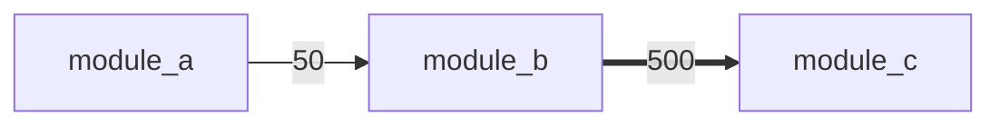

# Execution Graph Generator - Usage Guide

## Overview

The Execution Graph Generator combines **static analysis** (what code exists) with **dynamic tracing** (what actually runs) to create powerful Mermaid diagrams that show:

- **Hot Paths**: Frequently executed code paths highlighted in red
- **Dead Code**: Functions that exist but were never called
- **Call Counts**: How many times each function was called
- **Module Dependencies**: High-level architecture view
- **Function Details**: Detailed execution flow

## Quick Start

### 1. Basic Usage

```python
from execution_graph_generator import trace_execution

# Trace your main entry point
def my_main():
    # Your code here
    pass

result, report = trace_execution(my_main)
```

This generates `EXECUTION_ANALYSIS.md` with collapsible Mermaid diagrams.

### 2. With Arguments

```python
from execution_graph_generator import trace_execution
from my_module import process_data

# Trace function with arguments
result, report = trace_execution(
    process_data,
    input_file="data.csv",
    verbose=True
)
```

### 3. Trace Specific Commands

For the ClickUp Framework CLI commands:

```python
from execution_graph_generator import trace_execution
from clickup_framework.commands.map_command import map_command

# Trace the map command
class MockArgs:
    filter = 'python'
    output = '.tags.json'
    mer = 'flow'
    html = True
    # ... other args

result, report = trace_execution(map_command, MockArgs())
```

## Output Formats

### Module View (Always Visible)

Shows high-level dependencies between modules:



- **Thick arrows (==>)**: High call frequency (>100 calls)
- **Normal arrows (-->)**: Medium frequency (>10 calls)
- **Dotted arrows (-.->)**: Low frequency (<10 calls)

### Function View (Collapsible)

Detailed execution trace with:
- 🟢 **Green nodes**: Executed functions
- ⚫ **Gray dashed nodes**: Dead code (never executed)
- 🔴 **Red nodes**: Entry points
- 🔴 **Red edges**: Hot paths (>100 calls)
- 🟠 **Orange edges**: Warm paths (>10 calls)

### Dead Code Report (Collapsible)

Lists all functions that were found but never executed:

```markdown
#### `module_name`
- `unused_function_1()`
- `unused_function_2()`
```

### Hot Paths Report (Collapsible)

Top 20 most frequently called paths:

| Caller | Callee | Call Count |
|--------|--------|------------|
| `process()` | `validate()` | 1,500 |
| `validate()` | `check_type()` | 1,500 |

## Filtering Noise

The generator automatically filters out:
- Functions starting with `print_`
- Functions starting with `log_`
- Functions starting with `dump_`
- Standard library functions
- External package functions

### Custom Filters

```python
from execution_graph_generator import ExecutionTracer, StaticAnalyzer

# Custom noise filters
tracer = ExecutionTracer(
    project_root=Path.cwd(),
    noise_prefixes=('print_', 'log_', 'dump_', 'debug_', 'test_')
)
```

## Integration with Existing Map Command

You can enhance the existing `cum map` command to include execution traces:

### Option 1: Add a `--trace` Flag

```python
# In map_command.py
if args.trace:
    from execution_graph_generator import trace_execution
    trace_execution(lambda: map_command(args))
```

### Option 2: Create a New Command

```bash
# Create cum trace command
cum trace --command map --filter python --mer flow
```

### Option 3: Combine with CTags Output

The execution graph can be merged with the existing ctags-based diagrams:

1. **CTags**: Shows all possible dependencies (static)
2. **Execution Trace**: Shows what actually happened (dynamic)
3. **Overlay**: Highlight the hot paths on the ctags diagram

## Example: Tracing the Map Command

Create a test script:

```python
# trace_map_command.py
from pathlib import Path
from execution_graph_generator import trace_execution
from clickup_framework.commands.map_command import main as map_main

# Simulate command line args
import sys
sys.argv = [
    'cum',
    'map',
    '--python',
    '--mer', 'flow',
    '--html',
    '--output', 'trace_test.html'
]

# Trace the execution
result, report = trace_execution(map_main)

print("\n" + "="*80)
print("Execution analysis complete!")
print("See EXECUTION_ANALYSIS.md for the full report")
print("="*80)
```

Run it:

```bash
python trace_map_command.py
```

## Use Cases

### 1. Performance Optimization

Find hot paths to optimize:
- Look for red/orange edges with high call counts
- Focus optimization efforts on the most-called functions

### 2. Dead Code Detection

Clean up unused code:
- Review gray dashed nodes in the function view
- Check the Dead Code Report for removal candidates

### 3. Debugging

Understand execution flow:
- Trace a specific bug reproduction
- See exactly what functions were called and in what order

### 4. Documentation

Generate architecture diagrams:
- Use Module View for high-level docs
- Use Function View for detailed implementation docs
- Embed in GitHub README (works in markdown)

### 5. Code Review

Visualize changes:
- Trace before and after refactoring
- Compare execution paths
- Verify that old code paths are no longer used

## Advanced Features

### Programmatic Access

```python
from execution_graph_generator import (
    StaticAnalyzer,
    ExecutionTracer,
    MermaidGraphGenerator
)
from pathlib import Path

# Manual control
project_root = Path.cwd()
analyzer = StaticAnalyzer(project_root)
tracer = ExecutionTracer(project_root)

# Analyze
analyzer.analyze_directory()

# Trace
with tracer:
    my_function()

# Generate custom views
generator = MermaidGraphGenerator(analyzer, tracer)
module_graph = generator.generate_module_view()
function_graph = generator.generate_function_view(max_nodes=500)

# Access raw data
print(f"Called functions: {tracer.called_functions}")
print(f"Call graph: {tracer.call_graph}")
print(f"All functions: {analyzer.functions}")
```

### Export to JSON

```python
import json

# Export trace data
trace_data = {
    'call_graph': dict(tracer.call_graph),
    'called_functions': list(tracer.called_functions),
    'all_functions': analyzer.functions
}

with open('trace_data.json', 'w') as f:
    json.dump(trace_data, f, indent=2)
```

### Continuous Integration

Add to CI/CD pipeline:

```yaml
# .github/workflows/trace.yml
name: Execution Trace

on: [push]

jobs:
  trace:
    runs-on: ubuntu-latest
    steps:
      - uses: actions/checkout@v2
      - name: Run execution trace
        run: |
          python execution_graph_generator.py
      - name: Upload report
        uses: actions/upload-artifact@v2
        with:
          name: execution-analysis
          path: EXECUTION_ANALYSIS.md
```

## Tips and Best Practices

1. **Run on Representative Data**: Trace with typical input data to get accurate hot paths
2. **Multiple Traces**: Run different scenarios to see different execution paths
3. **Limit Scope**: For large codebases, trace specific modules/features
4. **Combine with Profiling**: Use with cProfile for timing data
5. **Version Control**: Commit EXECUTION_ANALYSIS.md to track architecture changes

## Troubleshooting

### Too Many Nodes

Reduce with `max_nodes` parameter:

```python
graph = generator.generate_function_view(max_nodes=100)
```

### Missing Calls

Ensure the code is actually executed:
- Check that traced code runs
- Verify no exceptions abort execution
- Use verbose mode to see what's being traced

### Performance Issues

For very large traces:
- Limit analysis to specific directories
- Increase noise filtering
- Use module view instead of function view

## Next Steps

- Integrate with WebGL visualization (combine with shader effects)
- Add interactive HTML output (clickable nodes)
- Merge with existing ctags-based diagrams
- Add time-series analysis (execution over time)
- Create diff view (compare two traces)
