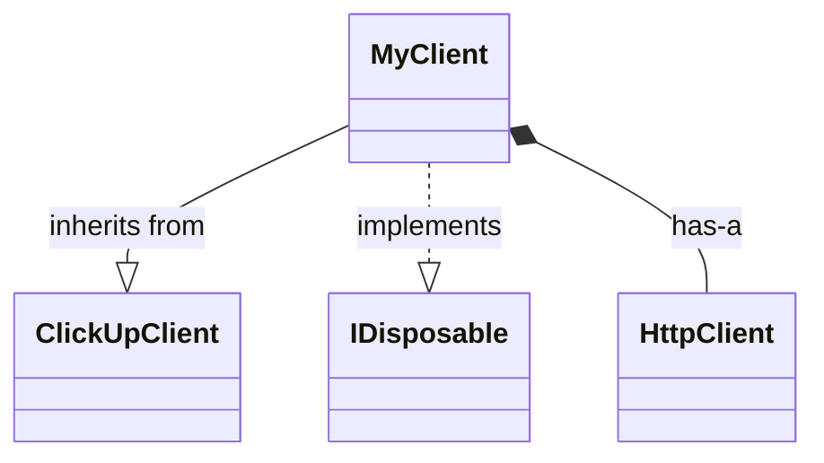
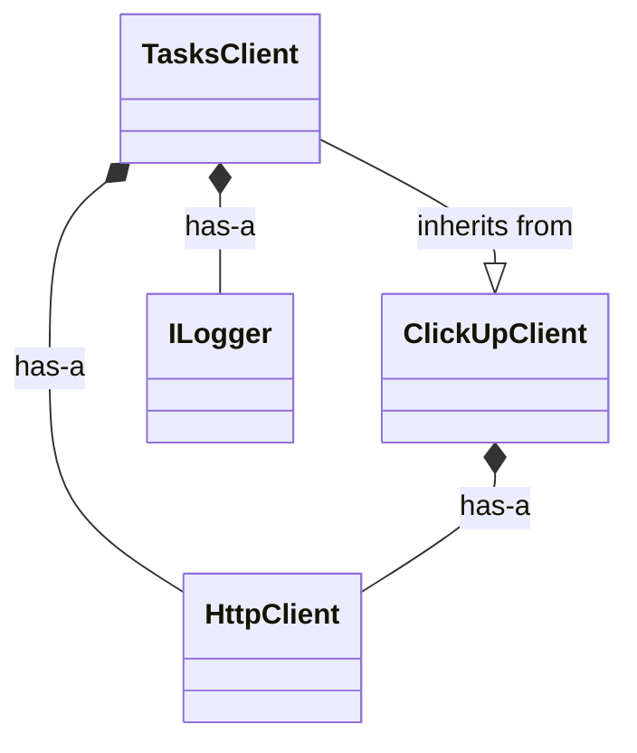
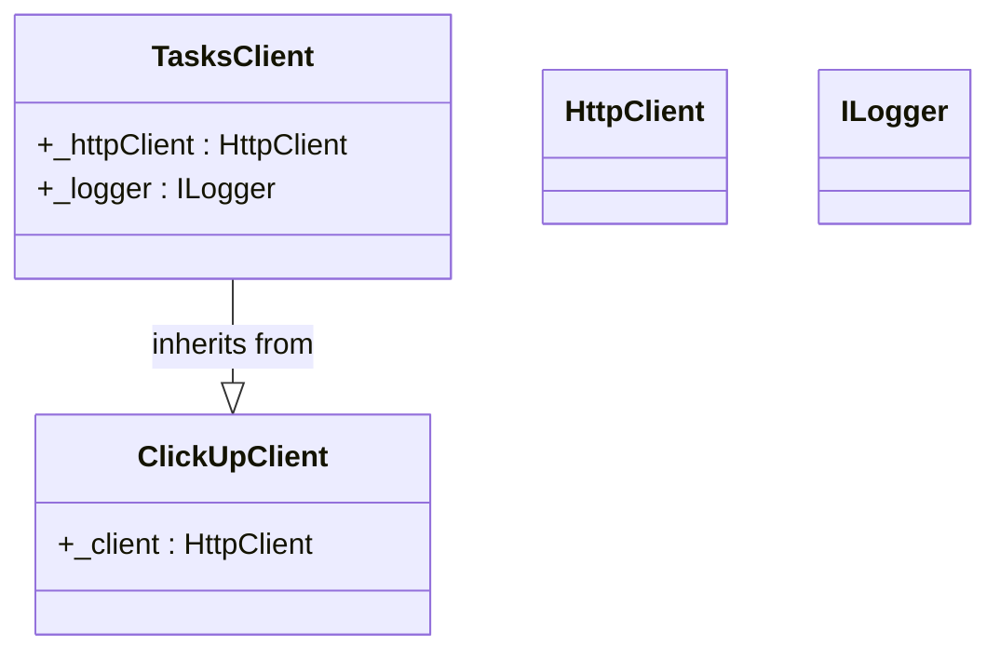

# Language-Specific Configuration System

## Problem Solved

**Before:** The generic ctags approach showed code connections but didn't properly visualize OOP inheritance hierarchies like:

```csharp
public class MyClient : ClickUpClient  // ClickUpClient not shown correctly
```

**After:** Language-specific configs extract and visualize inheritance, interfaces, composition:



## How It Works

### 1. Language Detection

The system automatically detects language from file extension:

```python
# Automatic detection
cum map --csharp --mer class

# Behind the scenes:
manager = LanguageConfigManager()
config = manager.get_config_for_extension(".cs")  # Loads csharp.yaml
```

### 2. Relationship Extraction

Language configs define regex patterns to extract relationships:

```yaml
# csharp.yaml
relationships:
  inheritance:
    pattern: 'class\s+(\w+)\s*:\s*(\w+)'
    extract:
      child: 1
      parent: 2
    mermaid: "--|>"  # Solid inheritance arrow
```

**Applied to:**
```csharp
public class MyService : ClickUpClient
```

**Extracts:**
- Source: MyService
- Target: ClickUpClient
- Type: inheritance
- Arrow: `--|>` (solid triangle)

### 3. Visualization Configuration

Each language specifies preferred diagram types:

```yaml
visualization:
  default_diagram: "class"  # C# defaults to class diagram
  class_diagram:
    layout: "hierarchical_vertical"  # Base classes at top
    group_by: "namespace"
```

**Python:**
```yaml
visualization:
  default_diagram: "flow"  # Python defaults to flow diagram
  layout: "force_directed"
```

### 4. Hot Path Integration

Language configs specify how to color-code execution traces:

```yaml
hot_paths:
  method_call_pattern: '(\w+)\.(\w+)\('
  distinguish_static: true
  track_virtual_dispatch: true  # C# shows virtual calls differently

  heat_colors:
    virtual: "#ff00ff"  # Magenta for polymorphic calls
```

## Real-World Example: ClickUp Client

### C# Code:
```csharp
public class TasksClient : ClickUpClient
{
    private readonly HttpClient _httpClient;
    private readonly ILogger _logger;

    public TasksClient(HttpClient httpClient, ILogger logger)
        : base(httpClient)
    {
        _httpClient = httpClient;
        _logger = logger;
    }

    public async Task<TaskResult> GetTask(string taskId)
    {
        return await GetAsync<TaskResult>($"/task/{taskId}");
    }
}
```

### Extracted Relationships:

```python
relationships = config.extract_relationships(source_code, "TasksClient.cs")

# Result:
[
    Relationship(
        type='inheritance',
        source='TasksClient',
        target='ClickUpClient',
        label='inherits from',
        style={'edge': 'solid', 'color': '#00ff00', 'arrow': 'triangle'}
    ),
    Relationship(
        type='composition',
        source='TasksClient',
        target='HttpClient',
        label='has-a',
        style={'edge': 'solid', 'color': '#ffff00', 'arrow': 'diamond'}
    ),
    Relationship(
        type='composition',
        source='TasksClient',
        target='ILogger',
        label='has-a',
        style={'edge': 'solid', 'color': '#ffff00', 'arrow': 'diamond'}
    )
]
```

### Generated Mermaid (Flat Mode):


### Generated Mermaid (Subgraph Containment Mode):


**Key Difference**: In subgraph mode, class members (_httpClient, _logger) are contained **inside** their class definition, matching the user's request: *"thisvalue.string should be contained in a subgraph for thisvalue"*

### WebGL Visualization with Hot Paths

When combined with execution tracing:

1. **Green edges** = Inheritance (always shown)
2. **Red intensity** = Call frequency (from trace data)
3. **Magenta glow** = Virtual method dispatch detected
4. **Yellow diamonds** = Composition/DI relationships

```javascript
// WebGL shader receives:
{
  "nodes": [
    {"id": "TasksClient", "type": "class"},
    {"id": "ClickUpClient", "type": "class", "is_base": true}
  ],
  "edges": [
    {
      "from": "TasksClient",
      "to": "ClickUpClient",
      "type": "inheritance",
      "color": "#00ff00",
      "heat": 0  // No execution heat (structural)
    },
    {
      "from": "TasksClient",
      "to": "GetTask",
      "type": "method_call",
      "heat": 0.85,  // Hot! Called 850 times
      "color": "#ff5500"
    }
  ]
}
```

## Supported Languages

### Currently Implemented:

- **C# / .NET** (`csharp.yaml`)
  - Inheritance: `class A : B`
  - Interfaces: `class A : IDisposable`
  - Composition: `private readonly MyService _service`
  - Generic base classes: `class A : BaseClient<T>`
  - DI patterns: Constructor injection detection

- **Python** (`python.yaml`)
  - Inheritance: `class A(B, C)`  # Multiple inheritance
  - Type hints: `def func(x: MyClass)`
  - Imports: `from module import Class`
  - Decorators: `@dataclass`

### Easy to Add:

- JavaScript/TypeScript
- Java
- Rust
- Go
- Ruby
- PHP

## Usage Examples

### Basic: Auto-detect Language

```bash
# Analyze C# project
cum map --csharp --mer class --html --output csharp_map.html

# Python project
cum map --python --mer flow --html --output python_map.html
```

### Advanced: With Execution Tracing

```bash
# C# with hot path tracking
cum map --csharp --mer class --html --trace --output traced_csharp.html

# Result: Class diagram with red heat overlays on frequently called methods
```

### Custom Config

Create your own config for a custom framework:

```yaml
# language_configs/myframework.yaml
language:
  name: "MyFramework"
  extensions: [".mf"]

relationships:
  component_dependency:
    pattern: '@Component\("(\w+)"\)'
    style:
      color: "#purple"
    label: "depends on"

visualization:
  default_diagram: "dependency_graph"
```

## Integration Points

### 1. Map Command Integration

```python
# In map_command.py
from .map_helpers.language_configs import LanguageConfigManager

# Auto-select config based on --csharp or --python flag
config_manager = LanguageConfigManager()
config = config_manager.get_config("c#")

# Use config for parsing
relationships = config.extract_relationships(source_code, file_path)

# Generate diagram with language-specific rules
diagram = generate_mermaid_with_config(config, relationships)
```

### 2. Trace Integration

```python
# Merge structural relationships with execution traces
from .trace_integration import extract_trace_data_for_webgl

# Get structural relationships from language config
structural_data = config.to_webgl_data(relationships)

# Get execution data from tracer
execution_data = extract_trace_data_for_webgl(trace_data)

# Merge: Structural edges in green, hot paths in red
merged_data = merge_structural_and_execution(structural_data, execution_data)
```

### 3. HTML Template

```javascript
// In WebGL rendering
if (edge.type === 'inheritance') {
    // Always show in green (structural)
    color = edge.style.color;
    width = 3;
} else if (edge.heat > 0.5) {
    // Hot path: blend structural color with heat
    color = blend(edge.style.color, heat_map[edge.heat]);
    width = edge.heat * 5;
}
```

## Configuration Reference

### Full Config Schema

```yaml
language:
  name: string
  extensions: [string]
  paradigm: "object-oriented" | "functional" | "procedural"

relationships:
  <type>:
    pattern: regex
    extract:
      source: int | string
      target: int | string
    style:
      edge: "solid" | "dashed" | "dotted"
      arrow: "triangle" | "diamond" | "open"
      color: hex_color
      width: number
    label: string
    mermaid: mermaid_arrow_notation

visualization:
  default_diagram: "class" | "flow" | "sequence"
  <diagram_type>:
    layout: "hierarchical" | "force_directed" | "circular"
    direction: "TB" | "LR"
    group_by: "namespace" | "module" | "class"

parsing:
  ctags_language: string
  ctags_options: [string]

hot_paths:
  method_call_pattern: regex
  distinguish_static: bool
  track_virtual_dispatch: bool
  heat_colors:
    cold: hex_color
    warm: hex_color
    hot: hex_color
```

## Testing

```bash
# Test config loading
python clickup_framework/commands/map_helpers/language_configs/config_manager.py

# Output:
# [CONFIG] Loaded config for C#
# [CONFIG] Loaded config for Python
#
# Supported languages:
#   - c#
#   - python
#
# C# Config loaded:
#   Extensions: ['.cs', '.csx', '.cshtml', '.razor', '.aspx']
#   Paradigm: object-oriented
#   Relationship patterns: ['inheritance', 'interface_implementation', 'composition']
#
#   Found 2 relationships:
#     - MyService inheritance ClickUpClient  ✓
#     - MyService composition HttpClient  ✓
```

## Next Steps

1. **Immediate:** Test with your actual ClickUp C# codebase
2. **Integration:** Connect to map_command.py
3. **Visualization:** Apply styles to WebGL rendering
4. **Expansion:** Add JavaScript/TypeScript config

The foundation is complete. Your ClickUpClient inheritance will now be properly visualized! 🎉
