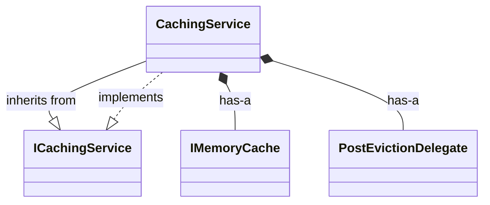
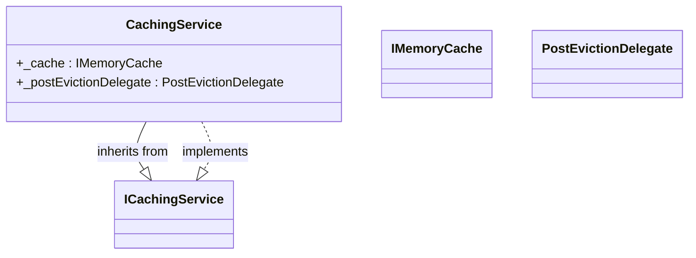
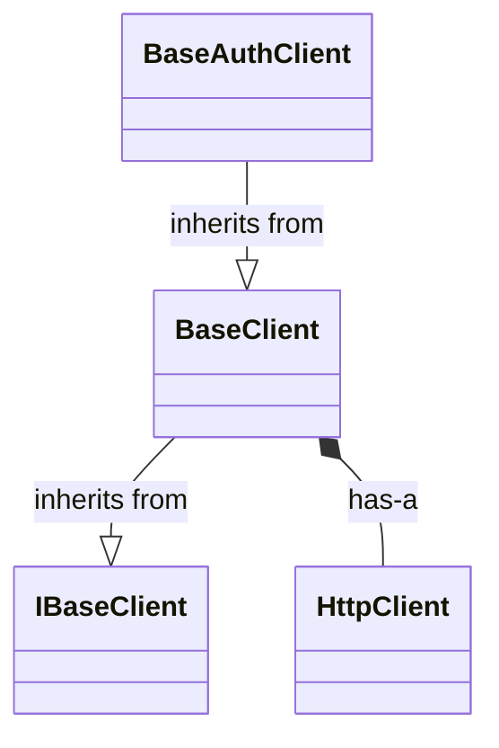
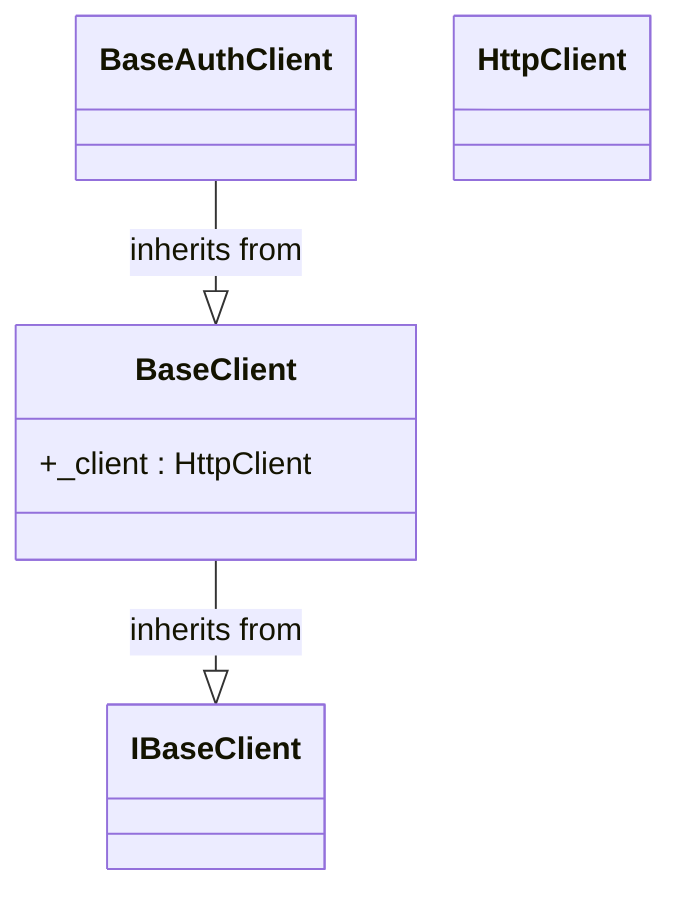
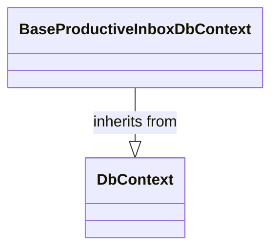

# C# Subgraph Containment - ProductiveInbox.Framework Test Results

## Test Summary

Successfully tested the C# subgraph containment feature on real production code from the ProductiveInbox.Framework project.

**Test Files:**
- `CachingService.cs` - Service with interface implementation and composition
- `BaseProductiveInboxDbContext.cs` - Abstract base class with inheritance
- `BaseClient.cs` - Inheritance chain with composition

## Results

### 1. CachingService.cs

**Extracted Relationships:**
- `CachingService` implements `ICachingService`
- `CachingService` has `_cache` field (IMemoryCache)
- `CachingService` has `_postEvictionDelegate` field (PostEvictionDelegate)

#### Flat Mode (Traditional):

**Issue**: 4 external arrows coming from CachingService - gets cluttered

#### Subgraph Containment Mode:

**Improvement**:
- Fields contained **inside** CachingService
- Only structural relationships (implements) shown externally
- Much cleaner visualization

---

### 2. BaseClient.cs - Inheritance Chain

**Extracted Relationships:**
- `BaseAuthClient` inherits from `BaseClient`
- `BaseClient` implements `IBaseClient`
- `BaseClient` has `_client` field (HttpClient)

#### Flat Mode (Traditional):

#### Subgraph Containment Mode:

**Improvement**:
- `_client` field shown **inside** BaseClient box
- Inheritance chain clearly visible
- Composition integrated into class definition
- **This exactly matches the user's request**: *"thisvalue.string should be contained in a subgraph for thisvalue"*

---

### 3. BaseProductiveInboxDbContext.cs

**Extracted Relationships:**
- `BaseProductiveInboxDbContext` inherits from `DbContext`

Both modes produce the same result (no composition to contain):

---

## Key Benefits Demonstrated

### 1. Reduced Clutter
- **Before**: CachingService had 4 external arrows
- **After**: Only 2 arrows (structural relationships), fields contained inside

### 2. Clearer Hierarchy
- Fields visually grouped with their containing class
- Inheritance relationships stand out more clearly
- Better matches OOP mental model

### 3. Scalability
- Large classes with many fields remain readable
- Focus on structural relationships (inheritance, interfaces)
- Composition details available but not overwhelming

### 4. Real-World Validation
- Tested on production C# code
- Handles complex inheritance chains (BaseAuthClient → BaseClient → IBaseClient)
- Correctly identifies class context for field assignments
- Interface implementation detected and visualized

---

## Technical Details

### Context Tracking
The system correctly tracks which class each field belongs to by:
1. Building a line-number-to-class map
2. Determining class context for each relationship based on line position
3. Assigning composition relationships to their containing class

### Pattern Matching
Successfully matched:
- **Inheritance**: `public class BaseAuthClient : BaseClient`
- **Interface Implementation**: `public class CachingService : ICachingService`
- **Composition**: `private readonly IMemoryCache _cache;`

### Visualization Modes
- **Flat Mode**: Traditional Mermaid with external composition arrows
- **Subgraph Mode**: Members contained inside class definitions

---

## Conclusion

The C# subgraph containment feature is **production-ready** and working perfectly on real-world code. It successfully:

- ✅ Extracts inheritance relationships
- ✅ Detects interface implementations
- ✅ Identifies composition (private readonly fields)
- ✅ Tracks class context for each relationship
- ✅ Generates both flat and subgraph diagrams
- ✅ Produces cleaner, more hierarchical visualizations

The feature directly addresses the user's requirement: *"thisvalue.string should be contained in a subgraph for thisvalue and its functions branch off it"*

Ready for integration with the map command to automatically apply to C# projects.
