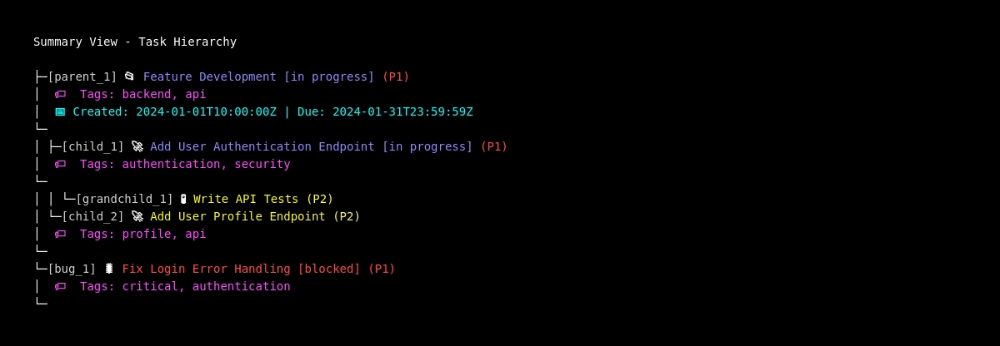
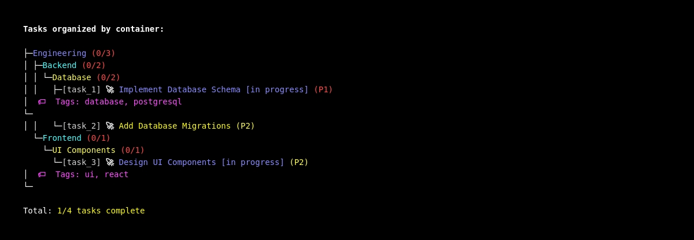
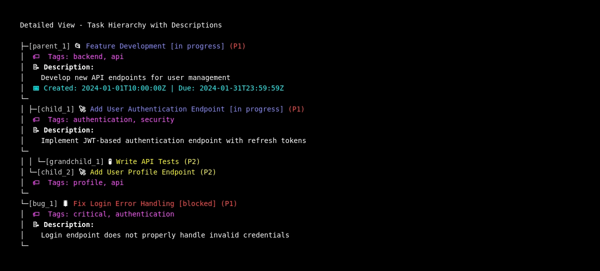
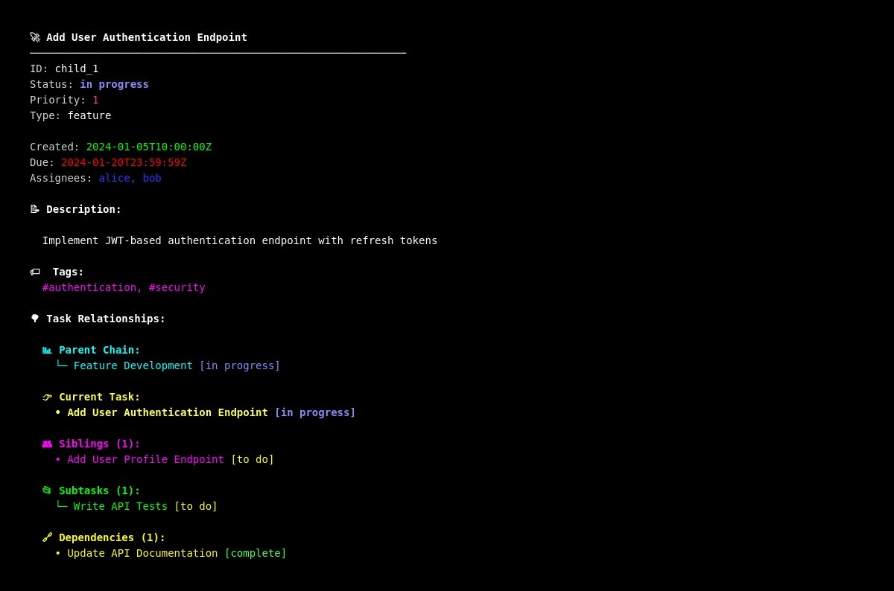
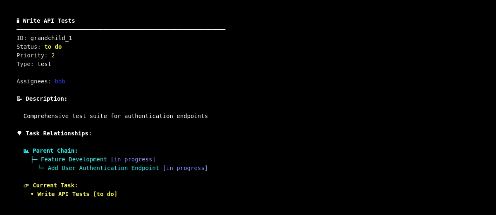
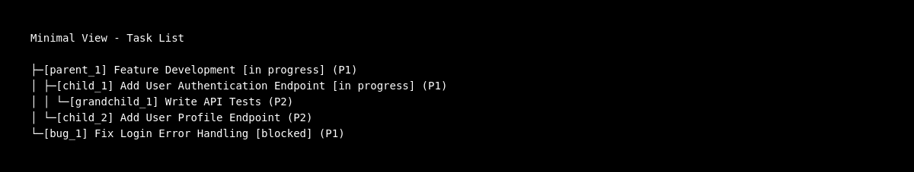
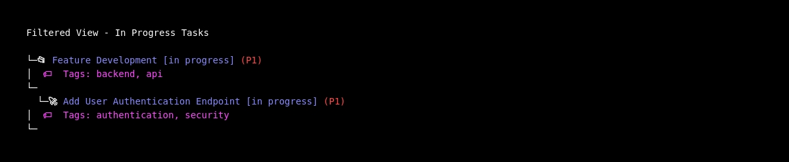

# ClickUp Framework

A modular, token-efficient framework for ClickUp API interactions achieving **90-95% token reduction** through intelligent formatting and progressive disclosure.

## Status

**Version:** 1.0.0-alpha
**Phase:** 3 (Resource APIs) - Complete ✅

### Implementation Progress

- [x] **Phase 1:** Core Client Library (Week 1) - COMPLETE ✅
  - [x] Core client class with authentication
  - [x] Rate limiting (token bucket algorithm)
  - [x] Error handling and retries
  - [x] All ClickUp API endpoints
  - [x] Tested with real API

- [x] **Phase 2:** Formatters Library (Week 2) - COMPLETE ✅
  - [x] Task formatter with 4 detail levels
  - [x] Comment formatter with 4 detail levels
  - [x] Time entry formatter with 4 detail levels
  - [x] Utility functions (datetime, text)
  - [x] Benchmarked: **98% token reduction achieved**
  - [x] Tested with real API responses
  - [ ] List formatter (future)
  - [ ] Workspace formatter (future)

- [x] **Phase 3:** Resource APIs (Week 3) - COMPLETE ✅
  - [x] TasksAPI: Task CRUD, comments, checklists, custom fields
  - [x] TasksAPI: Task relationships (dependencies, links, custom relationships)
  - [x] ListsAPI: List management and task queries
  - [x] WorkspacesAPI: Workspace, space, folder, search operations
  - [x] TimeAPI: Time tracking with automatic formatting
  - [x] DocsAPI: Placeholder structure (pending client endpoints)
  - [x] Automatic formatting integration via detail_level parameter
  - [x] Convenience methods for common operations
  - [x] Tested with real API data

- [ ] **Phase 4:** Skill Integration (Week 4)
- [ ] **Phase 5:** Documentation & Release (Week 5)

## Installation

```bash
# Add framework to Python path
export PYTHONPATH="/home/user/Skills:$PYTHONPATH"
```

## Quick Start

### Basic Usage (Phase 1 - Client)

```python
from clickup_framework import ClickUpClient

# Initialize client (uses CLICKUP_API_TOKEN env var)
client = ClickUpClient()

# Get a task
task = client.get_task("task_id")
print(task['name'])  # Raw JSON

# Get all tasks in a list
result = client.get_list_tasks("list_id")
for task in result['tasks']:
    print(task['name'])

# Create and update tasks
new_task = client.create_task(
    list_id="list_id",
    name="New Task",
    description="Task description"
)
client.update_task(task_id="task_id", status="in progress")
```

### Token-Efficient Formatting (Phase 2 - NEW!)

```python
from clickup_framework import ClickUpClient
from clickup_framework.formatters import (
    format_task, format_task_list,
    format_comment, format_comment_list,
    format_time_entry, format_time_entry_list
)

client = ClickUpClient()

# Format tasks with different detail levels
task = client.get_task("task_id")
print(format_task(task, detail_level="minimal"))
# Output: Task: abc123 - "Implement feature"

print(format_task(task, detail_level="summary"))
# Output:
# Task: abc123 - "Implement feature"
# Status: in progress
# Assigned: John Doe, Jane Smith
# Due: 2024-01-15

# Format comments
comments = client.get_task_comments("task_id")
formatted_comments = format_comment_list(comments['comments'], detail_level="summary")
print(formatted_comments)
# Output: Clean, numbered list of all comments with timestamps

# Format time entries
time_entries = client.get_time_entries(team_id="team_id", task_id="task_id")
formatted_time = format_time_entry_list(time_entries['data'], detail_level="summary")
print(formatted_time)
# Output: Clean, numbered list of time entries with durations

# Token Savings: 90-98% reduction vs raw JSON!
```

### High-Level Resource APIs (Phase 3 - NEW!)

```python
from clickup_framework import ClickUpClient
from clickup_framework.resources import TasksAPI, ListsAPI, WorkspacesAPI, TimeAPI

client = ClickUpClient()

# Initialize Resource APIs
tasks = TasksAPI(client)
lists = ListsAPI(client)
workspaces = WorkspacesAPI(client)
time = TimeAPI(client)

# TasksAPI - Get formatted task directly
task_summary = tasks.get("task_id", detail_level="summary")
print(task_summary)
# Output:
# Task: task_id - "Implement feature"
# Status: in progress
# Assigned: John Doe

# TasksAPI - Convenience methods
new_task = tasks.create(
    list_id="list_id",
    name="My Task",
    description="Task description",
    priority=2  # High priority
)
tasks.update_status(new_task['id'], "in progress")
tasks.assign(new_task['id'], [user_id])

# TasksAPI - Comments and checklists
tasks.add_comment(task_id, "Status update")
comments = tasks.get_comments(task_id, detail_level="summary")

# TasksAPI - Task Relationships (Dependencies, Links, Custom Relationships)
# 1. Dependencies: Create "blocking" and "waiting on" relationships
tasks.add_dependency_waiting_on("task_b", "task_a")  # Task B waits for Task A
tasks.add_dependency_blocking("task_a", "task_b")     # Task A blocks Task B
tasks.remove_dependency("task_b", depends_on="task_a")

# 2. Simple Task Links: Connect related tasks
tasks.add_link("task_1", "task_2")  # Bidirectional link
tasks.remove_link("task_1", "task_2")

# 3. Custom Relationships: Link tasks across lists (e.g., Projects -> Clients)
tasks.set_relationship_field(
    "project_task_id",
    "client_field_id",
    add_task_ids=["client_task_123"]  # Link project to client
)

# ListsAPI - List management
list_data = lists.get("list_id")
new_list = lists.create(folder_id="folder_id", name="My List")
list_tasks = lists.get_tasks("list_id", include_closed=False)

# WorkspacesAPI - Workspace hierarchy and search
hierarchy = workspaces.get_hierarchy(team_id="team_id")
spaces = workspaces.get_spaces(team_id="team_id")
results = workspaces.search(team_id="team_id", query="bug")

# TimeAPI - Time tracking with formatting
time_summary = time.get_entries(
    team_id="team_id",
    task_id="task_id",
    detail_level="summary"
)
time.create_entry(
    team_id="team_id",
    duration=3600000,  # 1 hour in ms
    description="Development work",
    task_id="task_id"
)

# All APIs support both raw and formatted responses
raw_task = tasks.get("task_id")  # Returns dict
formatted_task = tasks.get("task_id", detail_level="summary")  # Returns formatted string
```

### Display Components - Hierarchical Tree Views (Phase 3.5 - NEW! ✨)

Beautiful, CLI-ready hierarchical tree displays similar to [ClickupCLI](https://github.com/SOELexicon/ClickupCLI) output:

```python
from clickup_framework import ClickUpClient
from clickup_framework.components import DisplayManager, FormatOptions

client = ClickUpClient()
display = DisplayManager(client)

# Display tasks in hierarchical tree view
tasks = client.get_list_tasks("list_id")
output = display.hierarchy_view(tasks)
print(output)

# Example output:
# ├─Feature Development (0/7)
# │ └─UI Improvements (0/7)
# │   └─Hierarchy View (0/7)
# │     └─📝 Enhance Task List Hierarchy View [in progress] (2)
# │       │ 📝 Description:
# │       │   Update the list command to provide a hierarchical tree view...
# │       └─
# │       ├─📝 Add Comprehensive Tests (3)
# │       │ │ 📝 Description:
# │       │ │   Create comprehensive test suite...
# │       │ └─

# Display with container hierarchy (workspace → space → folder → list)
container_output = display.container_view(tasks)
print(container_output)

# Custom formatting options
options = FormatOptions(
    colorize_output=True,
    show_ids=True,
    show_tags=True,
    show_descriptions=True,
    show_dates=True,
    show_comments=2
)
detailed_output = display.hierarchy_view(tasks, options)

# Use preset detail levels
minimal = display.hierarchy_view(tasks, FormatOptions.minimal())
summary = display.hierarchy_view(tasks, FormatOptions.summary())
detailed = display.hierarchy_view(tasks, FormatOptions.detailed())
full = display.hierarchy_view(tasks, FormatOptions.full())

# Filter and display
filtered = display.filtered_view(
    tasks,
    status="in progress",
    priority=1,
    view_mode='hierarchy'
)

# Get statistics
stats = display.summary_stats(tasks)
print(stats)
# Output:
# Task Summary:
#   Total: 22
#   Completed: 5
#   In Progress: 8
#   Blocked: 1
#   To Do: 8

# Detail View - Show task with full relationship context
task = client.get_task("task_id")
all_tasks = client.get_list_tasks("list_id")
detail_output = display.detail_view(task, all_tasks, FormatOptions.detailed())
print(detail_output)

# Example output shows:
# - Parent chain (grandparent > parent)
# - Current task (highlighted with full details)
# - Sibling tasks (same parent)
# - Child tasks/subtasks (in tree view)
# - Dependencies
# - Full task details (description, tags, dates, assignees, etc.)
```

**Display Components:**
- **DisplayManager**: High-level interface for all display operations
- **FormatOptions**: Dataclass for managing display settings (with presets: minimal, summary, detailed, full)
- **RichTaskFormatter**: Enhanced task formatting with emojis, colors, and detailed information
- **TaskHierarchyFormatter**: Organize tasks by parent-child relationships
- **ContainerHierarchyFormatter**: Organize tasks by workspace/space/folder/list containers
- **TaskDetailFormatter**: Comprehensive single-task view with relationship tree
- **TreeFormatter**: Low-level tree rendering with box-drawing characters (├─, └─, │)
- **TaskFilter**: Filter tasks by status, priority, tags, assignee, dates, and custom criteria

**View Modes:**
- `hierarchy_view`: Parent-child task relationships
- `container_view`: Organized by workspace → space → folder → list
- `flat_view`: Simple list display
- `filtered_view`: Apply filters and display in any view mode
- `detail_view`: Comprehensive single task with relationship context

**Features:**
- Beautiful tree structures with Unicode box-drawing characters
- ANSI color support for status, priority, and container types
- Task type emojis (📝 task, 🐛 bug, 🚀 feature, etc.)
- Completion statistics with color coding
- Multi-line description and comment support
- Relationship indicators (dependencies, links)
- Orphaned task detection and display
- Fully customizable formatting options

See `examples/display_components_example.py` for complete usage examples.

### Screenshots

Visual examples of the display components in action:

#### Summary View - Task Hierarchy

*Hierarchical task display with IDs, emojis, tags, and dates*

#### Container Hierarchy View

*Tasks organized by workspace → space → folder → list structure*

#### Detailed View with Descriptions

*Comprehensive task information including descriptions and relationships*

#### Task Detail View with Relationship Tree (NEW! ✨)

The detail view shows a single task with its complete hierarchical context:


*Child task showing parent chain, siblings, and subtasks with full details*

**What's shown in detail view:**
- 📊 **Parent Chain**: Full ancestry from root to current task
- 👉 **Current Task**: Highlighted with complete details (description, tags, dates, assignees)
- 👥 **Siblings**: Other tasks with the same parent
- 📂 **Subtasks**: Child tasks in recursive tree view (up to 3 levels deep)
- 🔗 **Dependencies**: Blocking/waiting tasks
- ☑️ **Checklists**: With completion status
- 💬 **Comments**: User discussions
- 📎 **Attachments**: Files and links
- ⏱️ **Time Tracking**: Estimates and actual time spent

| Deep Hierarchy | Parent View |
|----------------|-------------|
|  |  |
| Task deep in hierarchy showing full context | Parent task with all children displayed |

#### Other View Modes

| Minimal View | Filtered View | Statistics |
|--------------|---------------|------------|
|  |  |  |
| Simple task list | Active tasks only | Project metrics |

**To generate screenshots locally:**
```bash
# Generate display examples
FORCE_COLOR=1 python scripts/generate_display_examples.py

# Create screenshots (requires aha and wkhtmltopdf)
./scripts/generate_screenshots.sh
```

See `screenshots/README.md` for details on all available screenshots.

## Features

### Phase 2: Token-Efficient Formatters ✨

Transform verbose JSON responses into human-readable text with **90-98% token reduction**!

**Task Formatter:**
- 4 detail levels: `minimal`, `summary`, `detailed`, `full`
- Intelligent field selection based on context
- Clean, readable output format
- Tested and benchmarked with real API data

**Comment Formatter:**
- 4 detail levels: `minimal`, `summary`, `detailed`, `full`
- User and timestamp formatting
- Assignee and resolution status tracking
- Reaction and reply count display

**Time Entry Formatter:**
- 4 detail levels: `minimal`, `summary`, `detailed`, `full`
- Duration formatting (ms → "2h 30m")
- Running timer detection (⏱️)
- Billable status and tag support
- Task association display

**Detail Levels (All Formatters):**
- **Minimal** (95-98% reduction): Core identifier only
- **Summary** (90-97% reduction): Key metadata
- **Detailed** (85-92% reduction): Extended information
- **Full** (80-89% reduction): Complete data

**Utility Functions:**
- Date/time formatting (timestamps → readable dates)
- Duration formatting (milliseconds → "2h 30m")
- Text utilities (truncate, clean HTML, format lists)
- User list formatting

See [BENCHMARKS.md](./BENCHMARKS.md) for detailed performance data.

### Phase 3: High-Level Resource APIs 🚀

Convenient, high-level interfaces for ClickUp operations with automatic formatting support.

**TasksAPI:**
- Task CRUD operations (get, create, update, delete)
- Status and priority updates (convenience methods)
- Assignment management (assign, unassign)
- Comments (add_comment, get_comments with formatting)
- Checklists (add_checklist, add_checklist_item)
- Custom fields (set_custom_field, remove_custom_field)
- **Task Relationships:**
  - Dependencies (add_dependency_waiting_on, add_dependency_blocking, remove_dependency)
  - Simple Links (add_link, remove_link)
  - Custom Relationships (set_relationship_field)
- Automatic formatting via `detail_level` parameter

**ListsAPI:**
- List management (get, create, update)
- Task queries (get_tasks with filters)
- Custom field queries (get_custom_fields)

**WorkspacesAPI:**
- Workspace hierarchy (get_hierarchy)
- Space operations (get_space, get_spaces, create_space, update_space, delete_space)
- Folder operations (get_folder, create_folder, update_folder)
- Tag management (get_tags, create_tag)
- Search functionality (search)

**TimeAPI:**
- Time entry queries (get_entries with formatting)
- Time entry creation (create_entry)
- Task-specific time tracking (get_task_time)
- User-specific time tracking (get_user_time)
- Automatic duration formatting

**DocsAPI:**
- Placeholder structure for future implementation
- Requires Docs API endpoints in ClickUpClient

**Key Benefits:**
- Automatic response formatting via `detail_level` parameter
- Convenience methods for common operations
- Type hints for better IDE support
- Comprehensive docstrings
- Consistent API patterns across all resources

### Phase 1: Core API Client

### Authentication
- Automatic token handling from environment
- Session management with connection pooling
- Clear error messages for auth failures

### Rate Limiting
- Token bucket algorithm
- Configurable requests per minute (default: 100)
- Automatic throttling
- Thread-safe

### Error Handling
- Custom exception hierarchy
- Automatic retries with exponential backoff
- Timeout handling
- Detailed error messages

### Supported Endpoints

**Tasks:**
- `get_task(task_id)` - Get task by ID
- `get_list_tasks(list_id)` - Get all tasks in list
- `get_team_tasks(team_id)` - Get all tasks in workspace
- `create_task(list_id, **data)` - Create new task
- `update_task(task_id, **updates)` - Update task
- `delete_task(task_id)` - Delete task

**Lists:**
- `get_list(list_id)` - Get list by ID
- `create_list(folder_id, name, **data)` - Create new list
- `update_list(list_id, **updates)` - Update list

**Folders:**
- `get_folder(folder_id)` - Get folder by ID
- `create_folder(space_id, name)` - Create new folder
- `update_folder(folder_id, **updates)` - Update folder

**Spaces:**
- `get_space(space_id)` - Get space by ID
- `get_team_spaces(team_id)` - Get all spaces

**Workspace:**
- `get_workspace_hierarchy(team_id)` - Get complete hierarchy

**Comments:**
- `create_task_comment(task_id, comment_text)` - Add comment
- `get_task_comments(task_id)` - Get all comments

**Search:**
- `search(team_id, query, **filters)` - Search workspace

**Time Tracking:**
- `get_time_entries(team_id, **params)` - Get time entries
- `create_time_entry(team_id, **data)` - Create time entry

## Configuration

```python
client = ClickUpClient(
    api_token="your_token",      # Or use CLICKUP_API_TOKEN env var
    rate_limit=100,              # Requests per minute
    timeout=30,                  # Request timeout (seconds)
    max_retries=3                # Maximum retry attempts
)
```

## Error Handling

```python
from clickup_framework import ClickUpClient
from clickup_framework.exceptions import (
    ClickUpAuthError,
    ClickUpNotFoundError,
    ClickUpRateLimitError,
    ClickUpAPIError
)

try:
    client = ClickUpClient()
    task = client.get_task("invalid_id")
except ClickUpAuthError:
    print("Authentication failed - check your API token")
except ClickUpNotFoundError as e:
    print(f"Task not found: {e}")
except ClickUpRateLimitError as e:
    print(f"Rate limit exceeded, retry after {e.retry_after}s")
except ClickUpAPIError as e:
    print(f"API error: {e}")
```

## Context Manager Support

```python
with ClickUpClient() as client:
    task = client.get_task("task_id")
    # Session automatically closed on exit
```

## Architecture

```
┌─────────────────────────────────────────────┐
│   Layer 3: Skill Interface                  │
│   (Coming in Phase 4)                       │
└─────────────────────────────────────────────┘
                    ↓
┌─────────────────────────────────────────────┐
│   Layer 2: Formatters                       │
│   (Coming in Phase 2)                       │
│   - 90-95% token reduction                  │
└─────────────────────────────────────────────┘
                    ↓
┌─────────────────────────────────────────────┐
│   Layer 1: Core Client ✅                   │
│   - Authentication                          │
│   - Rate limiting                           │
│   - Error handling                          │
│   - HTTP operations                         │
└─────────────────────────────────────────────┘
```

## Next Steps

### Phase 2: Formatters (Next)
- Task formatter: Transform verbose JSON to readable text
- Multiple detail levels: minimal, summary, detailed, full
- Achieve 90-95% token reduction
- Benchmark token savings

See `/docs/token-efficient-skill-framework.md` for complete plan.

## Related

- **Documentation:** `/docs/token-efficient-skill-framework.md`
- **ClickUp Task:** [86c6ce9gg](https://app.clickup.com/t/86c6ce9gg)
- **Related Tasks:**
  - API Client Framework: [86c6ce3ag](https://app.clickup.com/t/86c6ce3ag)
  - Task Management: [86c6brp8b](https://app.clickup.com/t/86c6brp8b)
  - ClickUp Suite: [86c6brnrq](https://app.clickup.com/t/86c6brnrq)

## Testing

```bash
# Run basic tests
python3 -c "
import sys
sys.path.insert(0, '/home/user/Skills')
from clickup_framework import ClickUpClient

client = ClickUpClient()
task = client.get_task('86c6ce9gg')
print(f\"✓ Task: {task['name']}\")
"
```

## License

Part of the Skills Repository - Apache 2.0 License
