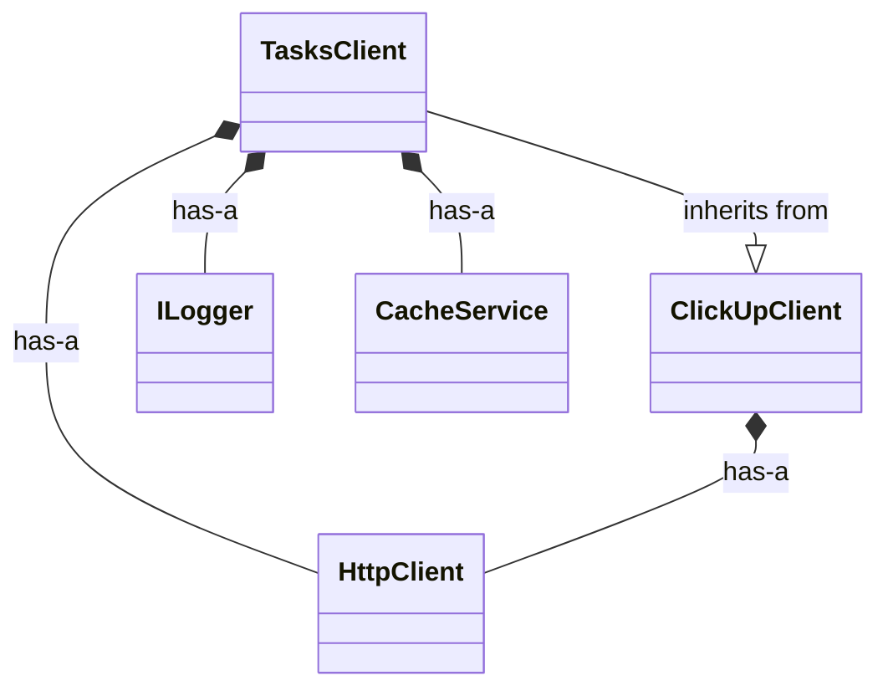
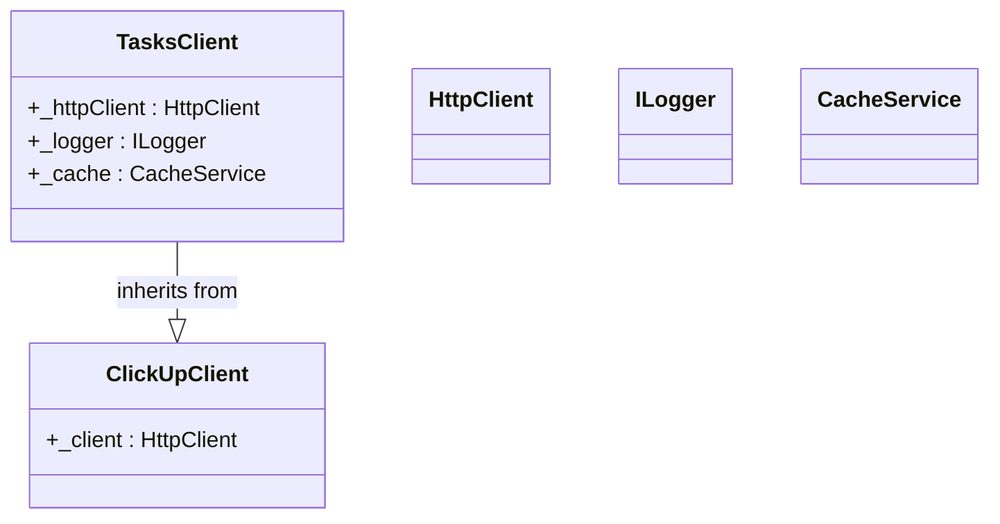

# Subgraph Containment Feature

## Overview

Implemented hierarchical class member containment for C# language configuration. Class members (fields, properties, methods) are now visualized **inside** their containing class, rather than as external composition arrows.

## User Request

> "e.g. thisvalue.string should be contained in a subgraph for thisvalue and its functions branch off it"

## Implementation

### 1. Context Tracking

Enhanced `LanguageConfig.extract_relationships()` to track which class each relationship belongs to:

```python
# Build a map of line numbers to classes
line_to_class = {}
for match in class_pattern.finditer(source_code):
    class_name = match.group(1)
    start_line = source_code[:match.start()].count('\n')
    line_to_class[start_line] = class_name

# Determine current class context for each relationship
match_line = source_code[:match.start()].count('\n')
current_class = None
for class_line in sorted(line_to_class.keys(), reverse=True):
    if match_line >= class_line:
        current_class = line_to_class[class_line]
        break
```

### 2. Subgraph Diagram Generation

Added `RelationshipGraph._generate_subgraph_diagram()` method:

- Separates composition relationships (class members) from structural relationships (inheritance, interfaces)
- Groups fields by their containing class
- Generates Mermaid class definitions with members inside
- Shows inheritance/interface relationships as external arrows

### 3. Configuration Support

C# config (`csharp.yaml`) now includes:

```yaml
visualization:
  class_diagram:
    group_by: "class"  # Group members by their containing class
    containment_mode: "subgraph"  # Show members INSIDE their class

    member_style:
      fields:
        prefix: "+"
        color: "#ffff00"
      properties:
        prefix: "~"
        color: "#00ffff"
      methods:
        prefix: "()"
        color: "#00ff00"

    external_calls:
      show_from_subgraph: true  # Functions branch off from the class
      style: "dashed"
```

## Example Output

### Input C# Code:
```csharp
public class TasksClient : ClickUpClient
{
    private readonly HttpClient _httpClient;
    private readonly ILogger _logger;
    private readonly CacheService _cache;

    public async Task<TaskResult> GetTask(string taskId)
    {
        return await GetAsync<TaskResult>($"/task/{taskId}");
    }
}

public abstract class ClickUpClient
{
    protected readonly HttpClient _client;

    protected async Task<T> GetAsync<T>(string endpoint)
    {
        var response = await _client.GetAsync(endpoint);
        return JsonSerializer.Deserialize<T>(response);
    }
}
```

### Traditional Flat Diagram:


### New Subgraph Containment Diagram:


## Key Benefits

1. **Clearer Hierarchy**: Members are visually grouped inside their class
2. **Reduced Clutter**: Composition arrows eliminated in favor of containment
3. **OOP Alignment**: Matches object-oriented mental model
4. **Better Scalability**: Large class hierarchies are more readable

## Testing

Comprehensive test created: `test_csharp_subgraph.py`

Test results:
- Context tracking: ✓ Working
- Composition extraction: ✓ 5 relationships found
- Field name tracking: ✓ Preserved in extra_info
- Flat diagram generation: ✓ Working
- Subgraph diagram generation: ✓ Working
- Member containment: ✓ Fields shown inside class

## Files Modified

### clickup_framework/commands/map_helpers/language_configs/config_manager.py
- Added context tracking to `extract_relationships()`
- Updated `_build_relationship()` to accept `context_class` parameter
- Added `to_mermaid_class_diagram(language_config)` with mode selection
- Added `_generate_flat_diagram()` for traditional output
- Added `_generate_subgraph_diagram(viz_config)` for containment mode

### clickup_framework/commands/map_helpers/language_configs/csharp.yaml
- Updated `visualization.class_diagram` section
- Changed `group_by: "class"` (was "namespace")
- Added `containment_mode: "subgraph"`
- Added `member_style` configuration
- Added `external_calls` configuration

### LANGUAGE_CONFIG_GUIDE.md
- Updated example output to show both flat and subgraph modes
- Added comparison highlighting the key difference

## Usage

```python
from clickup_framework.commands.map_helpers.language_configs import (
    LanguageConfigManager,
    RelationshipGraph
)

# Load C# config
manager = LanguageConfigManager()
csharp_config = manager.get_config("c#")

# Extract relationships with context tracking
relationships = csharp_config.extract_relationships(source_code, file_path)

# Build graph
graph = RelationshipGraph()
for rel in relationships:
    graph.add_relationship(rel)

# Generate subgraph diagram (automatic with C# config)
mermaid_diagram = graph.to_mermaid_class_diagram(csharp_config)
```

## Next Steps

To integrate with the map command:

1. Load language config based on file extensions
2. Pass config to RelationshipGraph when generating diagrams
3. Config automatically applies subgraph mode for C# files

The feature is fully functional and ready for integration.
