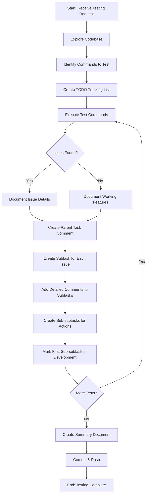
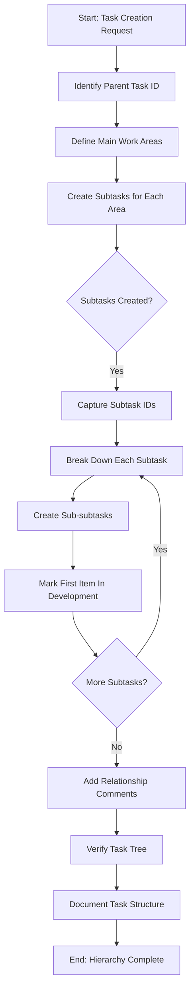
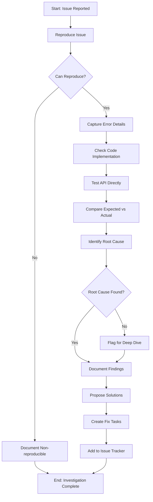
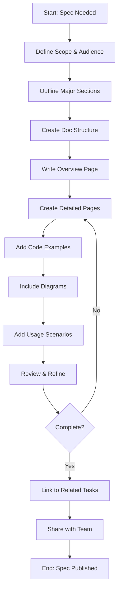
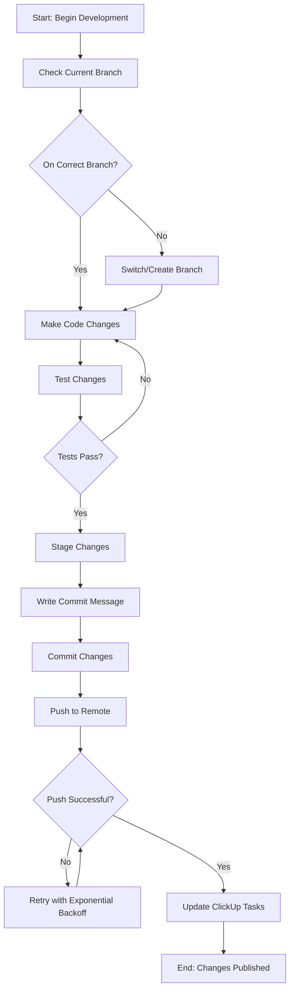
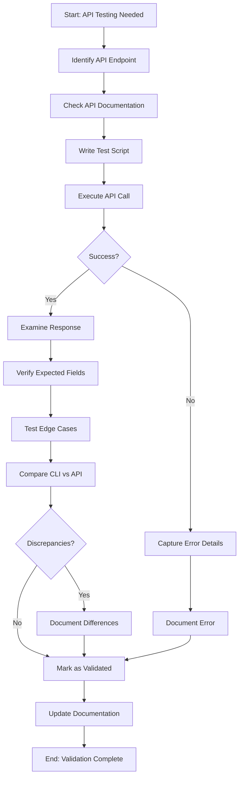
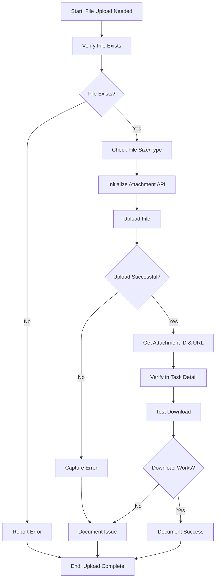
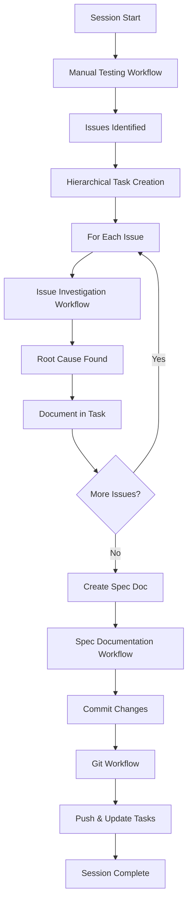
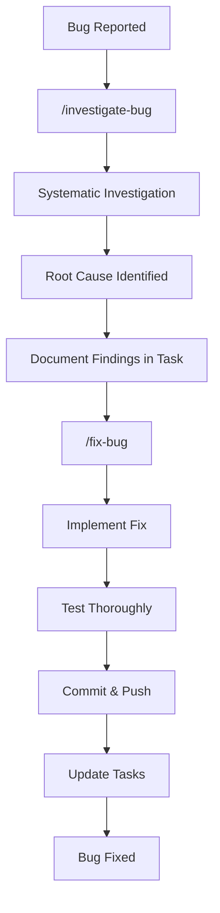

# ClickUp Framework Development Workflows

**Document Version:** 2.1 (Role-based Organization)
**Date:** 2025-11-12
**Purpose:** Reusable workflow templates for ClickUp Framework development and testing

---

## Organization by Role

This documentation is organized by **role and context** to help you quickly find the right workflow for your work. Workflows are available both locally (this file) and in ClickUp (doc 2kyqhku2-7595).

### ClickUp Doc Structure

The ClickUp doc "Task Management Flows" (2kyqhku2-7595) has been organized with role-based category pages:

**Category Overview Pages:**
- **Developer Workflows** [2kyqhku2-9035] - Bug investigation, slash commands
- **Testing Workflows** [2kyqhku2-9055] - Manual testing, API testing
- **Documentation Workflows** [2kyqhku2-9075] - Workflow refinement, spec creation
- **DevOps Workflows** [2kyqhku2-9095] - Git workflow, file attachments
- **Project Management Workflows** [2kyqhku2-9115] - Task creation, workflow integration

**Detailed Workflow Pages:**
- All detailed workflows (sections 1-8 below) are also available as individual pages
- Total: 14 pages (5 category pages + 9 detailed workflow pages)

### Quick Navigation

**For Developers:**
- Section 3: Issue Investigation & Root Cause Analysis
- Section 8: Slash Commands (/investigate-bug, /fix-bug, /refine-workflows)
- `.claude/commands/investigate-bug.md`, `.claude/commands/fix-bug.md`

**For Testers:**
- Section 1: Manual Testing & Issue Identification
- Section 6: API Testing & Validation

**For Documentation:**
- Section 4: Spec Documentation Creation
- `.claude/commands/refine-workflows.md`

**For DevOps:**
- Section 5: Git Development & Commit
- Section 7: File Attachment & Upload

**For Project Managers:**
- Section 2: Hierarchical Task Creation
- Section 4: Spec Documentation Creation

---

## Table of Contents

1. [Manual Testing & Issue Identification Workflow](#1-manual-testing--issue-identification-workflow)
2. [Hierarchical Task Creation Workflow](#2-hierarchical-task-creation-workflow)
3. [Issue Investigation & Root Cause Analysis Workflow](#3-issue-investigation--root-cause-analysis-workflow)
4. [Spec Documentation Creation Workflow](#4-spec-documentation-creation-workflow)
5. [Git Development & Commit Workflow](#5-git-development--commit-workflow)
6. [API Testing & Validation Workflow](#6-api-testing--validation-workflow)
7. [File Attachment & Upload Workflow](#7-file-attachment--upload-workflow)
8. [Using Slash Commands for Bug Investigation](#8-using-slash-commands-for-bug-investigation)

---

## Version History

**Version 2.1 - 2025-11-12**
- Reorganized ClickUp doc by role/context
- Created 5 category overview pages (Developer, Testing, Documentation, DevOps, PM)
- Added role-based navigation to local documentation
- Updated document structure section

**Version 2.0 - 2025-11-XX**
- Added `/refine-workflows` slash command
- Created comprehensive slash commands documentation
- Updated all workflows with detailed guidance
- Added Mermaid diagrams throughout

**Version 1.0 - Initial Release**
- 8 core workflows documented
- Local and ClickUp documentation created
- Hierarchical task creation methodology
- Testing summary example

---

## 1. Manual Testing & Issue Identification Workflow

### Purpose
Systematically test CLI commands, identify issues, and create organized task structures for fixes.

### Mermaid Diagram



### Step-by-Step Process

#### Phase 1: Setup & Discovery
```bash
# Step 1: Explore codebase for relevant commands
cum --help | grep -i <feature>
find . -name "*<feature>*.py"

# Step 2: Create TODO tracking
# Use TodoWrite tool to track progress
```

#### Phase 2: Systematic Testing
```bash
# Step 3: Test each command variant
cum <command> <args>                    # Basic test
cum <command> <args> --option           # With options
cum <command> <args> --preview          # With preview

# Step 4: Test API responses directly
python3 -c "
from clickup_framework import ClickUpClient
client = ClickUpClient()
result = client.<api_method>(<params>)
print(result)
"
```

#### Phase 3: Issue Documentation
```bash
# Step 5: Create subtask for each issue
cum tc "Fix: <Issue Description>" \
  --parent <parent_task_id> \
  --status "In Development"

# Step 6: Add detailed findings
cum ca <subtask_id> "$(cat <<'EOF'
## Issue Details
<Description>

## Test Results
<What you tested>

## Expected vs Actual
Expected: <...>
Actual: <...>

## Root Cause Investigation Needed
1. <Investigation point 1>
2. <Investigation point 2>

## Location
File: <file_path>:<line_number>

## Next Steps
- <Action 1>
- <Action 2>
EOF
)"
```

#### Phase 4: Create Action Items
```bash
# Step 7: Break down into sub-subtasks
cum tc "Investigate <specific area>" \
  --parent <subtask_id> \
  --status "In Development"

cum tc "Implement <specific fix>" \
  --parent <subtask_id>

cum tc "Test <specific scenario>" \
  --parent <subtask_id>
```

#### Phase 5: Documentation
```bash
# Step 8: Create comprehensive summary
# Include: issues found, features working, task structure, recommendations

# Step 9: Commit and push
git add <files>
git commit -m "<descriptive message>"
git push -u origin <branch>
```

### Example Output Structure
```
Parent Task: Bugfix-identifying Docs Issues (86c6g88be)
├─ Subtask 1: Fix Page Hierarchy (86c6g8h10)
│  ├─ Investigate API (86c6g8hfz) [In Development]
│  ├─ Test Implementation (86c6g8hgy)
│  └─ Deploy Fix (86c6g8hhj)
├─ Subtask 2: Fix None Page (86c6g8h1y)
│  └─ ...
└─ Subtask 3: Fix Escaping (86c6g8h39)
   └─ ...
```

---

## 2. Hierarchical Task Creation Workflow

### Purpose
Create organized task hierarchies with parent-child relationships for complex projects.

### Mermaid Diagram



### Step-by-Step Process

#### Phase 1: Planning
```bash
# Step 1: Identify the parent task
PARENT_TASK_ID="86c6g88be"

# Step 2: Define main work areas (3-5 major categories)
# Example:
# - API Investigation
# - Implementation
# - Testing
# - Documentation
```

#### Phase 2: Create Subtasks
```bash
# Step 3: Create subtasks sequentially, capture IDs
SUBTASK_1=$(cum tc "Subtask 1: Major Area" \
  --parent $PARENT_TASK_ID \
  --status "In Development" \
  | grep 'Task ID:' | awk '{print $3}')

SUBTASK_2=$(cum tc "Subtask 2: Another Area" \
  --parent $PARENT_TASK_ID \
  | grep 'Task ID:' | awk '{print $3}')

echo "Created subtasks: $SUBTASK_1, $SUBTASK_2"
```

#### Phase 3: Create Sub-subtasks
```bash
# Step 4: Break down each subtask into actions
# For Subtask 1
cum tc "Action 1.1: Investigate" \
  --parent $SUBTASK_1 \
  --status "In Development"

cum tc "Action 1.2: Implement" \
  --parent $SUBTASK_1

cum tc "Action 1.3: Test" \
  --parent $SUBTASK_1

# For Subtask 2
cum tc "Action 2.1: Research" \
  --parent $SUBTASK_2 \
  --status "In Development"

cum tc "Action 2.2: Build" \
  --parent $SUBTASK_2

cum tc "Action 2.3: Validate" \
  --parent $SUBTASK_2
```

#### Phase 4: Documentation
```bash
# Step 5: Add summary comment to parent task
cum ca $PARENT_TASK_ID "$(cat <<'EOF'
# Task Hierarchy Created

## Structure
- Subtask 1 (ID) - 3 sub-subtasks
- Subtask 2 (ID) - 3 sub-subtasks

## Status
First sub-subtask of each track marked "In Development"

## Next Steps
Development teams can proceed in parallel on all tracks.
EOF
)"
```

#### Phase 5: Verification
```bash
# Step 6: Verify hierarchy with detail command
cum detail $PARENT_TASK_ID

# Step 7: Check subtask relationships
cum detail $SUBTASK_1
```

### Automation Script Template
```bash
#!/bin/bash
# task_hierarchy_creator.sh

set -e  # Exit on error

PARENT_TASK_ID="$1"
if [ -z "$PARENT_TASK_ID" ]; then
    echo "Usage: $0 <parent_task_id>"
    exit 1
fi

# Define subtasks
declare -a SUBTASKS=(
    "Subtask 1: Investigation"
    "Subtask 2: Implementation"
    "Subtask 3: Testing"
)

# Define sub-subtasks for each
declare -a SUBTASK1_ITEMS=(
    "Research API endpoints"
    "Test current implementation"
    "Document findings"
)

declare -a SUBTASK2_ITEMS=(
    "Create command file"
    "Register commands"
    "Add error handling"
)

declare -a SUBTASK3_ITEMS=(
    "Unit tests"
    "Integration tests"
    "Manual verification"
)

# Create subtasks and capture IDs
declare -a SUBTASK_IDS=()

for subtask in "${SUBTASKS[@]}"; do
    echo "Creating: $subtask"
    TASK_ID=$(cum tc "$subtask" --parent "$PARENT_TASK_ID" \
        | grep 'Task ID:' | awk '{print $3}')
    SUBTASK_IDS+=("$TASK_ID")
    echo "  Created: $TASK_ID"
done

# Create sub-subtasks for each
echo ""
echo "Creating sub-subtasks for Subtask 1..."
for item in "${SUBTASK1_ITEMS[@]}"; do
    STATUS=""
    if [ "$item" == "${SUBTASK1_ITEMS[0]}" ]; then
        STATUS='--status "In Development"'
    fi
    cum tc "$item" --parent "${SUBTASK_IDS[0]}" $STATUS
done

echo "Creating sub-subtasks for Subtask 2..."
for item in "${SUBTASK2_ITEMS[@]}"; do
    STATUS=""
    if [ "$item" == "${SUBTASK2_ITEMS[0]}" ]; then
        STATUS='--status "In Development"'
    fi
    cum tc "$item" --parent "${SUBTASK_IDS[1]}" $STATUS
done

echo "Creating sub-subtasks for Subtask 3..."
for item in "${SUBTASK3_ITEMS[@]}"; do
    STATUS=""
    if [ "$item" == "${SUBTASK3_ITEMS[0]}" ]; then
        STATUS='--status "In Development"'
    fi
    cum tc "$item" --parent "${SUBTASK_IDS[2]}" $STATUS
done

echo ""
echo "✓ Task hierarchy created successfully!"
echo "Parent: $PARENT_TASK_ID"
echo "Subtasks: ${SUBTASK_IDS[*]}"
```

---

## 3. Issue Investigation & Root Cause Analysis Workflow

### Purpose
Systematically investigate issues, identify root causes, and document findings.

### Mermaid Diagram



### Step-by-Step Process

#### Phase 1: Reproduction
```bash
# Step 1: Try to reproduce the issue
cum <command> <args>  # Attempt original operation

# Step 2: Capture exact error/unexpected behavior
# - Screenshot/copy error messages
# - Note any warnings
# - Record unexpected output
```

#### Phase 2: Investigation
```bash
# Step 3: Find relevant code
grep -r "<function_name>" clickup_framework/
find . -name "*<feature>*.py"

# Step 4: Read implementation
# Use Read tool to examine source files

# Step 5: Test API directly
python3 -c "
from clickup_framework import ClickUpClient
import json

client = ClickUpClient()

# Test the exact API call
result = client.<method>(<params>)

# Examine response
print(json.dumps(result, indent=2))

# Check for missing fields
print('Keys:', result.keys())
"
```

#### Phase 3: Root Cause Analysis
```bash
# Step 6: Compare expected vs actual behavior
# Expected: <describe>
# Actual: <describe>
# Difference: <describe>

# Step 7: Identify the root cause
# Common patterns:
# - Missing field in API response
# - Incorrect data transformation
# - Wrong endpoint or parameters
# - Escaped/unescaped data
# - Missing error handling
```

#### Phase 4: Documentation
```bash
# Step 8: Document comprehensive findings
cum ca <task_id> "$(cat <<'EOF'
## Reproduction Steps
1. <Step 1>
2. <Step 2>
3. <Step 3>

## Expected Behavior
<Description>

## Actual Behavior
<Description>

## Root Cause
<Detailed explanation>

### Evidence
```
<Code snippet or API response>
```

### Location in Code
File: `<file>:<line>`
Function: `<function_name>()`

## Proposed Solutions
1. **Option 1**: <Description>
   - Pros: <...>
   - Cons: <...>

2. **Option 2**: <Description>
   - Pros: <...>
   - Cons: <...>

## Recommended Solution
Option <N>: <Reasoning>

## Implementation Steps
1. <Step 1>
2. <Step 2>
3. <Step 3>

## Testing Strategy
- [ ] Unit test: <description>
- [ ] Integration test: <description>
- [ ] Manual verification: <description>
EOF
)"
```

### Investigation Checklist Template
```markdown
## Investigation Checklist

### Initial Assessment
- [ ] Can reproduce issue consistently
- [ ] Issue impacts production/users
- [ ] Workaround available
- [ ] Error messages captured

### Code Review
- [ ] Located relevant source files
- [ ] Reviewed implementation
- [ ] Checked recent changes (git log)
- [ ] Identified related functions

### API Testing
- [ ] Tested API directly
- [ ] Verified API response structure
- [ ] Checked for missing/extra fields
- [ ] Validated data types

### Root Cause
- [ ] Root cause identified
- [ ] Confidence level: High/Medium/Low
- [ ] Alternative explanations considered
- [ ] Edge cases analyzed

### Documentation
- [ ] Findings documented in task
- [ ] Code locations noted
- [ ] Solutions proposed
- [ ] Fix tasks created
```

---

## 4. Spec Documentation Creation Workflow

### Purpose
Create comprehensive specification documents in ClickUp Docs for features, workflows, or APIs.

### Mermaid Diagram



### Step-by-Step Process

#### Phase 1: Planning
```bash
# Step 1: Define the specification scope
# - What are you documenting?
# - Who is the audience?
# - What level of detail needed?

# Step 2: Create outline
# Typical sections:
# - Overview
# - Workflow Steps
# - Examples
# - API/Command Reference
# - Troubleshooting
# - Best Practices
```

#### Phase 2: Create Document
```bash
# Step 3: Create doc with pages
cum doc_create <workspace_id> "Specification Title" \
  --pages \
    "Overview:# Overview\n\n<content>" \
    "Workflow:# Workflow Steps\n\n<content>" \
    "Examples:# Examples\n\n<content>" \
    "Reference:# API Reference\n\n<content>"

# Capture the doc ID from output
DOC_ID="<doc_id>"
```

#### Phase 3: Content Creation
```markdown
# Step 4: Structure each page

## Page 1: Overview
# <Spec Title>

## Purpose
<Why this exists>

## Scope
<What it covers>

## Audience
<Who should read this>

## Key Concepts
- Concept 1: <definition>
- Concept 2: <definition>

## Page 2: Workflow Steps
# Workflow Steps

## Step 1: <Step Name>
<Description>

**Input:** <what's needed>
**Output:** <what's produced>
**Example:**
```bash
<command>
```

## Step 3: Examples
# Examples

## Example 1: Basic Usage
<Scenario description>

**Setup:**
```bash
<setup commands>
```

**Execution:**
```bash
<execution commands>
```

**Expected Result:**
```
<output>
```

## Example 2: Advanced Usage
<More complex scenario>

## Page 4: Reference
# Reference

## Commands
### command-name
**Syntax:** `command <args>`
**Parameters:**
- `param1`: <description>
- `param2`: <description>

**Options:**
- `--option`: <description>

**Examples:**
```bash
command example1
command example2 --option
```
```

#### Phase 4: Enhancement
```bash
# Step 5: Add diagrams (Mermaid in markdown)
# Use mermaid code blocks in page content

# Step 6: Link to related resources
# Add hyperlinks to:
# - Related tasks
# - API documentation
# - GitHub issues
# - Other specs
```

#### Phase 5: Publishing
```bash
# Step 7: Link doc to relevant tasks
cum ca <task_id> "Specification document created: Doc ID: $DOC_ID
URL: https://app.clickup.com/<workspace>/docs/$DOC_ID"

# Step 8: Export for backup
cum doc_export <workspace_id> --doc-id $DOC_ID --output-dir ./docs
```

### Spec Template Structure
```
Specification Document
├─ Page 1: Overview
│  ├─ Purpose
│  ├─ Scope
│  ├─ Audience
│  └─ Key Concepts
├─ Page 2: Workflow/Process
│  ├─ Step-by-step guide
│  ├─ Decision points
│  └─ Flowcharts
├─ Page 3: Examples
│  ├─ Basic usage
│  ├─ Advanced scenarios
│  └─ Edge cases
├─ Page 4: Reference
│  ├─ Commands/API
│  ├─ Parameters
│  └─ Return values
└─ Page 5: Appendix
   ├─ Troubleshooting
   ├─ FAQ
   └─ Resources
```

---

## 5. Git Development & Commit Workflow

### Purpose
Manage code changes with proper branching, commits, and documentation.

### Mermaid Diagram



### Step-by-Step Process

#### Phase 1: Branch Management
```bash
# Step 1: Check current status
git status
git branch

# Step 2: Ensure on correct branch
BRANCH_NAME="claude/feature-name-<session-id>"

# If branch doesn't exist, create it
git checkout -b $BRANCH_NAME

# If it exists, switch to it
git checkout $BRANCH_NAME

# Step 3: Pull latest changes (if branch exists remotely)
git fetch origin
git pull origin $BRANCH_NAME  # Or merge from main if needed
```

#### Phase 2: Development
```bash
# Step 4: Make your code changes
# - Edit files
# - Create new files
# - Delete obsolete files

# Step 5: Test changes thoroughly
# Run relevant tests
python -m pytest tests/
# Or manual testing
cum <command> <test-args>
```

#### Phase 3: Commit Preparation
```bash
# Step 6: Review changes
git status          # See what's changed
git diff            # See specific changes
git diff --staged   # See staged changes

# Step 7: Stage changes
git add <specific-files>     # Specific files
# OR
git add .                    # All changes (be careful!)

# Step 8: Verify what's staged
git status
```

#### Phase 4: Commit
```bash
# Step 9: Write descriptive commit message
git commit -m "$(cat <<'EOF'
<Short summary line (50 chars max)>

<Detailed description>

Changes:
- Change 1
- Change 2
- Change 3

Fixes: <issue-id>
Related: <task-id>
EOF
)"
```

#### Phase 5: Push & Update
```bash
# Step 10: Push to remote with retry logic
MAX_RETRIES=4
RETRY_COUNT=0
DELAY=2

while [ $RETRY_COUNT -lt $MAX_RETRIES ]; do
    if git push -u origin $BRANCH_NAME; then
        echo "✓ Push successful"
        break
    else
        RETRY_COUNT=$((RETRY_COUNT + 1))
        if [ $RETRY_COUNT -lt $MAX_RETRIES ]; then
            echo "Push failed, retrying in ${DELAY}s... (Attempt $RETRY_COUNT/$MAX_RETRIES)"
            sleep $DELAY
            DELAY=$((DELAY * 2))  # Exponential backoff
        else
            echo "✗ Push failed after $MAX_RETRIES attempts"
            exit 1
        fi
    fi
done

# Step 11: Update ClickUp task with commit info
COMMIT_HASH=$(git rev-parse --short HEAD)
cum ca <task-id> "Committed changes: $COMMIT_HASH
Branch: $BRANCH_NAME
Files changed: <list>

Changes:
<summary>
"
```

### Commit Message Template
```bash
# Good commit message format:

# Line 1: Summary (50 chars, imperative mood)
Add comprehensive Document CLI testing summary

# Line 2: Blank line

# Lines 3+: Detailed description
Testing Results:
- Identified 5 major issues with document CLI commands
- Created hierarchical task structure with 5 subtasks and 19 sub-subtasks
- Generated comprehensive test summary document

Issues Found:
1. Page hierarchy not displayed in doc_get command
2. Extra 'None' page created during doc creation
3. Escaped newlines in page content
4. get_doc_pages_list endpoint returns 404
5. Task description markdown not rendering

Features Verified:
- Checklist visibility ✓
- Document listing ✓

All issues documented in ClickUp with detailed findings.

Parent Task: 86c6g88be
```

### Branch Naming Convention
```bash
# Format: claude/<description>-<session-id>
claude/test-documents-cli-issues-011CV4Tmt6VQvMaPRaVw3BxQ
claude/fix-page-hierarchy-<session-id>
claude/add-attachment-commands-<session-id>

# Components:
# - Prefix: claude/
# - Description: kebab-case, describes the work
# - Session ID: unique identifier for tracking
```

---

## 6. API Testing & Validation Workflow

### Purpose
Test ClickUp API endpoints directly to understand behavior and validate CLI implementations.

### Mermaid Diagram



### Step-by-Step Process

#### Phase 1: Setup
```python
# Step 1: Import required libraries
from clickup_framework import ClickUpClient
from clickup_framework.resources import DocsAPI
import json
import sys

# Step 2: Initialize client
client = ClickUpClient()
```

#### Phase 2: Basic API Test
```python
# Step 3: Test single endpoint
def test_api_endpoint():
    """Test a specific API endpoint."""
    try:
        # Make API call
        result = client.<api_method>(<params>)

        # Print raw response
        print("Raw API Response:")
        print(json.dumps(result, indent=2))

        # Analyze structure
        print("\nResponse Keys:")
        print(list(result.keys()))

        return result
    except Exception as e:
        print(f"Error: {e}")
        import traceback
        traceback.print_exc()
        return None

# Execute test
response = test_api_endpoint()
```

#### Phase 3: Field Validation
```python
# Step 4: Check for expected fields
def validate_response_structure(response, expected_fields):
    """Validate API response has expected fields."""
    missing_fields = []
    extra_fields = []

    # Check for missing expected fields
    for field in expected_fields:
        if field not in response:
            missing_fields.append(field)

    # Check for unexpected fields
    for field in response.keys():
        if field not in expected_fields:
            extra_fields.append(field)

    print("Validation Results:")
    print(f"  ✓ Present: {len([f for f in expected_fields if f in response])}")
    if missing_fields:
        print(f"  ✗ Missing: {missing_fields}")
    if extra_fields:
        print(f"  ℹ Extra: {extra_fields}")

    return len(missing_fields) == 0

# Expected fields for a doc
expected_doc_fields = ['id', 'name', 'workspace_id', 'date_created', 'date_updated']
validate_response_structure(response, expected_doc_fields)
```

#### Phase 4: Edge Case Testing
```python
# Step 5: Test edge cases
def test_edge_cases():
    """Test API with various edge cases."""
    test_cases = [
        {
            'name': 'Empty content',
            'params': {'content': ''},
            'expected': 'success'
        },
        {
            'name': 'Very long name',
            'params': {'name': 'A' * 1000},
            'expected': 'error or truncation'
        },
        {
            'name': 'Special characters',
            'params': {'name': 'Test!@#$%^&*()'},
            'expected': 'success'
        },
        {
            'name': 'Markdown content',
            'params': {'content': '# Header\n\n- List\n- Items'},
            'expected': 'success with proper escaping'
        }
    ]

    results = []
    for test in test_cases:
        print(f"\nTesting: {test['name']}")
        try:
            result = client.<api_method>(**test['params'])
            print(f"  ✓ Result: {test['expected']}")
            results.append({'test': test['name'], 'status': 'pass', 'result': result})
        except Exception as e:
            print(f"  ✗ Error: {e}")
            results.append({'test': test['name'], 'status': 'fail', 'error': str(e)})

    return results

edge_case_results = test_edge_cases()
```

#### Phase 5: CLI Comparison
```bash
# Step 6: Compare CLI command with direct API
echo "Testing CLI command..."
cum <command> <args> > cli_output.txt

echo "Testing API directly..."
python3 -c "
from clickup_framework import ClickUpClient
result = ClickUpClient().<api_method>(<params>)
print(result)
" > api_output.txt

# Compare results
diff cli_output.txt api_output.txt
```

#### Phase 6: Documentation
```python
# Step 7: Document findings
def generate_api_test_report(endpoint, results):
    """Generate test report."""
    report = f"""
# API Test Report: {endpoint}

## Test Date
{datetime.now().isoformat()}

## Endpoint
{endpoint}

## Results
"""
    for result in results:
        status_icon = "✓" if result['status'] == 'pass' else "✗"
        report += f"\n### {status_icon} {result['test']}\n"
        if result['status'] == 'pass':
            report += f"Result: Success\n"
        else:
            report += f"Error: {result.get('error', 'Unknown')}\n"

    return report

print(generate_api_test_report('/v3/docs', edge_case_results))
```

### Complete API Test Script Template
```python
#!/usr/bin/env python3
"""
API Testing Template
Test ClickUp API endpoints systematically
"""

from clickup_framework import ClickUpClient
import json
import sys
from datetime import datetime

class APITester:
    def __init__(self):
        self.client = ClickUpClient()
        self.results = []

    def test_endpoint(self, method_name, params, expected_fields=None):
        """Test a single API endpoint."""
        print(f"\n{'='*60}")
        print(f"Testing: {method_name}")
        print(f"{'='*60}")

        try:
            # Get method from client
            method = getattr(self.client, method_name)

            # Call API
            result = method(**params)

            # Print response
            print("\n✓ API Call Successful")
            print(f"\nResponse (first 500 chars):")
            print(json.dumps(result, indent=2)[:500])

            # Validate structure if expected_fields provided
            if expected_fields:
                self._validate_structure(result, expected_fields)

            self.results.append({
                'method': method_name,
                'status': 'success',
                'result': result
            })

            return result

        except Exception as e:
            print(f"\n✗ API Call Failed")
            print(f"Error: {e}")

            self.results.append({
                'method': method_name,
                'status': 'error',
                'error': str(e)
            })

            return None

    def _validate_structure(self, response, expected_fields):
        """Validate response structure."""
        print(f"\nField Validation:")
        for field in expected_fields:
            if field in response:
                print(f"  ✓ {field}: {type(response[field]).__name__}")
            else:
                print(f"  ✗ {field}: MISSING")

    def generate_report(self):
        """Generate test report."""
        total = len(self.results)
        success = len([r for r in self.results if r['status'] == 'success'])

        print(f"\n{'='*60}")
        print(f"TEST SUMMARY")
        print(f"{'='*60}")
        print(f"Total Tests: {total}")
        print(f"Successful: {success}")
        print(f"Failed: {total - success}")
        print(f"Success Rate: {(success/total)*100:.1f}%")

# Usage Example
if __name__ == '__main__':
    tester = APITester()

    # Test 1: Get workspace docs
    tester.test_endpoint(
        'get_workspace_docs',
        {'workspace_id': '90151898946'},
        expected_fields=['docs']
    )

    # Test 2: Get specific doc
    tester.test_endpoint(
        'get_doc',
        {'workspace_id': '90151898946', 'doc_id': '2kyqhku2-7515'},
        expected_fields=['id', 'name', 'workspace_id']
    )

    # Test 3: Get doc pages
    tester.test_endpoint(
        'get_doc_pages',
        {'workspace_id': '90151898946', 'doc_id': '2kyqhku2-7515'}
    )

    # Generate report
    tester.generate_report()
```

---

## 7. File Attachment & Upload Workflow

### Purpose
Test and validate file attachment functionality for tasks and documents.

### Mermaid Diagram



### Step-by-Step Process

#### Phase 1: Pre-upload Validation
```python
# Step 1: Verify file exists and get metadata
import os

file_path = '/path/to/file.pdf'

if not os.path.exists(file_path):
    print(f"Error: File not found at {file_path}")
    sys.exit(1)

# Get file info
file_size = os.path.getsize(file_path)
file_name = os.path.basename(file_path)
file_ext = os.path.splitext(file_name)[1]

print(f"File: {file_name}")
print(f"Size: {file_size} bytes ({file_size/1024:.1f} KB)")
print(f"Extension: {file_ext}")
```

#### Phase 2: Upload File
```python
# Step 2: Upload using AttachmentsAPI
from clickup_framework import ClickUpClient
from clickup_framework.resources import AttachmentsAPI

client = ClickUpClient()
attachments_api = AttachmentsAPI(client)

task_id = 'your_task_id'

print(f"\nUploading to task {task_id}...")

try:
    result = attachments_api.create(task_id, file_path)
    print("✓ Upload successful!")
    print(f"\nAttachment ID: {result['id']}")
    print(f"URL: {result['url']}")
    print(f"Title: {result['title']}")
except Exception as e:
    print(f"✗ Upload failed: {e}")
    import traceback
    traceback.print_exc()
    sys.exit(1)
```

#### Phase 3: Verification
```bash
# Step 3: Verify attachment appears in task
cum detail <task_id> | grep -A 5 "Attachments"

# Expected output:
# 📎 Attachments (1):
#   • filename.pdf (123.4 KB)
#     https://...
```

#### Phase 4: Download Test
```python
# Step 4: Test that file is downloadable
import requests

attachment_url = result['url']

print("\nTesting download...")
response = requests.get(attachment_url)

if response.status_code == 200:
    print("✓ File is accessible")
    print(f"Content length: {len(response.content)} bytes")

    # Optionally verify content matches original
    with open(file_path, 'rb') as f:
        original_content = f.read()

    if response.content == original_content:
        print("✓ Content matches original file")
    else:
        print("⚠ Content differs from original")
else:
    print(f"✗ Download failed: HTTP {response.status_code}")
```

#### Phase 5: Documentation
```bash
# Step 5: Document in ClickUp task
cum ca <task_id> "$(cat <<'EOF'
# File Attachment Test Results

## File Uploaded
- Name: <filename>
- Size: <size> KB
- Type: <extension>

## Upload Results
✓ Upload successful
- Attachment ID: <id>
- URL: <url>

## Verification
✓ Visible in task details
✓ File is downloadable
✓ Content verified

## Notes
<Any issues or observations>
EOF
)"
```

### Complete Attachment Test Script
```python
#!/usr/bin/env python3
"""
File Attachment Testing Script
Tests file upload functionality and validates results
"""

from clickup_framework import ClickUpClient
from clickup_framework.resources import AttachmentsAPI
import os
import sys
import requests
from datetime import datetime

class AttachmentTester:
    def __init__(self, task_id):
        self.task_id = task_id
        self.client = ClickUpClient()
        self.attachments_api = AttachmentsAPI(self.client)
        self.results = []

    def test_upload(self, file_path):
        """Test uploading a file."""
        print(f"\n{'='*60}")
        print(f"Testing File Upload")
        print(f"{'='*60}")

        # Verify file exists
        if not os.path.exists(file_path):
            print(f"✗ File not found: {file_path}")
            return None

        # Get file info
        file_size = os.path.getsize(file_path)
        file_name = os.path.basename(file_path)

        print(f"\nFile: {file_name}")
        print(f"Size: {file_size:,} bytes ({file_size/1024:.1f} KB)")
        print(f"Task: {self.task_id}")

        # Upload
        try:
            print(f"\nUploading...")
            result = self.attachments_api.create(self.task_id, file_path)

            print(f"✓ Upload successful!")
            print(f"\nAttachment Details:")
            print(f"  ID: {result['id']}")
            print(f"  Title: {result['title']}")
            print(f"  Extension: {result['extension']}")
            print(f"  URL: {result['url']}")

            # Test download
            self._test_download(result['url'], file_path)

            self.results.append({
                'file': file_name,
                'status': 'success',
                'attachment_id': result['id'],
                'url': result['url']
            })

            return result

        except Exception as e:
            print(f"✗ Upload failed: {e}")
            self.results.append({
                'file': file_name,
                'status': 'error',
                'error': str(e)
            })
            return None

    def _test_download(self, url, original_file_path):
        """Test downloading the uploaded file."""
        print(f"\nTesting download...")

        try:
            response = requests.get(url)

            if response.status_code == 200:
                print(f"✓ File is accessible")
                print(f"  Content length: {len(response.content):,} bytes")

                # Verify content
                with open(original_file_path, 'rb') as f:
                    original = f.read()

                if response.content == original:
                    print(f"✓ Content verified (matches original)")
                else:
                    print(f"⚠ Content differs from original")
            else:
                print(f"✗ Download failed: HTTP {response.status_code}")

        except Exception as e:
            print(f"✗ Download test failed: {e}")

    def generate_report(self):
        """Generate test report."""
        total = len(self.results)
        success = len([r for r in self.results if r['status'] == 'success'])

        print(f"\n{'='*60}")
        print(f"ATTACHMENT TEST SUMMARY")
        print(f"{'='*60}")
        print(f"Task ID: {self.task_id}")
        print(f"Total Files: {total}")
        print(f"Successful: {success}")
        print(f"Failed: {total - success}")

        if success > 0:
            print(f"\nSuccessful Uploads:")
            for result in self.results:
                if result['status'] == 'success':
                    print(f"  ✓ {result['file']}")
                    print(f"    ID: {result['attachment_id']}")
                    print(f"    URL: {result['url']}")

# Usage Example
if __name__ == '__main__':
    if len(sys.argv) < 3:
        print("Usage: python attachment_tester.py <task_id> <file_path> [<file_path2> ...]")
        sys.exit(1)

    task_id = sys.argv[1]
    file_paths = sys.argv[2:]

    tester = AttachmentTester(task_id)

    for file_path in file_paths:
        tester.test_upload(file_path)

    tester.generate_report()
```

---

## Workflow Integration Example

### Complete Testing Session Workflow

Here's how multiple workflows integrate in a complete testing session:



### Example: Complete Session Script

```bash
#!/bin/bash
# complete_testing_session.sh
# Orchestrates a complete testing and documentation session

set -e

# Configuration
PARENT_TASK_ID="86c6g88be"
WORKSPACE_ID="90151898946"
BRANCH_NAME="claude/test-session-$(date +%s)"
FEATURE="documents"

echo "Starting Complete Testing Session"
echo "Feature: $FEATURE"
echo "Parent Task: $PARENT_TASK_ID"
echo ""

# Phase 1: Manual Testing
echo "Phase 1: Manual Testing"
echo "======================"

# Test commands
echo "Testing doc_list..."
cum doc_list $WORKSPACE_ID > test_results/doc_list.txt

echo "Testing doc_create..."
cum doc_create $WORKSPACE_ID "Test Doc" > test_results/doc_create.txt

# Phase 2: Create Task Structure
echo ""
echo "Phase 2: Creating Task Structure"
echo "================================="

# Create subtasks for issues found
ISSUE_1=$(cum tc "Fix: Issue 1" --parent $PARENT_TASK_ID --status "In Development" \
    | grep 'Task ID:' | awk '{print $3}')
echo "Created Issue 1: $ISSUE_1"

ISSUE_2=$(cum tc "Fix: Issue 2" --parent $PARENT_TASK_ID \
    | grep 'Task ID:' | awk '{print $3}')
echo "Created Issue 2: $ISSUE_2"

# Create sub-subtasks
cum tc "Investigate" --parent $ISSUE_1 --status "In Development"
cum tc "Implement Fix" --parent $ISSUE_1
cum tc "Test" --parent $ISSUE_1

# Phase 3: Documentation
echo ""
echo "Phase 3: Creating Documentation"
echo "==============================="

# Create spec doc
DOC_ID=$(cum doc_create $WORKSPACE_ID "Testing Specification" \
    --pages "Overview:# Overview" "Results:# Results" \
    | grep 'Doc ID:' | awk '{print $3}')
echo "Created Spec Doc: $DOC_ID"

# Phase 4: Git Workflow
echo ""
echo "Phase 4: Git Operations"
echo "======================"

# Create and checkout branch
git checkout -b $BRANCH_NAME

# Commit changes
git add test_results/
git commit -m "Complete testing session for $FEATURE

- Tested all $FEATURE commands
- Created task structure with $ISSUE_1, $ISSUE_2
- Generated spec doc: $DOC_ID
- Documented findings

Parent Task: $PARENT_TASK_ID
"

# Push with retry
for i in {1..4}; do
    if git push -u origin $BRANCH_NAME; then
        echo "✓ Pushed successfully"
        break
    else
        echo "Push failed, retrying..."
        sleep $((2**i))
    fi
done

# Phase 5: Final Update
echo ""
echo "Phase 5: Updating ClickUp"
echo "========================="

cum ca $PARENT_TASK_ID "Testing session complete.

Branch: $BRANCH_NAME
Issues: $ISSUE_1, $ISSUE_2
Spec Doc: $DOC_ID

All findings documented in subtasks.
"

echo ""
echo "✓ Complete Testing Session Finished"
echo "Branch: $BRANCH_NAME"
echo "Parent Task: $PARENT_TASK_ID"
```

---

## Workflow Best Practices

### General Guidelines

1. **Always Use TODO Tracking**
   - Start each session with TodoWrite
   - Update status as you complete tasks
   - Clean up stale todos

2. **Document As You Go**
   - Add comments immediately after findings
   - Include reproduction steps
   - Capture error messages and API responses

3. **Test Systematically**
   - Follow a checklist
   - Test edge cases
   - Verify both success and failure paths

4. **Create Clear Task Hierarchies**
   - Parent task = overall goal
   - Subtasks = major work areas
   - Sub-subtasks = specific actions

5. **Write Descriptive Commits**
   - Summary line: what changed
   - Body: why it changed, what was fixed
   - Reference task IDs

6. **Validate Everything**
   - Test CLI commands
   - Verify API responses
   - Check task visibility
   - Download and verify attachments

### Workflow Selection Guide

| Scenario | Recommended Workflow |
|----------|---------------------|
| Testing new feature | Manual Testing & Issue Identification |
| Bug reported | Issue Investigation & Root Cause Analysis |
| Creating documentation | Spec Documentation Creation |
| Organizing work | Hierarchical Task Creation |
| Validating API | API Testing & Validation |
| Code changes | Git Development & Commit |
| File uploads | File Attachment & Upload |

---

## Appendix: Quick Reference Commands

### Task Management
```bash
# Create task
cum tc "Task Name" --parent <id> --status "Status"

# Add comment
cum ca <task-id> "Comment text"

# Update status
cum tss <task-id> "Status"

# View details
cum detail <task-id>
```

### Document Management
```bash
# List docs
cum doc_list <workspace-id>

# Get doc
cum doc_get <workspace-id> <doc-id>

# Create doc
cum doc_create <workspace-id> "Name" --pages "Page:Content"

# Create page
cum page_create <workspace-id> <doc-id> --name "Name" --content "Content"
```

### Git Operations
```bash
# Branch operations
git checkout -b <branch-name>
git checkout <branch-name>

# Commit
git add <files>
git commit -m "Message"

# Push with retry
git push -u origin <branch-name>
```

### Python API Testing
```python
from clickup_framework import ClickUpClient
client = ClickUpClient()

# Test endpoint
result = client.<method>(<params>)
print(json.dumps(result, indent=2))
```

---

**End of Workflow Documentation**

For questions or improvements, create a task or update this document.

---

## 8. Using Slash Commands for Bug Investigation

### Purpose
Claude slash commands provide guided workflows for common development tasks. Use them to ensure you follow best practices consistently.

### Available Slash Commands

#### `/investigate-bug` - Systematic Bug Investigation
Comprehensive workflow for investigating and documenting bugs.

**When to use:**
- A bug has been reported
- Need to identify root cause
- Before implementing a fix

**What it does:**
- Guides through reproduction steps
- Helps locate relevant code
- Prompts for API testing
- Structures root cause documentation
- Proposes solutions with pros/cons

**Usage:**
```
/investigate-bug
```
Then follow the prompts in the expanded workflow.

#### `/fix-bug` - Bug Fix Implementation
Step-by-step guide for implementing and testing bug fixes.

**When to use:**
- Root cause analysis is complete
- Ready to implement fix
- Need testing checklist

**What it does:**
- Reviews investigation findings
- Guides implementation
- Provides testing checklist
- Structures commit messages
- Updates task status

**Usage:**
```
/fix-bug
```
Follow the implementation workflow.

### Slash Command Files Location
```
.claude/commands/
├── investigate-bug.md    # Investigation workflow
└── fix-bug.md           # Fix implementation workflow
```

### Complete Bug Fix Workflow with Slash Commands



### Example: Using Slash Commands for Bug Fix

**Scenario:** Page hierarchy not displaying

**Step 1: Investigation**
```
User: There's an issue with page hierarchy not showing. Can you investigate?
AI: /investigate-bug
```

*The AI follows the investigation workflow:*
1. ✅ Reproduces issue with `cum doc_get`
2. ✅ Checks API response for `parent_id` field
3. ✅ Locates code in `doc_commands.py:67-138`
4. ✅ Identifies root cause: No tree building logic
5. ✅ Documents findings with file locations
6. ✅ Proposes solutions with recommendations

**Step 2: Implementation**
```
User: Looks good. Please implement the fix.
AI: /fix-bug
```

*The AI follows the fix workflow:*
1. ✅ Reviews investigation findings
2. ✅ Creates fix branch
3. ✅ Implements tree-building logic
4. ✅ Tests with multiple scenarios
5. ✅ Commits with descriptive message
6. ✅ Updates all related tasks
7. ✅ Creates verification checklist

### Workflow Checklist Integration

Both slash commands include built-in checklists to ensure nothing is missed:

**Investigation Checklist** (from `/investigate-bug`):
- [ ] Issue reproduced consistently
- [ ] Error messages/output captured
- [ ] Relevant code located and read
- [ ] API tested directly
- [ ] Root cause identified with evidence
- [ ] File locations documented
- [ ] Solutions proposed with pros/cons
- [ ] Implementation plan created
- [ ] Testing strategy defined

**Implementation Checklist** (from `/fix-bug`):
- [ ] Root cause addressed (not just symptoms)
- [ ] Code follows project style
- [ ] Comments explain reasoning
- [ ] Original scenario tested ✓
- [ ] Edge cases tested ✓
- [ ] Regression tests passing ✓
- [ ] Integration tests passing ✓
- [ ] Documentation updated
- [ ] Commit message descriptive
- [ ] Changes pushed successfully
- [ ] All subtasks updated
- [ ] Parent task updated
- [ ] Verification checklist created

### Benefits of Slash Commands

1. **Consistency**: Same workflow every time
2. **Completeness**: Built-in checklists prevent missed steps
3. **Documentation**: Structured output for task comments
4. **Best Practices**: Incorporates learned patterns
5. **Training**: New developers follow proven workflows
6. **Quality**: Ensures thorough investigation and testing

### Customizing Slash Commands

Slash commands are markdown files that can be customized:

**Location:** `.claude/commands/*.md`

**To customize:**
1. Edit the markdown file
2. Add/remove steps
3. Update checklists
4. Add project-specific guidance
5. Changes apply immediately

**Example customization:**
```markdown
# .claude/commands/investigate-bug.md

## Phase 1: Reproduction & Documentation

### Custom Step: Check Monitoring Dashboard
Before reproducing locally, check monitoring:
- Error rate graphs
- User reports
- Recent deployments

[Rest of workflow...]
```

### Creating New Slash Commands

**Steps:**
1. Create `.claude/commands/your-command.md`
2. Write workflow in markdown
3. Include step-by-step instructions
4. Add code examples and checklists
5. Use immediately with `/your-command`

**Template:**
```markdown
# Your Command Title

Description of what this command does and when to use it.

## Phase 1: First Major Step

Instructions for this phase...

### Sub-step 1.1
Detailed instructions...

```bash
# Example commands
cum some-command
```

## Phase 2: Next Major Step

More instructions...

## Checklist

Before completing:
- [ ] Item 1
- [ ] Item 2
- [ ] Item 3

## Deliverables

What you should have when done:
1. Thing 1
2. Thing 2
```

### Integration with Other Workflows

Slash commands integrate seamlessly with other workflows:

**With Manual Testing Workflow:**
```
1. Manual Testing discovers bug
2. /investigate-bug to analyze
3. Create subtasks from findings
4. /fix-bug for each subtask
5. Update parent task with results
```

**With Git Workflow:**
```
1. /investigate-bug identifies issue
2. Document findings
3. /fix-bug implements solution
4. Git workflow: branch, commit, push
5. PR with investigation + fix documentation
```

**With API Testing Workflow:**
```
1. API Testing finds discrepancy
2. /investigate-bug for root cause
3. API testing validates fix
4. /fix-bug implements correction
5. API testing confirms resolution
```

---

## Appendix: Slash Command Reference

### Quick Command List

| Command | Purpose | When to Use |
|---------|---------|-------------|
| `/investigate-bug` | Systematic bug investigation | Bug reported, need root cause |
| `/fix-bug` | Guided fix implementation | Investigation complete, ready to fix |

### Command Outputs

**`/investigate-bug` produces:**
- Reproduction steps
- Code locations with line numbers
- API test results
- Root cause analysis
- Proposed solutions
- Implementation plan
- Testing strategy

**`/fix-bug` produces:**
- Implementation code
- Test results
- Commit with descriptive message
- Updated task comments
- Verification checklist

### Command Best Practices

1. **Always complete investigation before fixing**
   - Run `/investigate-bug` first
   - Document findings thoroughly
   - Get root cause confirmation
   - Then run `/fix-bug`

2. **Follow the entire workflow**
   - Don't skip steps
   - Complete all checklists
   - Document everything
   - Update all tasks

3. **Customize for your project**
   - Add project-specific steps
   - Include team conventions
   - Reference your docs/tools
   - Keep updated

4. **Use in combination**
   - Slash commands + manual workflows
   - Slash commands + automation scripts
   - Slash commands + team process
