# Bench-01-Overview

```mermaid
graph TB
    DIR0[".claude<br/>13 symbols"]
    style DIR0 fill:#0d1f1a,stroke:#10b981,color:#10b981,stroke-width:2px,stroke-width:3px
    DIR1[".claude/commands<br/>178 symbols"]
    style DIR1 fill:#1a1625,stroke:#8b5cf6,color:#8b5cf6,stroke-width:2px,stroke-width:3px
    DIR2[".claude/skills/cli-reference<br/>29 symbols"]
    style DIR2 fill:#0c1c20,stroke:#06b6d4,color:#06b6d4,stroke-width:2px,stroke-width:3px
    DIR3[".claude/skills/setup-guide<br/>31 symbols"]
    style DIR3 fill:#211a0d,stroke:#f59e0b,color:#f59e0b,stroke-width:2px,stroke-width:3px
    DIR4[".claude/skills/workflow<br/>21 symbols"]
    style DIR4 fill:#1f0d18,stroke:#ec4899,color:#ec4899,stroke-width:2px,stroke-width:3px
    DIR5[".github<br/>67 symbols"]
    style DIR5 fill:#0d1f1a,stroke:#10b981,color:#10b981,stroke-width:2px,stroke-width:3px
    DIR6[".trace_history<br/>20 symbols"]
    style DIR6 fill:#1a1625,stroke:#8b5cf6,color:#8b5cf6,stroke-width:2px,stroke-width:3px
    DIR7["clickup_framework<br/>293 symbols"]
    style DIR7 fill:#0c1c20,stroke:#06b6d4,color:#06b6d4,stroke-width:2px,stroke-width:3px
    DIR8["apis<br/>177 symbols"]
    style DIR8 fill:#211a0d,stroke:#f59e0b,color:#f59e0b,stroke-width:2px,stroke-width:3px
    DIR9["automation<br/>44 symbols"]
    style DIR9 fill:#1f0d18,stroke:#ec4899,color:#ec4899,stroke-width:2px,stroke-width:3px

    F0["settings.json<br/>7 symbols"]
    DIR0 --> F0
    F1["settings.local.json<br/>6 symbols"]
    DIR0 --> F1
    F2["refine-workflows.md<br/>45 symbols"]
    DIR1 --> F2
    F3["coder-workflow.md<br/>40 symbols"]
    DIR1 --> F3
    F4["cli-ref.md<br/>26 symbols"]
    DIR1 --> F4
    F5["cum.md<br/>19 symbols"]
    DIR1 --> F5
    F6["workflow.md<br/>17 symbols"]
    DIR1 --> F6
    F7["skill.md<br/>29 symbols"]
    DIR2 --> F7
    F8["skill.md<br/>31 symbols"]
    DIR3 --> F8
    F9["skill.md<br/>21 symbols"]
    DIR4 --> F9
    F10["copilot-instructions.md<br/>48 symbols"]
    DIR5 --> F10
    F11["README.md<br/>12 symbols"]
    DIR5 --> F11
    F12["copilot-settings.md<br/>7 symbols"]
    DIR5 --> F12
    F13["trace_test_demo_20251119_142641.json<br/>10 symbols"]
    DIR6 --> F13
    F14["trace_test_demo_latest.json<br/>10 symbols"]
    DIR6 --> F14
    F15["client.py<br/>📦 1 classes<br/>📊 156 vars"]
    DIR7 --> F15
    C15_0["ClickUpClient<br/>0 methods"]
    style C15_0 fill:#0f0f0f,stroke:#8b5cf6,stroke-width:1px,color:#8b5cf6
    F15 --> C15_0
    F16["mcp_server.py<br/>⚙️ 38 funcs<br/>📊 3 vars"]
    DIR7 --> F16
    F17["context.py<br/>📦 1 classes<br/>⚙️ 1 funcs<br/>📊 34 vars"]
    DIR7 --> F17
    C17_0["ContextManager<br/>0 methods"]
    style C17_0 fill:#0f0f0f,stroke:#8b5cf6,stroke-width:1px,color:#8b5cf6
    F17 --> C17_0
    F18["cli.py<br/>📦 1 classes<br/>⚙️ 9 funcs<br/>📊 6 vars"]
    DIR7 --> F18
    C18_0["ImprovedArgumentParser<br/>0 methods"]
    style C18_0 fill:#0f0f0f,stroke:#8b5cf6,stroke-width:1px,color:#8b5cf6
    F18 --> C18_0
    F19["exceptions.py<br/>📦 7 classes<br/>📊 4 vars"]
    DIR7 --> F19
    F20["tasks.py<br/>📦 1 classes<br/>📊 14 vars"]
    DIR8 --> F20
    C20_0["TasksAPI<br/>0 methods"]
    style C20_0 fill:#0f0f0f,stroke:#8b5cf6,stroke-width:1px,color:#8b5cf6
    F20 --> C20_0
    F21["time_tracking.py<br/>📦 1 classes<br/>📊 13 vars"]
    DIR8 --> F21
    C21_0["TimeTrackingAPI<br/>0 methods"]
    style C21_0 fill:#0f0f0f,stroke:#8b5cf6,stroke-width:1px,color:#8b5cf6
    F21 --> C21_0
    F22["docs.py<br/>📦 1 classes<br/>📊 12 vars"]
    DIR8 --> F22
    C22_0["DocsAPI<br/>0 methods"]
    style C22_0 fill:#0f0f0f,stroke:#8b5cf6,stroke-width:1px,color:#8b5cf6
    F22 --> C22_0
    F23["views.py<br/>📦 1 classes<br/>📊 12 vars"]
    DIR8 --> F23
    C23_0["ViewsAPI<br/>0 methods"]
    style C23_0 fill:#0f0f0f,stroke:#8b5cf6,stroke-width:1px,color:#8b5cf6
    F23 --> C23_0
    F24["lists.py<br/>📦 1 classes<br/>📊 11 vars"]
    DIR8 --> F24
    C24_0["ListsAPI<br/>0 methods"]
    style C24_0 fill:#0f0f0f,stroke:#8b5cf6,stroke-width:1px,color:#8b5cf6
    F24 --> C24_0
    F25["config.py<br/>📦 1 classes<br/>⚙️ 4 funcs<br/>📊 13 vars"]
    DIR9 --> F25
    C25_0["AutomationConfig<br/>0 methods"]
    style C25_0 fill:#0f0f0f,stroke:#8b5cf6,stroke-width:1px,color:#8b5cf6
    F25 --> C25_0
    F26["models.py<br/>📦 2 classes<br/>📊 8 vars"]
    DIR9 --> F26
    C26_0["ParentUpdateResult<br/>0 methods"]
    style C26_0 fill:#0f0f0f,stroke:#8b5cf6,stroke-width:1px,color:#8b5cf6
    F26 --> C26_0
    C26_1["TaskUpdateEvent<br/>0 methods"]
    style C26_1 fill:#0f0f0f,stroke:#8b5cf6,stroke-width:1px,color:#8b5cf6
    F26 --> C26_1
    F27["parent_updater.py<br/>📦 1 classes<br/>📊 7 vars"]
    DIR9 --> F27
    C27_0["ParentTaskAutomationEngine<br/>0 methods"]
    style C27_0 fill:#0f0f0f,stroke:#8b5cf6,stroke-width:1px,color:#8b5cf6
    F27 --> C27_0
    F28["status_matcher.py<br/>📦 1 classes<br/>📊 6 vars"]
    DIR9 --> F28
    C28_0["StatusMatcher<br/>0 methods"]
    style C28_0 fill:#0f0f0f,stroke:#8b5cf6,stroke-width:1px,color:#8b5cf6
    F28 --> C28_0
    F29["__init__.py<br/>📊 1 vars"]
    DIR9 --> F29
```

## Statistics

- **Total Symbols**: 184638
- **Files Analyzed**: 522
- **Languages**: 1

### By Language

- **Unknown**: 184638 symbols
  - array: 2277
  - boolean: 1911
  - chapter: 171
  - class: 383
  - def: 18
  - function: 708
  - hashtag: 9
  - heading1: 54
  - heading2: 66
  - heading3: 62
  - heredoc: 19
  - id: 938
  - l4subsection: 8
  - label: 3
  - member: 1887
  - namespace: 2
  - nsprefix: 138
  - null: 879
  - number: 34717
  - object: 6755
  - play: 2
  - section: 1210
  - string: 129441
  - subsection: 1930
  - subsubsection: 550
  - unknown: 6
  - variable: 494