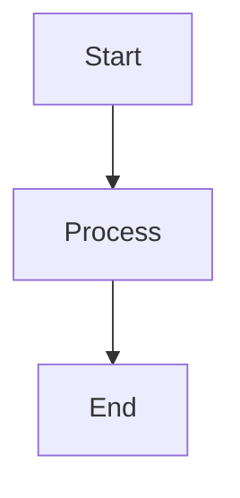
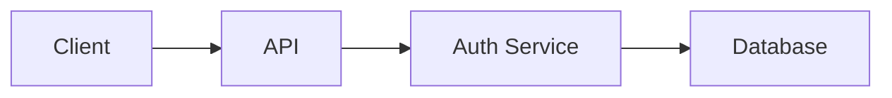

# ClickUp Comment Formatting Guide

## Overview

ClickUp comments support **native markdown** via the `comment_text` field. This is different from some other platforms that use rich text JSON formats.

## Supported Markdown

### Text Formatting
- **Bold**: `**text**` or `__text__`
- *Italic*: `*text*` or `_text_`
- `Inline code`: `` `code` ``
- ~~Strikethrough~~: `~~text~~`

### Headers
```markdown
# H1 Header
## H2 Header
### H3 Header
#### H4 Header
##### H5 Header
###### H6 Header
```

### Lists

**Unordered:**
```markdown
- Item 1
- Item 2
  - Nested item
- Item 3
```

**Ordered:**
```markdown
1. First
2. Second
3. Third
```

### Code Blocks

````markdown
```python
def example():
    print('All lines included')
    print('Including the last line')
    return True
```
````

**Important**: All lines in code blocks are included, including the last line before the closing backticks.

### Links
```markdown
[Link text](https://example.com)
```

### Images
```markdown

```

## API Format

Comments are sent to ClickUp using the `comment_text` field:

```python
{
    "comment_text": "# Header\n\n**Bold** and *italic* text"
}
```

**NOT** as rich text JSON like:
```python
{
    "comment": [
        {"text": "Header", "attributes": {"bold": true}},
        ...
    ]
}
```

## CLI Usage

```bash
# Add comment with markdown
cum ca task_id "## Update\n\n**Status**: Complete\n\nCode:\n\`\`\`python\nprint('done')\n\`\`\`"

# Add from file
cum ca task_id --comment-file comment.md

# With image upload
cum ca task_id "See diagram: {{image:hash}}" --upload-images
```

## Image Embedding

Images can be embedded using the handlebar syntax:

```markdown
Check out this diagram:

{{image:sha256_hash}}

The image above shows...
```

When using `--upload-images`:
1. Images are uploaded to ClickUp as attachments
2. Handlebars are replaced with image markdown: ``
3. Images display inline in the comment

## Mermaid Diagrams

Mermaid diagrams are automatically converted to images (requires Mermaid CLI):

````markdown

````

With `--upload-images`:
1. Mermaid code is converted to PNG image (dark theme by default)
2. Image is uploaded to ClickUp
3. Image handlebar is added above the code block
4. Final comment shows the rendered diagram

### Mermaid Options

```python
# Dark mode (default)
processor.process(content,
    process_mermaid=True,
    theme='dark',
    background_color='transparent'
)

# Other themes: 'default', 'forest', 'neutral'
```

## Task Descriptions vs Comments

| Feature | Task Descriptions | Comments |
|---------|------------------|----------|
| Markdown Support | ✅ via `markdown_description` | ✅ via `comment_text` |
| Format | Plain markdown | Plain markdown |
| Code Blocks | ✅ All lines included | ✅ All lines included |
| Images | ✅ Inline display | ✅ Inline display |
| Mermaid | ✅ With CLI | ✅ With CLI |

## Troubleshooting

### Code Block Missing Last Line
**Problem**: Last line of code block not showing
**Cause**: Rich text JSON was being used instead of plain markdown
**Solution**: Use plain markdown in `comment_text` field (fixed in v1.x)

### Backticks Escaped with Slashes
**Problem**: Seeing `\```python` instead of code block
**Cause**: Rich text JSON format not supported by ClickUp comments
**Solution**: Use plain markdown (fixed in v1.x)

### Images Not Displaying Inline
**Problem**: Images show as links instead of embedded
**Cause**: Images not uploaded before comment creation
**Solution**: Use `--upload-images` flag with comment commands

## Examples

### Complete Example

```bash
# Create comment with all features
cat > comment.md << 'EOF'
## Implementation Complete ✅

### Changes Made
- **Added** user authentication
- **Updated** database schema
- **Fixed** validation bug

### Code Example
```python
def authenticate(user, password):
    """Authenticate user with password."""
    if not user or not password:
        raise ValueError("Credentials required")
    return verify_password(user, password)
```

### Architecture Diagram


**Status**: Ready for review
EOF

# Add to ClickUp
cum ca task_id --comment-file comment.md --upload-images
```

This will:
1. Process markdown formatting
2. Convert mermaid diagram to PNG (dark theme)
3. Upload mermaid image
4. Replace handlebar with image markdown
5. Create comment with inline image

## Best Practices

1. **Use `--upload-images`** when content contains images or mermaid diagrams
2. **Test code blocks** to ensure last line is included
3. **Use dark theme** for mermaid diagrams (better for dark mode UIs)
4. **Prefer markdown** for formatting over HTML
5. **Use handlebars** for images to enable caching and tracking

## API Reference

### Python API
```python
from clickup_framework import ClickUpClient
from clickup_framework.parsers import ContentProcessor, ParserContext

client = ClickUpClient()
processor = ContentProcessor(ParserContext.COMMENT, client=client)

# Process and upload
result = processor.process_and_upload(
    content=markdown_text,
    task_id="task_id",
    format_markdown=True,
    process_mermaid=True
)

# Create comment
client.create_task_comment(task_id, comment_text=result['content'])
```

### CLI
```bash
cum ca <task_id> <text>                    # Add comment
cum ca <task_id> --comment-file <path>     # From file
cum ca <task_id> <text> --upload-images    # With image upload
cum ca <task_id> <text> --skip-mermaid     # Skip mermaid processing
```
