# Mermaid Chart Examples - Comprehensive Reference

This document provides complex examples of all major Mermaid diagram types. Each example demonstrates advanced features and syntax to help you create sophisticated visualizations.

Reference: [Mermaid Documentation](https://mermaid.js.org/intro/)

---

## Table of Contents

1. [Flowcharts](#1-flowcharts)
2. [Sequence Diagrams](#2-sequence-diagrams)
3. [Class Diagrams](#3-class-diagrams)
4. [State Diagrams](#4-state-diagrams)
5. [Entity Relationship Diagrams](#5-entity-relationship-diagrams)
6. [User Journey](#6-user-journey)
7. [Gantt Charts](#7-gantt-charts)
8. [Pie Charts](#8-pie-charts)
9. [Quadrant Charts](#9-quadrant-charts)
10. [Requirement Diagrams](#10-requirement-diagrams)
11. [GitGraph](#11-gitgraph)
12. [Mindmaps](#12-mindmaps)
13. [Timeline](#13-timeline)
14. [Sankey Diagrams](#14-sankey-diagrams)
15. [XY Charts](#15-xy-charts)
16. [Block Diagrams](#16-block-diagrams)

---

## 1. Flowcharts

Complex flowchart demonstrating decision trees, subgraphs, styling, and multiple node shapes.

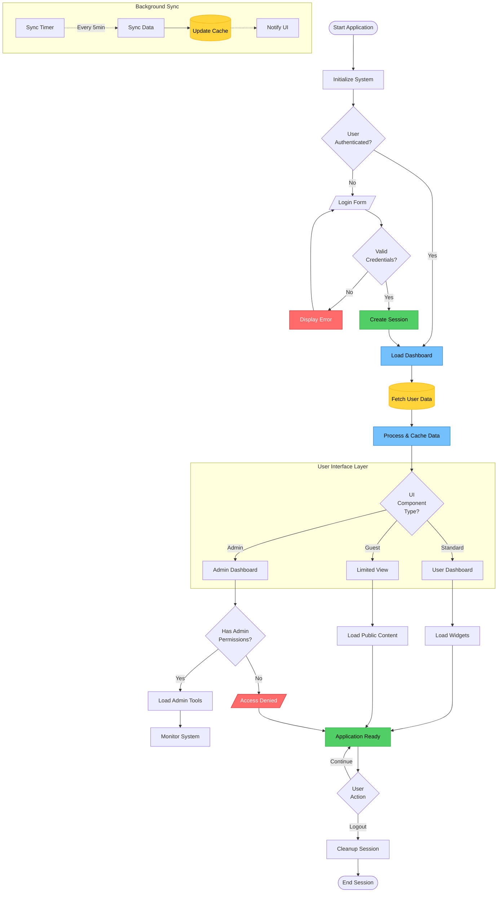

**Key Features:**
- Multiple node shapes: rounded `([])`, rectangle `[]`, decision `{}`, input/output `/\`, database `[([])]`
- Subgraphs for organizing related components
- Dotted lines for async operations `-.->`
- Custom styling with classDef
- Line breaks in labels with `<br/>`

---

## 2. Sequence Diagrams

Complex microservices interaction with loops, alternatives, and parallel execution.

```mermaid
sequenceDiagram
    autonumber
    actor User
    participant Web as Web Client
    participant API as API Gateway
    participant Auth as Auth Service
    participant Order as Order Service
    participant Inventory as Inventory Service
    participant Payment as Payment Service
    participant Queue as Message Queue
    participant Email as Email Service

    User->>+Web: Place Order
    Web->>+API: POST /api/orders

    API->>+Auth: Validate Token
    Auth-->>-API: Token Valid ✓

    rect rgb(200, 220, 250)
        note right of API: Order Processing Flow
        API->>+Order: Create Order
        Order->>Order: Generate Order ID

        par Parallel Validation
            Order->>+Inventory: Check Stock
            Inventory-->>-Order: Stock Available
        and
            Order->>+Payment: Validate Payment Method
            Payment-->>-Order: Payment Method Valid
        end

        alt Stock Available
            Order->>+Inventory: Reserve Items
            Inventory->>Inventory: Lock Inventory
            Inventory-->>-Order: Items Reserved

            Order->>+Payment: Process Payment
            Payment->>Payment: Charge Customer

            alt Payment Successful
                Payment-->>Order: Payment Confirmed
                Order->>Order: Update Order Status: CONFIRMED

                Order->>+Queue: Publish OrderConfirmed Event
                Queue-->>-Order: Event Published

                Order-->>-API: Order Created Successfully
                API-->>-Web: 201 Created {orderId}
                Web-->>-User: Order Confirmation

                Queue->>+Email: OrderConfirmed Event
                Email->>Email: Generate Confirmation Email
                Email->>User: Send Confirmation Email
                deactivate Email

            else Payment Failed
                Payment-->>Order: Payment Failed ✗
                Order->>+Inventory: Release Reserved Items
                Inventory-->>-Order: Items Released
                Order-->>-API: 402 Payment Required
                API-->>-Web: Payment Error
                Web-->>-User: Payment Failed Message
            end

        else Out of Stock
            Inventory-->>Order: Insufficient Stock
            Order-->>-API: 409 Conflict
            API-->>-Web: Out of Stock Error
            Web-->>-User: Product Unavailable
        end
    end

    loop Every 5 minutes
        Order->>Queue: Check Pending Orders
        Queue-->>Order: Pending Order List
        Order->>Order: Process Timeouts
    end

    note over User,Email: All services use distributed tracing<br/>for request monitoring
```

**Key Features:**
- Auto-numbering with `autonumber`
- Actor vs Participant distinction
- Parallel execution with `par/and`
- Alternative paths with `alt/else`
- Loops for recurring actions
- Activation/deactivation boxes with `+/-`
- Rectangle highlights with `rect`
- Notes spanning multiple participants
- Emoji support in messages

---

## 3. Class Diagrams

Complex class hierarchy with multiple relationship types and annotations.

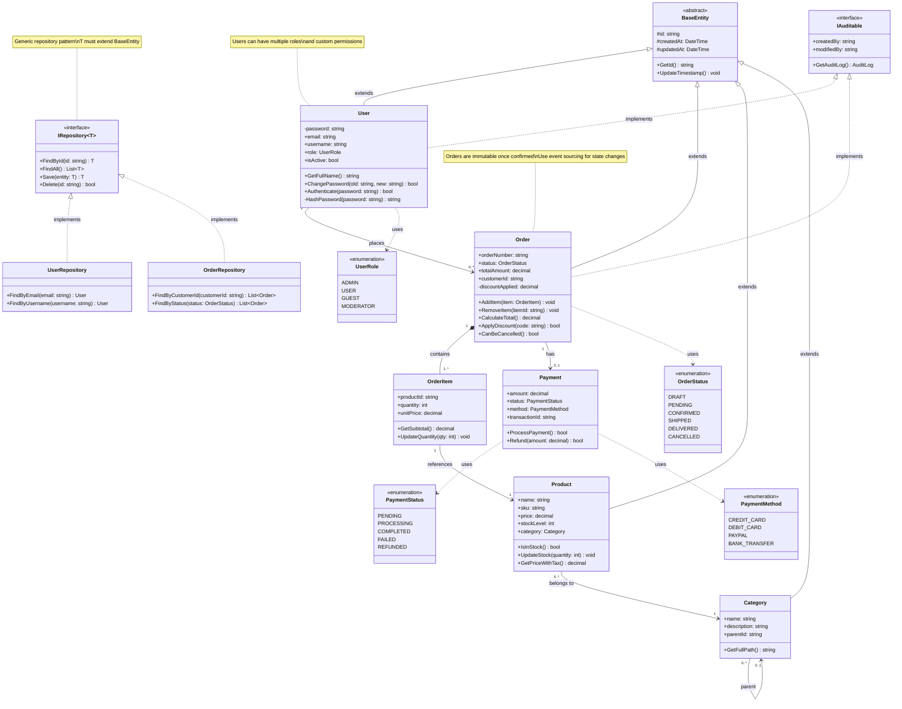

**Key Features:**
- Generic types with `~T~`
- Access modifiers: `+` public, `-` private, `#` protected
- Stereotypes: `<<interface>>`, `<<abstract>>`, `<<enumeration>>`
- Relationship types:
  - Inheritance: `<|--`
  - Implementation: `<|..`
  - Composition: `*--`
  - Aggregation: `o--`
  - Association: `-->`
  - Dependency: `..>`
- Cardinality: `"1"`, `"0..1"`, `"1..*"`, `"0..*"`
- Annotations with notes
- Method and property definitions

---

## 4. State Diagrams

Complex state machine with nested states, parallel states, and transitions.

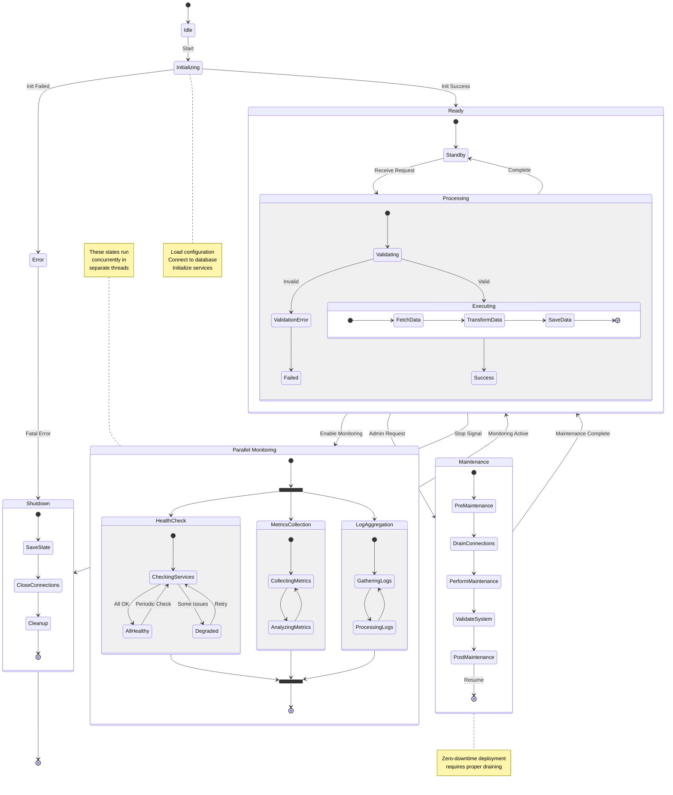

**Key Features:**
- Nested states with composite states
- Parallel states using `<<fork>>` and `<<join>>`
- Directional hints with `direction LR`
- Transition labels
- Notes for documentation
- Entry and exit points `[*]`
- Complex state hierarchies

---

## 5. Entity Relationship Diagrams

Comprehensive database schema with multiple relationship types and attributes.

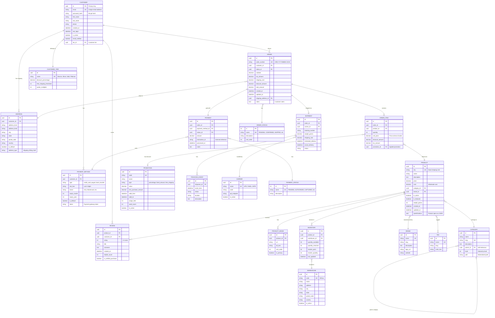

**Key Features:**
- Comprehensive e-commerce database schema
- Relationship types:
  - `||--||` one-to-one
  - `||--o{` one-to-many
  - `}o--||` many-to-one
  - `}o--o{` many-to-many
- Detailed attributes with types and descriptions
- Foreign keys and primary keys marked
- Unique constraints `UK`
- Self-referencing relationships (Category parent)
- Business rules in comments

---

## 6. User Journey

Complex user journey mapping emotional states and touchpoints.

```mermaid
journey
    title E-Commerce Customer Purchase Journey
    section Discovery
      Search for product: 5: Customer
      Browse categories: 4: Customer
      Read reviews: 5: Customer
      Watch product video: 4: Customer, Content Team
      Compare prices: 3: Customer
      Add to wishlist: 4: Customer
    section Consideration
      Check shipping costs: 3: Customer
      Read return policy: 4: Customer
      Look for discount codes: 5: Customer
      Contact support: 3: Customer, Support Team
      Get product recommendations: 4: Customer, AI System
    section Purchase
      Add to cart: 5: Customer
      Apply coupon code: 5: Customer
      Review cart items: 4: Customer
      Enter shipping info: 3: Customer
      Select payment method: 3: Customer
      Confirm payment: 2: Customer, Payment Gateway
      Receive confirmation: 5: Customer, Email Service
    section Fulfillment
      Order processing: 4: Customer, Warehouse Team
      Inventory check: 3: Warehouse Team, Inventory System
      Package preparation: 4: Warehouse Team
      Quality check: 5: Warehouse Team
      Shipment dispatch: 5: Warehouse Team, Carrier
      Track shipment: 4: Customer, Carrier
    section Delivery
      Out for delivery: 4: Customer, Carrier
      Receive package: 5: Customer, Carrier
      Inspect product: 4: Customer
      Test product: 5: Customer
    section Post-Purchase
      Leave review: 5: Customer
      Share on social media: 4: Customer
      Contact support (if needed): 3: Customer, Support Team
      Request return: 2: Customer, Support Team
      Receive refund: 3: Customer, Finance Team
      Loyalty points earned: 5: Customer, Loyalty System
```

**Key Features:**
- Multiple sections representing journey phases
- Emotional scoring (1-5 scale)
- Multiple actors per step
- Cross-functional touchpoints
- End-to-end customer experience mapping

---

## 7. Gantt Charts

Complex project timeline with dependencies, milestones, and resource allocation.

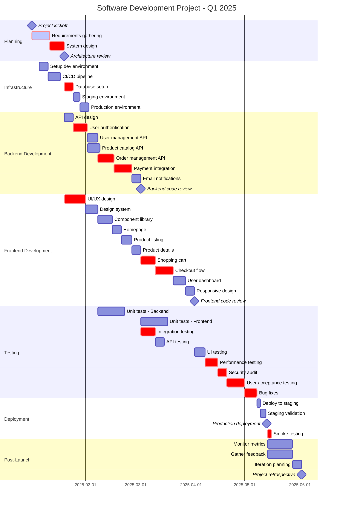

**Key Features:**
- Multiple sections for different workstreams
- Task dependencies using `after` keyword
- Critical path marking with `crit`
- Active tasks with `active`
- Milestones with `milestone`
- Date formatting
- Overlapping parallel tasks
- Resource allocation visibility

---

## 8. Pie Charts

Pie chart showing distribution with detailed labels.

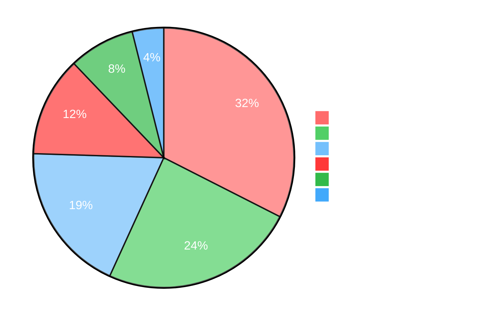

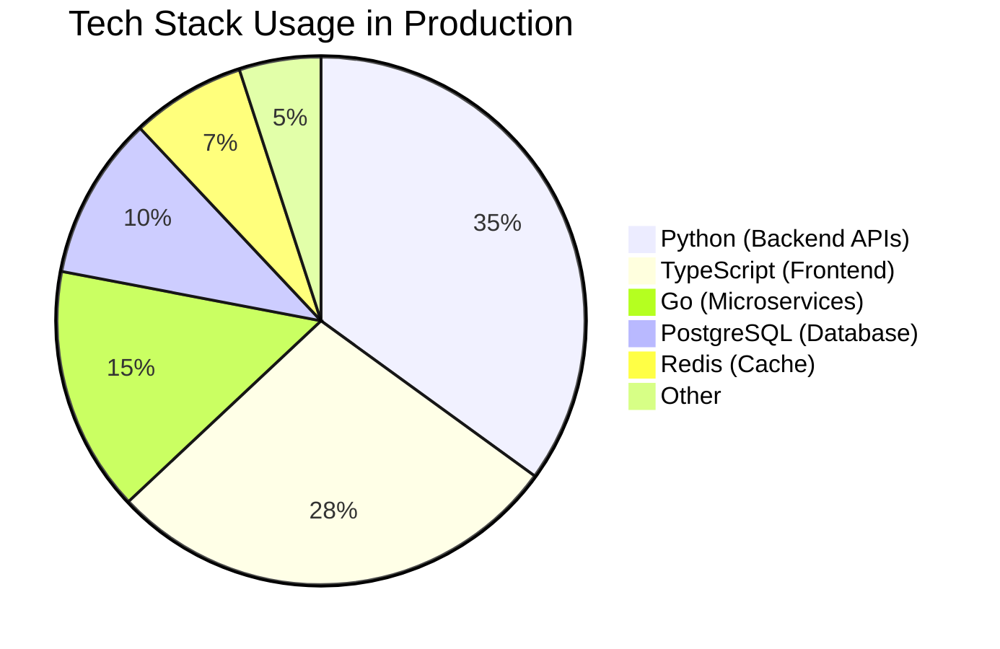

**Key Features:**
- Percentage-based distribution
- Custom theming with init directive
- Clear labeling
- Visual hierarchy

---

## 9. Quadrant Charts

Prioritization matrix for feature development.

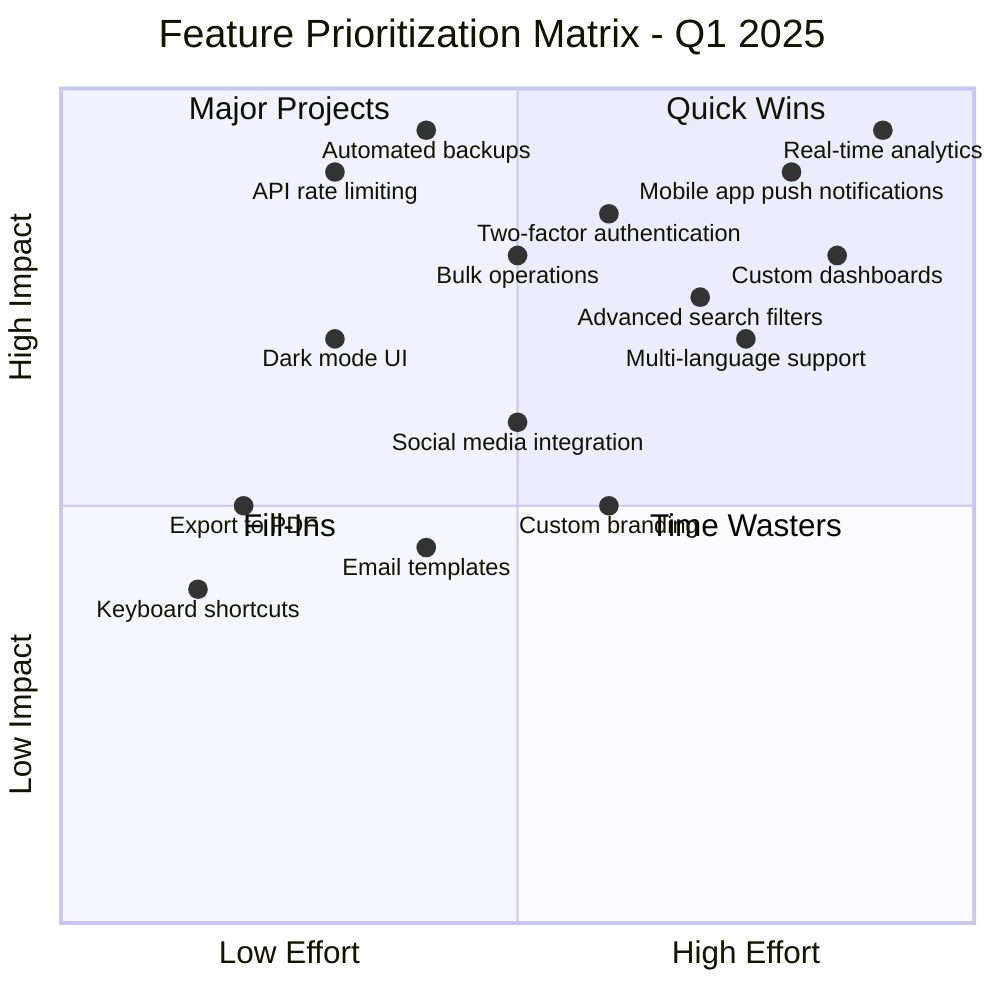

**Key Features:**
- Four-quadrant matrix
- X and Y axis labels
- Quadrant naming
- Coordinate-based positioning [x, y]
- Strategic planning visualization

---

## 10. Requirement Diagrams

Complex requirement relationships and traceability.

```mermaid
requirementDiagram
    requirement user_auth {
        id: FR-001
        text: User Authentication System
        risk: high
        verifymethod: test
    }

    requirement two_factor {
        id: FR-002
        text: Two-Factor Authentication
        risk: medium
        verifymethod: test
    }

    requirement password_policy {
        id: FR-003
        text: Password Complexity Requirements
        risk: medium
        verifymethod: inspection
    }

    requirement session_mgmt {
        id: FR-004
        text: Session Management
        risk: high
        verifymethod: test
    }

    requirement data_encryption {
        id: NFR-001
        text: Data Encryption at Rest
        risk: high
        verifymethod: inspection
    }

    requirement performance {
        id: NFR-002
        text: Response Time < 200ms
        risk: medium
        verifymethod: test
    }

    requirement scalability {
        id: NFR-003
        text: Support 10,000 concurrent users
        risk: high
        verifymethod: test
    }

    functionalRequirement audit_log {
        id: FR-005
        text: Audit Logging
        risk: low
        verifymethod: demonstration
    }

    performanceRequirement api_performance {
        id: NFR-004
        text: API Throughput > 1000 req/s
        risk: medium
        verifymethod: test
    }

    interfaceRequirement rest_api {
        id: IF-001
        text: RESTful API Interface
        risk: low
        verifymethod: inspection
    }

    element auth_service {
        type: service
        docref: docs/auth_service.md
    }

    element database {
        type: database
        docref: docs/database_schema.md
    }

    element load_balancer {
        type: infrastructure
        docref: docs/infrastructure.md
    }

    user_auth - contains -> two_factor
    user_auth - contains -> password_policy
    user_auth - contains -> session_mgmt
    user_auth - contains -> audit_log

    user_auth - satisfies -> data_encryption
    user_auth - satisfies -> performance

    scalability - refines -> performance

    auth_service - satisfies -> user_auth
    auth_service - implements -> rest_api

    database - satisfies -> data_encryption
    load_balancer - satisfies -> scalability
    load_balancer - satisfies -> api_performance
```

**Key Features:**
- Multiple requirement types (functional, performance, interface)
- Risk levels
- Verification methods
- Traceability with relationships:
  - `contains` - decomposition
  - `satisfies` - implementation
  - `refines` - elaboration
  - `implements` - realization
- Element linking to system components

---

## 11. GitGraph

Complex Git branching strategy with releases and hotfixes.

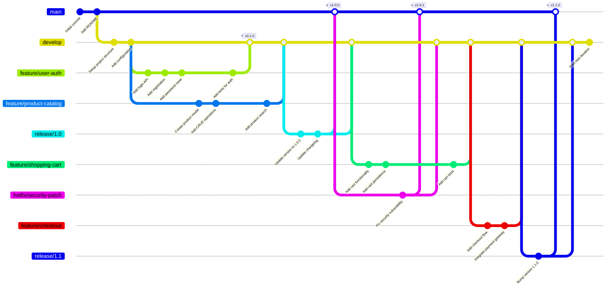

**Key Features:**
- Multiple branch types (feature, release, hotfix)
- Branch merging
- Tagging releases
- GitFlow workflow visualization
- Custom main branch name
- Complex branching patterns

---

## 12. Mindmaps

Hierarchical knowledge organization.

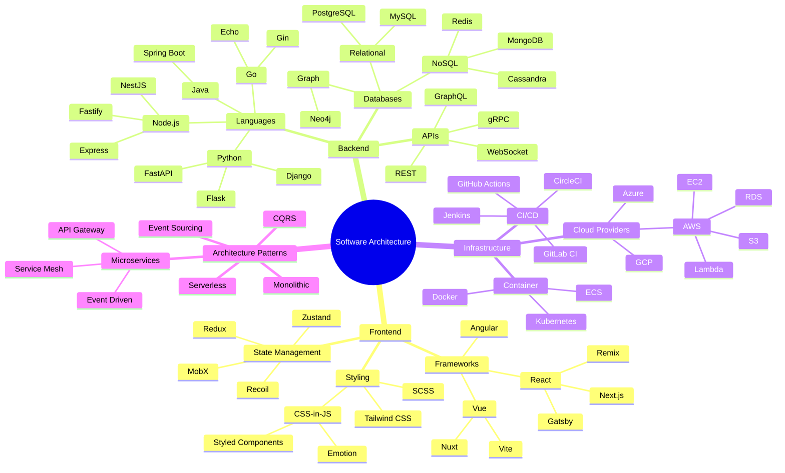

**Key Features:**
- Root node as central concept
- Hierarchical structure
- Multiple levels of nesting
- Radial layout
- Knowledge mapping

---

## 13. Timeline

Historical events and milestones.

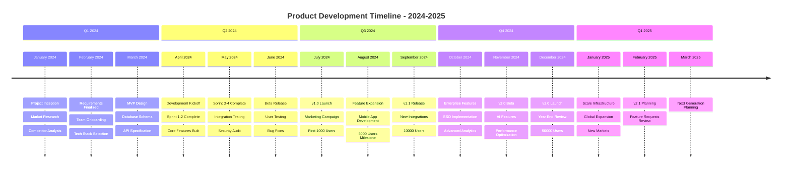

**Key Features:**
- Time-based sections
- Multiple events per period
- Chronological progression
- Milestone tracking
- Historical documentation

---

## 14. Sankey Diagrams

Flow visualization showing quantities and distributions.

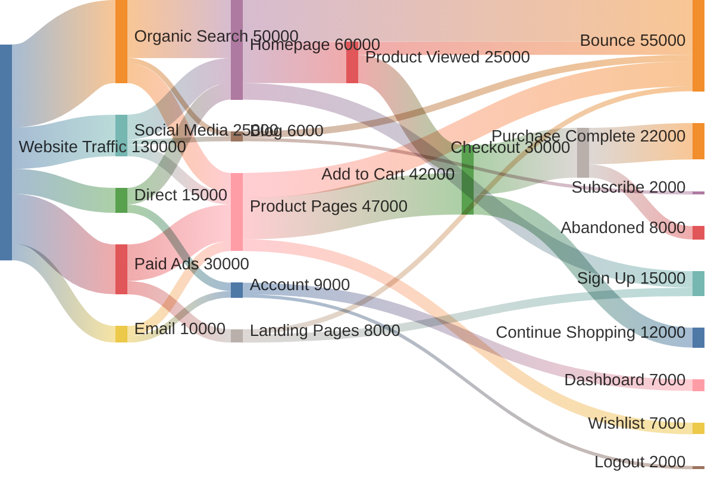

**Key Features:**
- Flow-based visualization
- Quantity representation
- Multi-level flows
- Path analysis
- Conversion funnel visualization

---

## 15. XY Charts

Data plotting with multiple series.

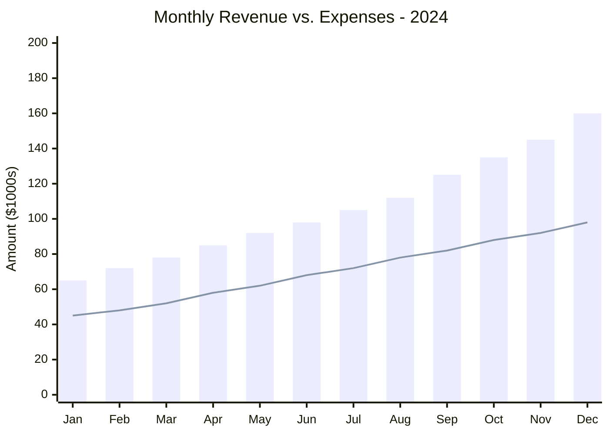

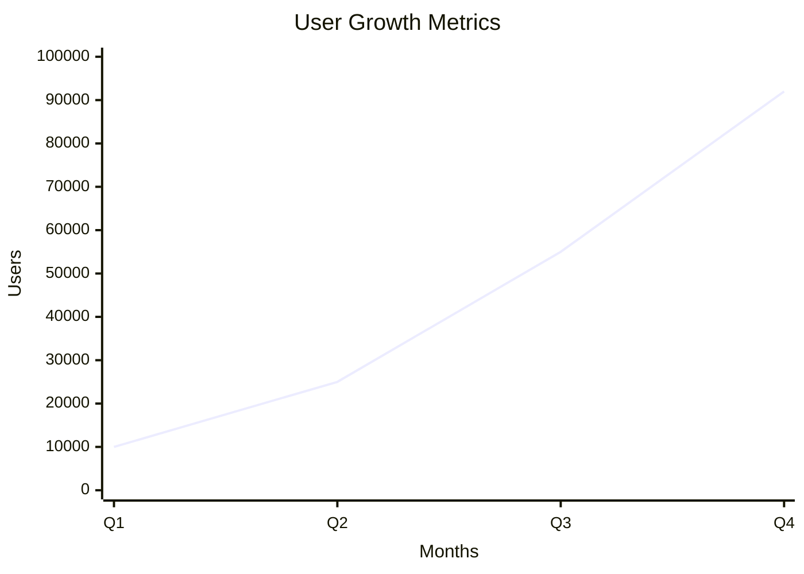

**Key Features:**
- Multiple chart types (bar, line)
- X and Y axis configuration
- Data series
- Quantitative analysis
- Trend visualization

---

## 16. Block Diagrams

System architecture and component relationships.

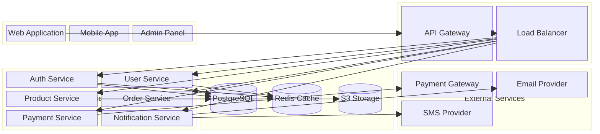

**Key Features:**
- Block-based architecture
- Column layout control
- Nested blocks
- Connection visualization
- System component organization

---

## Usage with ClickUp Framework

All these diagrams can be used with the ClickUp Framework commands:

```bash
# In task descriptions
cum tc "Architecture Docs" --description-file examples.md --upload-images

# In comments
cum ca task_id --comment-file diagram.md --upload-images

# In docs
cum dc "Technical Specs" --content-file specs.md --upload-images
```

For more information, see [MERMAID_DIAGRAMS.md](MERMAID_DIAGRAMS.md).

---

## Testing Your Diagrams

Test diagrams locally before uploading:

```bash
# Render to PNG
mmdc -i diagram.mmd -o output.png

# With dark theme
mmdc -i diagram.mmd -o output.png -t dark -b transparent

# Specify width
mmdc -i diagram.mmd -o output.png -w 1920
```

---

## Resources

- [Official Mermaid Documentation](https://mermaid.js.org/)
- [Mermaid Live Editor](https://mermaid.live/)
- [Mermaid CLI](https://github.com/mermaid-js/mermaid-cli)
- [ClickUp Markdown Reference](MARKDOWN_FORMATTING_GUIDE.md)

---

**Last Updated:** 2025-11-17
**Version:** 1.0.0
