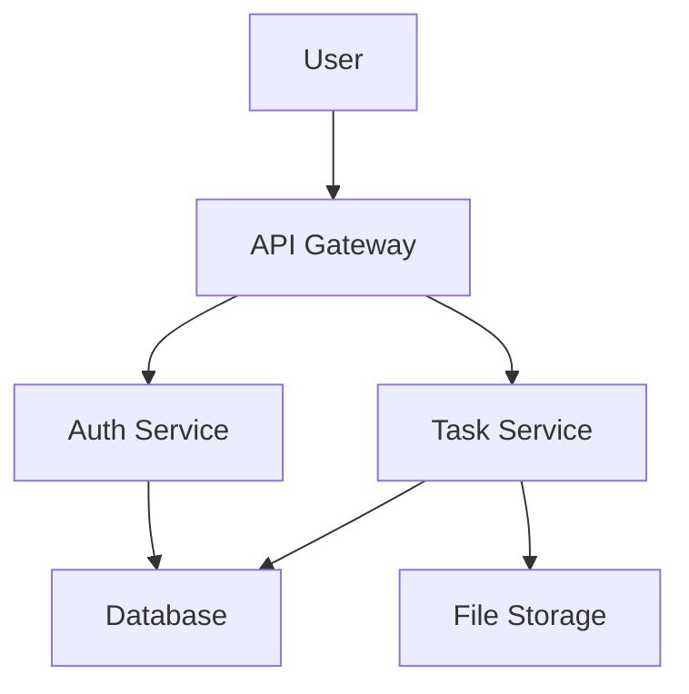
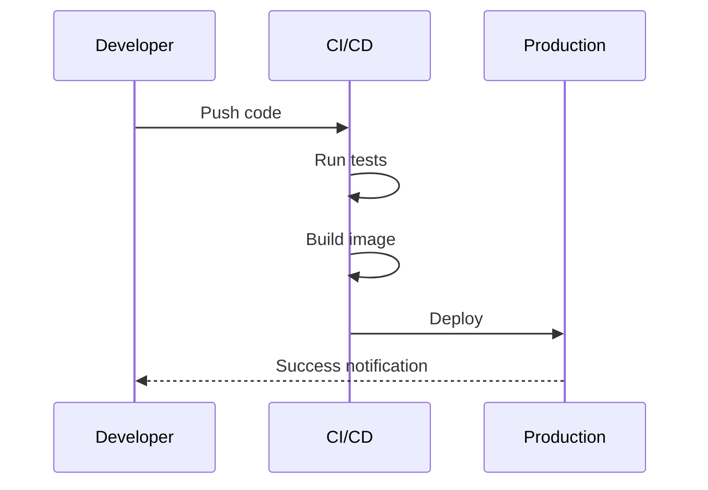
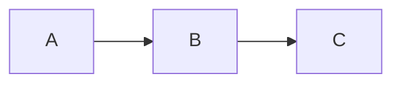
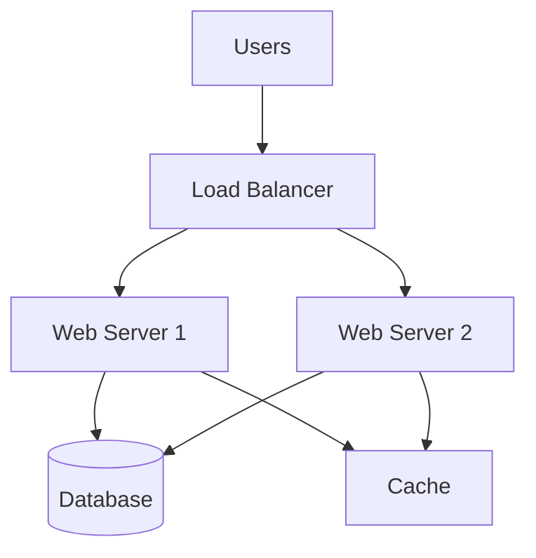
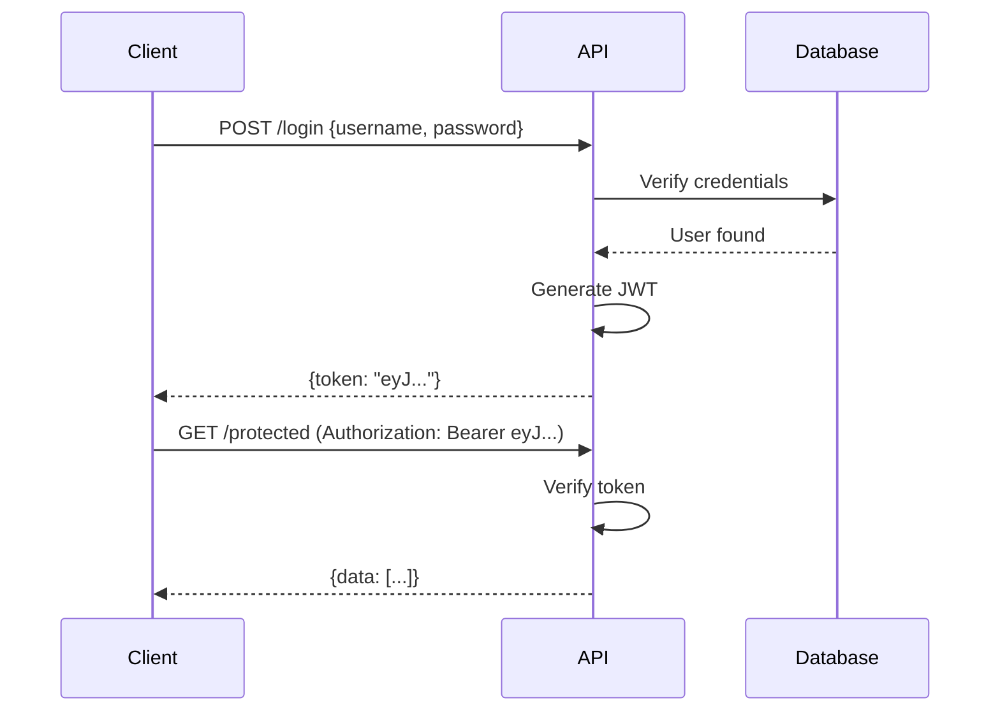
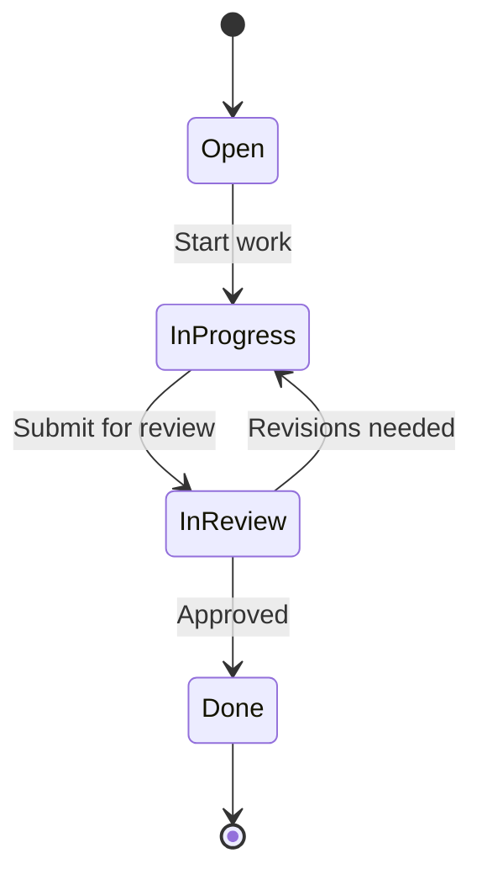
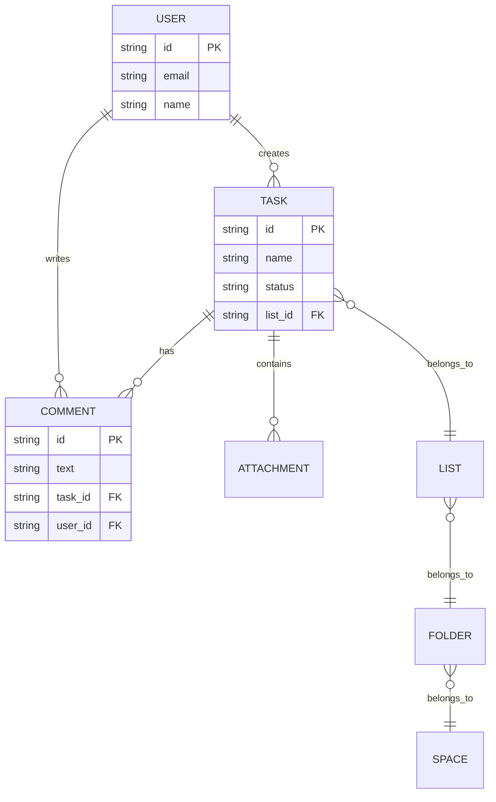
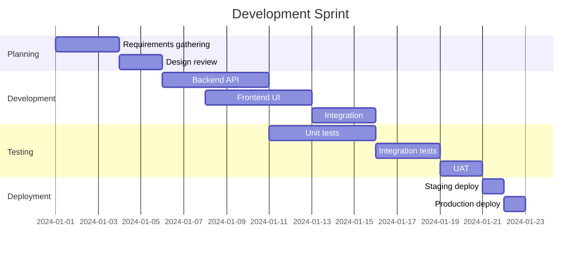

# Mermaid Diagram Upload Guide

## Overview

The ClickUp Framework supports automatic conversion of Mermaid diagrams to images and uploading them to tasks. Diagrams can be embedded in:
- Task descriptions
- Comments
- Docs
- Pages

## Prerequisites

Install Mermaid CLI (mmdc):

```bash
npm install -g @mermaid-js/mermaid-cli
```

Verify installation:

```bash
mmdc --version
```

## Supported Diagram Types

The framework supports all Mermaid diagram types:

### Flowcharts & Graphs
- `graph TD` / `graph TB` - Top-down graph
- `graph LR` - Left-right graph
- `graph BT` - Bottom-top graph
- `graph RL` - Right-left graph
- `flowchart` - Modern flowchart syntax

### Specialized Diagrams
- `sequenceDiagram` - Sequence diagrams
- `classDiagram` - UML class diagrams
- `stateDiagram` / `stateDiagram-v2` - State machines
- `erDiagram` - Entity relationship diagrams
- `journey` - User journey maps
- `gantt` - Gantt charts
- `pie` - Pie charts
- `gitGraph` - Git branching visualization
- `mindmap` - Hierarchical mindmaps
- `timeline` - Historical timelines
- `quadrantChart` - 2x2 matrices
- And more!

See `clickup_framework/utils/mermaid_types.py` for complete list.

## Usage

### In Task Descriptions

```bash
# Create task with mermaid diagram
cum tc "Architecture Review" -d "$(cat architecture.md)" --upload-images

# Update task description with diagrams
cum tu task_id --description "$(cat updated.md)" --upload-images
```

**Example markdown file (architecture.md):**

````markdown
## System Architecture



The architecture uses a microservices approach.
````

### In Comments

```bash
# Add comment with mermaid diagram
cum ca task_id --comment-file diagram.md --upload-images

# With debug output
cum ca task_id --comment-file diagram.md --upload-images --debug
```

**Example comment file (diagram.md):**

````markdown
## Deployment Flow



Deployment takes approximately 10 minutes.
````

### In Docs

```bash
# Create doc with diagrams
cum dc "Technical Documentation" --content-file tech_docs.md --upload-images

# Update doc with diagrams
cum du doc_id --content-file updated_docs.md --upload-images
```

## Theme Options

Mermaid diagrams support multiple themes:

### Dark Mode (Default)
```bash
# Dark theme with transparent background (default)
cum ca task_id --comment-file diagram.md --upload-images
```

This is the default because it works well with both light and dark UIs.

### Other Themes

Themes can be configured in Python API:

```python
from clickup_framework.parsers import ContentProcessor, ParserContext
from clickup_framework import ClickUpClient

client = ClickUpClient()
processor = ContentProcessor(ParserContext.COMMENT, client=client)

result = processor.process(
    content=markdown_with_mermaid,
    process_mermaid=True,
    convert_mermaid_to_images=True,
    theme='forest',  # Options: 'default', 'dark', 'forest', 'neutral'
    background_color='white'  # or 'transparent'
)
```

## How It Works

### Processing Pipeline

1. **Detection**: Markdown parser detects ````mermaid``` code blocks
2. **Conversion**: Mermaid CLI converts diagram to PNG image
3. **Caching**: Image saved to cache with SHA-256 hash
4. **Upload**: Image uploaded to ClickUp task as attachment
5. **Embedding**: Handlebar `{{image:hash}}` replaced with image markdown

### Example Flow

**Input markdown:**
````markdown```mermaidgraph LR
    A --> B
    B --> C```
````**After processing (without upload):**
````markdown
{{image:a1b2c3d4...}}

```mermaidgraph LR
    A --> B
    B --> C
```````**After upload:**
````markdown



````### Cache System

- Images cached in `~/.clickup_framework/image_cache/`
- Filename format: `{sha256_hash}.png`
- Prevents re-generation of identical diagrams
- Cache shared across all tasks

## CLI Options

### Comment Commands

```bash
cum ca <task_id> <text> [options]
cum ca <task_id> --comment-file <path> [options]
```

**Options:**
- `--upload-images` - Upload images to ClickUp
- `--skip-mermaid` - Skip mermaid processing
- `--image-cache <dir>` - Custom cache directory
- `--debug` - Show generated JSON

### Task Update Commands

```bash
cum tu <task_id> --description <text> [options]
cum tu <task_id> --description-file <path> [options]
```

**Options:**
- `--upload-images` - Upload images to ClickUp
- `--skip-mermaid` - Skip mermaid processing
- `--image-cache <dir>` - Custom cache directory

## Examples

### Example 1: System Diagram in Task

```bash
cat > system_diagram.md << 'EOF'
## System Overview



Our infrastructure uses redundant web servers with shared database and cache.
EOF

cum tc "System Architecture" --description-file system_diagram.md --upload-images
```

### Example 2: Sequence Diagram in Comment

```bash
cat > api_flow.md << 'EOF'
## API Authentication Flow



Authentication uses JWT tokens with 24-hour expiration.
EOF

cum ca current --comment-file api_flow.md --upload-images
```

### Example 3: State Machine Diagram

```bash
cat > state_machine.md << 'EOF'
## Task State Machine



Tasks follow a standard workflow from Open to Done.
EOF

cum ca task_id --comment-file state_machine.md --upload-images
```

### Example 4: ER Diagram for Database

```bash
cat > er_diagram.md << 'EOF'
## Database Schema



Core entities and relationships in our system.
EOF

cum ca current --comment-file er_diagram.md --upload-images
```

### Example 5: Gantt Chart

```bash
cat > project_timeline.md << 'EOF'
## Project Timeline



Sprint runs from January 1-22, 2024.
EOF

cum ca current --comment-file project_timeline.md --upload-images
```

## Python API

For programmatic access:

```python
from clickup_framework import ClickUpClient
from clickup_framework.parsers import ContentProcessor, ParserContext

client = ClickUpClient()

# For task descriptions
processor = ContentProcessor(
    context=ParserContext.TASK_DESCRIPTION,
    client=client
)

markdown = """
## Architecture


"""

# Process and upload
result = processor.process_and_upload(
    content=markdown,
    task_id="task_id",
    format_markdown=True,
    process_mermaid=True,
    convert_mermaid_to_images=True,
    theme='dark',
    background_color='transparent'
)

# Update task
client.update_task(
    task_id="task_id",
    markdown_description=result['content']
)

# Check results
if result['upload_results']['uploaded']:
    print(f"Uploaded {len(result['upload_results']['uploaded'])} images")
```

## Troubleshooting

### Mermaid CLI Not Found

**Error:** "Mermaid CLI (mmdc) not found"

**Solution:**
```bash
npm install -g @mermaid-js/mermaid-cli
```

Or set environment variable:
```bash
export MERMAID_CLI_PATH=/path/to/mmdc
```

### Puppeteer Issues

If mmdc fails to install due to Puppeteer:

```bash
# Use puppeteer-core instead
npm install -g @mermaid-js/mermaid-cli --no-sandbox
```

### Image Not Displaying

**Issue:** Image shows as text instead of rendering

**Causes:**
1. `--upload-images` flag not used
2. Images not uploaded before comment/description creation
3. Handlebar not replaced with image URL

**Solution:** Always use `--upload-images` flag when content has diagrams

### Theme Not Applied

**Issue:** Diagram doesn't use dark theme

**Cause:** Theme only configurable via Python API (not CLI yet)

**Workaround:** Use Python script or default dark theme is applied automatically

## Best Practices

1. **Always use --upload-images** when markdown contains diagrams
2. **Use dark theme** (default) for better cross-UI compatibility
3. **Keep diagrams simple** - complex diagrams may not render well at small sizes
4. **Add text descriptions** - Don't rely solely on diagrams
5. **Test locally first** - Verify diagram renders with `mmdc -i test.mmd -o test.png`
6. **Use meaningful names** - Add descriptive text above/below diagrams
7. **Cache is your friend** - Identical diagrams won't be regenerated

## See Also

- [Comment Formatting](COMMENT_FORMAT.md) - General markdown formatting
- [CLI Reference](cli/COMMENT_COMMANDS.md) - Comment command options
- [Image Embedding](IMAGE_EMBEDDING.md) - Image handlebar syntax
- [Mermaid Types](../clickup_framework/utils/mermaid_types.py) - Supported diagram types
