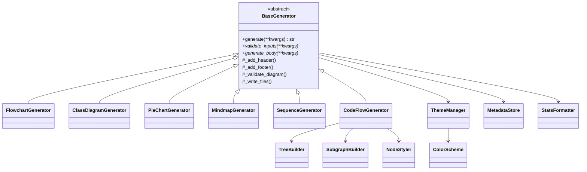
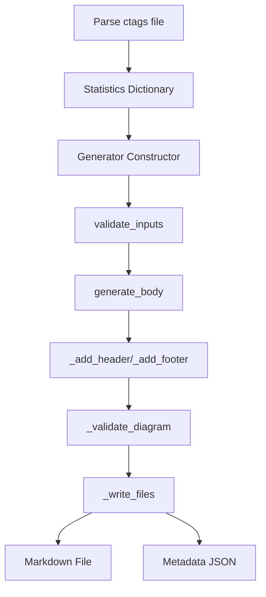

# Mermaid Generators Architecture

## Overview

The Mermaid diagram generators use a modular architecture based on the **Template Method** design pattern. All generators inherit from a common `BaseGenerator` abstract class that defines the workflow for diagram generation.

## Module Structure

```
clickup_framework/commands/map_helpers/mermaid/
├── generators/
│   ├── __init__.py                    # Public exports
│   ├── base_generator.py              # Abstract base class (Template Method)
│   ├── flowchart_generator.py         # Directory structure flowcharts
│   ├── class_diagram_generator.py     # UML class diagrams
│   ├── pie_chart_generator.py         # Language distribution pie charts
│   ├── mindmap_generator.py           # Hierarchical mindmaps
│   ├── sequence_generator.py          # Execution sequence diagrams
│   └── code_flow_generator.py         # Call graph with subgraphs
├── styling/
│   ├── theme_manager.py               # Theme management (dark/light)
│   ├── node_styler.py                 # Node styling utilities
│   └── color_schemes.py               # Color palette definitions
├── core/
│   ├── metadata_store.py              # Metadata export (JSON)
│   ├── node_manager.py                # Node ID management
│   ├── tree_builder.py                # Directory tree construction
│   └── subgraph_builder.py            # Hierarchical subgraph building
├── formatters/
│   ├── label_formatter.py             # Label text formatting
│   └── stats_formatter.py             # Statistics display formatting
├── config/
│   └── generator_config.py            # Generator configuration
└── exceptions.py                       # Custom exceptions

Legacy compatibility wrapper:
clickup_framework/commands/map_helpers/mermaid_generators.py
```

## Design Patterns

### 1. Template Method Pattern (BaseGenerator)

The `BaseGenerator` class defines the skeleton of the diagram generation algorithm:

```python
class BaseGenerator(ABC):
    def generate(self, **kwargs) -> str:
        """Template method defining the generation workflow."""
        try:
            self.validate_inputs(**kwargs)
            self._add_header()
            self.generate_body(**kwargs)
            self._add_footer()
            self._validate_diagram()
            self._write_files()
            return self.output_file
        except Exception as e:
            self._handle_error(e)
            raise

    @abstractmethod
    def validate_inputs(self, **kwargs) -> None:
        """Subclass implements input validation."""
        pass

    @abstractmethod
    def generate_body(self, **kwargs) -> None:
        """Subclass implements diagram body generation."""
        pass
```

**Benefits:**
- Consistent workflow across all generators
- Common functionality (header, footer, validation, file writing) in one place
- Subclasses only implement diagram-specific logic

### 2. Builder Pattern (TreeBuilder, SubgraphBuilder)

Complex diagram structures are built incrementally using builder classes:

```python
builder = TreeBuilder()
builder.set_root("project")
builder.add_child("src", parent="project")
builder.add_child("tests", parent="project")
tree = builder.build()
```

### 3. Strategy Pattern (ThemeManager)

Different styling strategies can be applied via the theme system:

```python
theme_manager = ThemeManager(theme='dark')
node_style = theme_manager.get_node_style('directory')
```

## Class Hierarchy



## Generator Workflow

Each generator follows this standard workflow:

1. **Initialization**: Create generator instance with stats and output file
2. **Validation**: Verify required data exists in stats dictionary
3. **Header Generation**: Add markdown title and opening mermaid fence
4. **Body Generation**: Generate diagram-specific content (implemented by subclass)
5. **Footer Generation**: Add closing fence and statistics section
6. **Diagram Validation**: Verify mermaid syntax is valid
7. **File Writing**: Write markdown file and optional metadata JSON

## Data Flow



## Statistics Dictionary Format

All generators expect a statistics dictionary from the ctags parser:

```python
stats = {
    'total_symbols': 150,
    'files_analyzed': 10,
    'by_language': {
        'Python': {'function': 50, 'class': 20},
        'JavaScript': {'function': 40, 'class': 15}
    },
    'symbols_by_file': {
        '/path/to/file.py': [
            {'name': 'func1', 'kind': 'function', 'language': 'Python'},
            {'name': 'MyClass', 'kind': 'class', 'language': 'Python'}
        ]
    },
    'all_symbols': {
        'Module.func1': {'name': 'func1', 'scope': 'Module', 'kind': 'function'},
        'Module.MyClass': {'name': 'MyClass', 'scope': 'Module', 'kind': 'class'}
    },
    'function_calls': {
        'Module.main': ['Module.helper', 'Utils.process'],
        'Module.helper': []
    }
}
```

## Configuration System

Generators can be configured via `generator_config.py`:

```python
@dataclass
class GeneratorConfig:
    class FlowchartConfig:
        max_depth: int = 3
        show_symbols: bool = True

    class CodeFlowConfig:
        max_nodes: int = 80
        max_depth: int = 8
        include_orphans: bool = True
```

## Theme System

The theme system provides consistent styling across all generators:

- **Dark Theme**: Designed for dark backgrounds (default)
- **Light Theme**: Designed for light backgrounds
- **Custom Themes**: Create custom `ColorScheme` instances

See [THEMES.md](THEMES.md) and [THEME_CUSTOMIZATION.md](THEME_CUSTOMIZATION.md) for details.

## Error Handling

All generators use a consistent error handling approach:

- **DataValidationError**: Raised when required stats data is missing
- **FileOperationError**: Raised when file operations fail
- **MermaidValidationError**: Raised when generated diagram has invalid syntax

Errors are caught in the template method and logged with helpful context.

## Extension Points

To add a new generator type:

1. Create new file in `generators/` directory
2. Inherit from `BaseGenerator`
3. Implement `validate_inputs()` and `generate_body()` methods
4. Export from `generators/__init__.py`
5. Add wrapper function to `mermaid_generators.py` (optional, for backward compatibility)
6. Create comprehensive tests in `tests/commands/map_helpers/`

See [ADDING_GENERATORS.md](ADDING_GENERATORS.md) for detailed guide.

## Testing Strategy

- **Unit Tests**: Test each generator class independently
- **Integration Tests**: Test complete generation workflow with real stats data
- **Edge Case Tests**: Test empty data, max limits, special characters
- **Regression Tests**: Ensure output matches previous versions

Target: 90%+ code coverage across all modules.

## Performance Considerations

- **Lazy Loading**: Generators only process data they need
- **Incremental Building**: Use builders for complex structures
- **Caching**: ThemeManager caches color schemes
- **Limits**: Maximum nodes/depth limits prevent runaway generation

## Future Enhancements

- Additional diagram types (gantt, git graph, entity-relationship)
- Interactive diagrams with click handlers
- SVG export in addition to markdown
- Incremental regeneration (only update changed files)
- Custom diagram templates
