# Code Map Diagram

```mermaid
graph TB
    L0[Unknown]

    F0["cli-ref.md<br/>chapter:1, section:9, subsection:16"]
    L0 --> F0
    F1["coder-workflow.md<br/>chapter:1, section:12, subsection:27"]
    L0 --> F1
    F2["cum.md<br/>section:16, subsection:3"]
    L0 --> F2
    F3["fix-bug.md<br/>chapter:1, section:11, subsection:5"]
    L0 --> F3
    F4["investigate-bug.md<br/>chapter:1, section:8, subsection:5"]
    L0 --> F4
    F5["refine-workflows.md<br/>chapter:8, section:13, subsection:24"]
    L0 --> F5
    F6["workflow.md<br/>chapter:1, section:7, subsection:9"]
    L0 --> F6
    F7["settings.json<br/>array:2, object:3, string:2"]
    L0 --> F7
    F8["settings.local.json<br/>array:3, object:1, string:9"]
    L0 --> F8
    F9["skill.md<br/>chapter:1, section:19, subsection:9"]
    L0 --> F9
    F10["skill.md<br/>chapter:1, section:12, subsection:18"]
    L0 --> F10
    F11["skill.md<br/>chapter:1, section:10, subsection:10"]
    L0 --> F11
    F12["README.md<br/>chapter:1, section:2, subsection:6, subsubsection:3"]
    L0 --> F12
    F13["copilot-instructions.md<br/>chapter:1, section:15, subsection:32"]
    L0 --> F13
    F14["copilot-settings.md<br/>chapter:1, section:1, subsection:5"]
    L0 --> F14
    F15["BENCHMARKS.md<br/>chapter:1, section:7, subsection:9"]
    L0 --> F15
    F16["CLICKUP.md<br/>chapter:1, section:27, subsection:78, subsubsection:15"]
    L0 --> F16
    F17["CLI_COMMAND_REFERENCE.md<br/>chapter:1, section:7, subsection:15, subsubsection:43"]
    L0 --> F17
    F18["COMMAND_REFERENCE.md<br/>chapter:1, section:16, subsection:3"]
    L0 --> F18
    F19["CTAGS_INTEGRATION_EXAMPLE.md<br/>chapter:1, section:13, subsection:5"]
    L0 --> F19
```

## Statistics

- **Total Symbols**: 30520
- **Files Analyzed**: 349
- **Languages**: 1

### By Language

- **Unknown**: 30520 symbols
  - array: 2275
  - boolean: 1792
  - chapter: 106
  - class: 272
  - console: 3
  - def: 18
  - function: 627
  - hashtag: 2
  - heredoc: 19
  - id: 182
  - key: 3
  - l4subsection: 8
  - label: 3
  - member: 1458
  - namespace: 2
  - nsprefix: 136
  - null: 879
  - number: 1351
  - object: 6667
  - section: 951
  - string: 11776
  - subsection: 1386
  - subsubsection: 245
  - unknown: 6
  - variable: 353