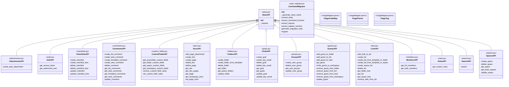

# Code Map - Class Diagram

```mermaid
classDiagram
    class AttachmentsAPI {
        <<attachments.py>>
        -create_task_attachment
    }
    class AuthAPI {
        <<auth.py>>
        -get_access_token
        -get_authorized_user
    }
    class BaseAPI {
        <<base.py>>
        -__init__
        -_request
    }
    class ChecklistsAPI {
        <<checklists.py>>
        -create_checklist
        -create_checklist_item
        -delete_checklist
        -delete_checklist_item
        -update_checklist
        -update_checklist_item
    }
    class CommandMigrator {
        <<auto_migrate.py>>
        -__init__
        -_generate_class_name
        -convert_body
        -extract_command_function
        -extract_imports
        -extract_register_function
        -generate_migrated_code
        -migrate
    }
    class CommentsAPI {
        <<comments.py>>
        -create_list_comment
        -create_task_comment
        -create_threaded_comment
        -create_view_comment
        -delete_comment
        -get_list_comments
        -get_task_comments
        -get_threaded_comments
        -get_view_comments
        -update_comment
    }
    class CtagsCodeMap {
        <<CtagsMapper.psm1>>
    }
    class CtagsParser {
        <<CtagsMapper.psm1>>
    }
    class CtagsTag {
        <<CtagsMapper.psm1>>
    }
    class CustomFieldsAPI {
        <<custom_fields.py>>
        -get_accessible_custom_fields
        -get_folder_custom_fields
        -get_space_custom_fields
        -get_workspace_custom_fields
        -remove_custom_field_value
        -set_custom_field_value
    }
    class DocsAPI {
        <<docs.py>>
        -add_page_attachment
        -create_doc
        -create_page
        -delete_doc
        -delete_page
        -get_doc
        -get_doc_pages
        -get_page
        -get_workspace_docs
        -set_page_color
    }
    class FoldersAPI {
        <<folders.py>>
        -create_folder
        -create_folder_from_template
        -delete_folder
        -get_folder
        -get_space_folders
        -update_folder
    }
    class GoalsAPI {
        <<goals.py>>
        -create_goal
        -create_key_result
        -delete_goal
        -delete_key_result
        -get_goal
        -get_goals
        -update_goal
        -update_key_result
    }
    class GroupsAPI {
        <<groups.py>>
        -create_user_group
        -delete_user_group
        -get_user_groups
        -update_user_group
    }
    class GuestsAPI {
        <<guests.py>>
        -add_guest_to_folder
        -add_guest_to_list
        -add_guest_to_task
        -get_guest
        -invite_guest_to_workspace
        -remove_guest_from_folder
        -remove_guest_from_list
        -remove_guest_from_task
        -remove_guest_from_workspace
        -update_guest
    }
    class ListsAPI {
        <<lists.py>>
        -add_task_to_list
        -create_list
        -create_list_from_template_in_folder
        -create_list_from_template_in_space
        -create_space_list
        -delete_list
        -get_folder_lists
        -get_list
        -get_space_lists
        -remove_task_from_list
    }
    class MembersAPI {
        <<members.py>>
        -get_list_members
        -get_task_members
    }
    class RolesAPI {
        <<roles.py>>
        -get_custom_roles
    }
    class SearchAPI {
        <<search.py>>
        -search
    }
    class SpacesAPI {
        <<spaces.py>>
        -create_space
        -delete_space
        -get_space
        -get_team_spaces
        -update_space
    }

    %% Inheritance relationships
    BaseAPI <|-- AttachmentsAPI
    BaseAPI <|-- AuthAPI
    BaseAPI <|-- ChecklistsAPI
    BaseAPI <|-- CommentsAPI
    BaseAPI <|-- CustomFieldsAPI
    BaseAPI <|-- DocsAPI
    BaseAPI <|-- FoldersAPI
    BaseAPI <|-- GoalsAPI
    BaseAPI <|-- GroupsAPI
    BaseAPI <|-- GuestsAPI
    BaseAPI <|-- ListsAPI
    BaseAPI <|-- MembersAPI
    BaseAPI <|-- RolesAPI
    BaseAPI <|-- SearchAPI
    BaseAPI <|-- SpacesAPI
```

## Statistics

- **Total Symbols**: 30536
- **Files Analyzed**: 352
- **Languages**: 1