# Code Map - Architecture Diagram

```mermaid
graph TB
    DIR0[".claude<br/>22 symbols"]
    style DIR0 fill:#1e3a8a,stroke:#60a5fa,stroke-width:3px
    DIR1[".claude/commands<br/>178 symbols"]
    style DIR1 fill:#1e3a8a,stroke:#60a5fa,stroke-width:3px
    DIR2[".claude/skills/cli-reference<br/>29 symbols"]
    style DIR2 fill:#1e3a8a,stroke:#60a5fa,stroke-width:3px
    DIR3[".claude/skills/setup-guide<br/>31 symbols"]
    style DIR3 fill:#1e3a8a,stroke:#60a5fa,stroke-width:3px
    DIR4[".claude/skills/workflow<br/>21 symbols"]
    style DIR4 fill:#1e3a8a,stroke:#60a5fa,stroke-width:3px
    DIR5[".github<br/>67 symbols"]
    style DIR5 fill:#1e3a8a,stroke:#60a5fa,stroke-width:3px
    DIR6["clickup_framework<br/>293 symbols"]
    style DIR6 fill:#1e3a8a,stroke:#60a5fa,stroke-width:3px
    DIR7["clickup_framework.egg-info<br/>7 symbols"]
    style DIR7 fill:#1e3a8a,stroke:#60a5fa,stroke-width:3px
    DIR8["apis<br/>177 symbols"]
    style DIR8 fill:#1e3a8a,stroke:#60a5fa,stroke-width:3px
    DIR9["automation<br/>44 symbols"]
    style DIR9 fill:#1e3a8a,stroke:#60a5fa,stroke-width:3px

    F0["settings.local.json<br/>15 symbols"]
    DIR0 --> F0
    F1["settings.json<br/>7 symbols"]
    DIR0 --> F1
    F2["refine-workflows.md<br/>45 symbols"]
    DIR1 --> F2
    F3["coder-workflow.md<br/>40 symbols"]
    DIR1 --> F3
    F4["cli-ref.md<br/>26 symbols"]
    DIR1 --> F4
    F5["cum.md<br/>19 symbols"]
    DIR1 --> F5
    F6["workflow.md<br/>17 symbols"]
    DIR1 --> F6
    F7["skill.md<br/>29 symbols"]
    DIR2 --> F7
    F8["skill.md<br/>31 symbols"]
    DIR3 --> F8
    F9["skill.md<br/>21 symbols"]
    DIR4 --> F9
    F10["copilot-instructions.md<br/>48 symbols"]
    DIR5 --> F10
    F11["README.md<br/>12 symbols"]
    DIR5 --> F11
    F12["copilot-settings.md<br/>7 symbols"]
    DIR5 --> F12
    F13["client.py<br/>📦 1 classes<br/>📊 156 vars"]
    DIR6 --> F13
    C13_0["ClickUpClient<br/>0 methods"]
    style C13_0 fill:#065f46,stroke:#34d399
    F13 --> C13_0
    F14["mcp_server.py<br/>⚙️ 38 funcs<br/>📊 3 vars"]
    DIR6 --> F14
    F15["context.py<br/>📦 1 classes<br/>⚙️ 1 funcs<br/>📊 34 vars"]
    DIR6 --> F15
    C15_0["ContextManager<br/>0 methods"]
    style C15_0 fill:#065f46,stroke:#34d399
    F15 --> C15_0
    F16["cli.py<br/>📦 1 classes<br/>⚙️ 9 funcs<br/>📊 6 vars"]
    DIR6 --> F16
    C16_0["ImprovedArgumentParser<br/>0 methods"]
    style C16_0 fill:#065f46,stroke:#34d399
    F16 --> C16_0
    F17["exceptions.py<br/>📦 7 classes<br/>📊 4 vars"]
    DIR6 --> F17
    F18["entry_points.txt<br/>7 symbols"]
    DIR7 --> F18
    F19["tasks.py<br/>📦 1 classes<br/>📊 14 vars"]
    DIR8 --> F19
    C19_0["TasksAPI<br/>0 methods"]
    style C19_0 fill:#065f46,stroke:#34d399
    F19 --> C19_0
    F20["time_tracking.py<br/>📦 1 classes<br/>📊 13 vars"]
    DIR8 --> F20
    C20_0["TimeTrackingAPI<br/>0 methods"]
    style C20_0 fill:#065f46,stroke:#34d399
    F20 --> C20_0
    F21["docs.py<br/>📦 1 classes<br/>📊 12 vars"]
    DIR8 --> F21
    C21_0["DocsAPI<br/>0 methods"]
    style C21_0 fill:#065f46,stroke:#34d399
    F21 --> C21_0
    F22["views.py<br/>📦 1 classes<br/>📊 12 vars"]
    DIR8 --> F22
    C22_0["ViewsAPI<br/>0 methods"]
    style C22_0 fill:#065f46,stroke:#34d399
    F22 --> C22_0
    F23["lists.py<br/>📦 1 classes<br/>📊 11 vars"]
    DIR8 --> F23
    C23_0["ListsAPI<br/>0 methods"]
    style C23_0 fill:#065f46,stroke:#34d399
    F23 --> C23_0
    F24["config.py<br/>📦 1 classes<br/>⚙️ 4 funcs<br/>📊 13 vars"]
    DIR9 --> F24
    C24_0["AutomationConfig<br/>0 methods"]
    style C24_0 fill:#065f46,stroke:#34d399
    F24 --> C24_0
    F25["models.py<br/>📦 2 classes<br/>📊 8 vars"]
    DIR9 --> F25
    C25_0["ParentUpdateResult<br/>0 methods"]
    style C25_0 fill:#065f46,stroke:#34d399
    F25 --> C25_0
    C25_1["TaskUpdateEvent<br/>0 methods"]
    style C25_1 fill:#065f46,stroke:#34d399
    F25 --> C25_1
    F26["parent_updater.py<br/>📦 1 classes<br/>📊 7 vars"]
    DIR9 --> F26
    C26_0["ParentTaskAutomationEngine<br/>0 methods"]
    style C26_0 fill:#065f46,stroke:#34d399
    F26 --> C26_0
    F27["status_matcher.py<br/>📦 1 classes<br/>📊 6 vars"]
    DIR9 --> F27
    C27_0["StatusMatcher<br/>0 methods"]
    style C27_0 fill:#065f46,stroke:#34d399
    F27 --> C27_0
    F28["__init__.py<br/>📊 1 vars"]
    DIR9 --> F28
```

## Statistics

- **Total Symbols**: 30536
- **Files Analyzed**: 352
- **Languages**: 1

### By Language

- **Unknown**: 30536 symbols
  - array: 2275
  - boolean: 1792
  - chapter: 110
  - class: 270
  - console: 3
  - def: 18
  - function: 628
  - hashtag: 2
  - heredoc: 19
  - id: 183
  - key: 3
  - l4subsection: 8
  - label: 3
  - member: 1455
  - namespace: 2
  - nsprefix: 138
  - null: 879
  - number: 1351
  - object: 6667
  - section: 952
  - string: 11778
  - subsection: 1386
  - subsubsection: 255
  - unknown: 6
  - variable: 353