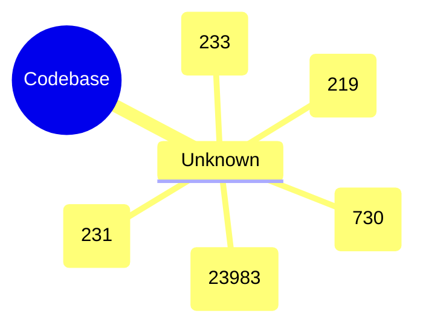

# Mindmap

## Statistics

- **Total Symbols**: 33598
- **Files Analyzed**: 491
- **Languages**: 1

### By Language

- **Unknown**: 33598 symbols
  - array: 2277
  - boolean: 1872
  - chapter: 142
  - class: 356
  - def: 18
  - function: 695
  - hashtag: 9
  - heading1: 49
  - heading2: 66
  - heading3: 57
  - heredoc: 19
  - id: 883
  - l4subsection: 8
  - label: 3
  - member: 1794
  - namespace: 2
  - nsprefix: 138
  - null: 879
  - number: 1521
  - object: 6755
  - play: 2
  - section: 1133
  - string: 12179
  - subsection: 1751
  - subsubsection: 531
  - unknown: 6
  - variable: 453