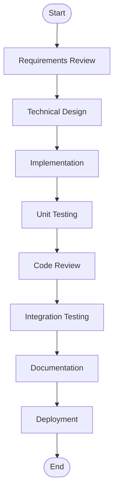
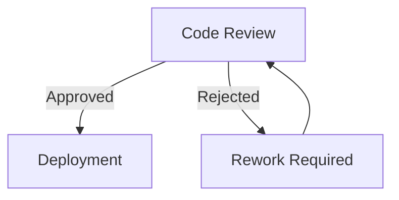
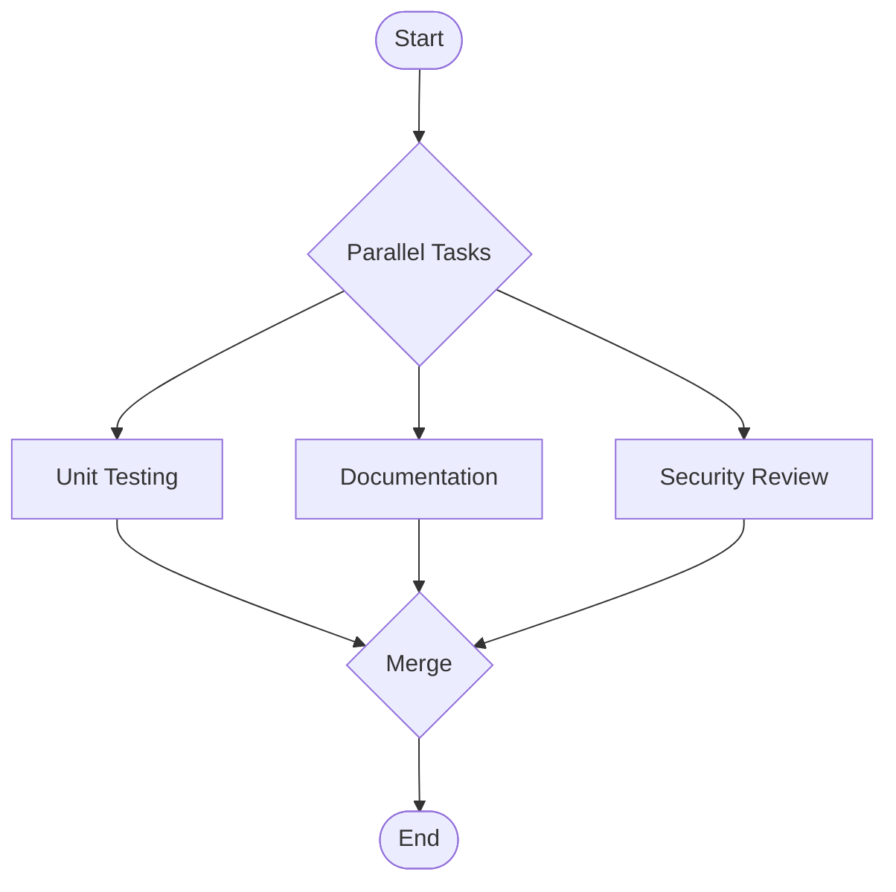
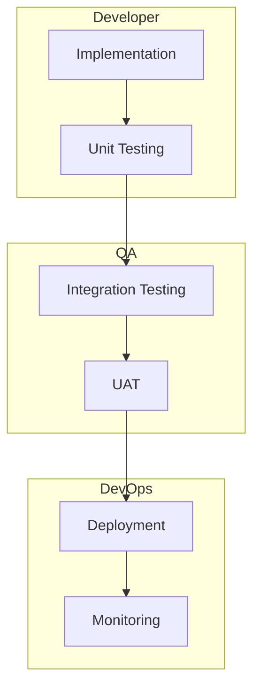

# ClickUp Task Templates - Complete Collection

## Summary

Created comprehensive task templates for all missing ClickUp task types. Each template includes detailed sections for tracking, documentation, and workflow management.

## Created Templates

### 1. Core Management Templates
- **Goal.md** - Strategic goal tracking with OKRs
- **Project.md** - Comprehensive project management
- **Objective.md** - OKR-based objective tracking
- **User_Story.md** - Agile user story management

### 2. Requirements & Specifications
- **Requirement.md** - Detailed requirement documentation
- **Test_Result.md** - QA test execution results

### 3. Development & CI/CD
- **Pull_Request.md** - PR tracking and review
- **Warning.md** - Build warning tracking
- **Error.md** - Error and exception management

### 4. Knowledge & Content
- **Lesson_Learned.md** - Knowledge capture and sharing
- **Content.md** - Content management and publishing
- **Resource.md** - Resource and asset management

### 5. Service & Support
- **Request.md** - Service request tracking

## Workflow JSON Structure

The `clickup_task_workflows.json` file contains 10 unique workflows for each task type. Each workflow can be converted to a Mermaid flowchart.

### Example Mermaid Conversion

```javascript
// Function to convert workflow to Mermaid
function workflowToMermaid(workflow) {
  let mermaid = 'graph TD\n';
  const steps = workflow.steps;
  
  for (let i = 0; i < steps.length; i++) {
    const currentStep = steps[i].replace(/\s+/g, '_');
    
    if (i === 0) {
      mermaid += `    Start([Start]) --> ${currentStep}[${steps[i]}]\n`;
    } else {
      const prevStep = steps[i-1].replace(/\s+/g, '_');
      mermaid += `    ${prevStep} --> ${currentStep}[${steps[i]}]\n`;
    }
    
    if (i === steps.length - 1) {
      mermaid += `    ${currentStep} --> End([End])\n`;
    }
  }
  
  return mermaid;
}
```

### Sample Mermaid Output



## How to Use the Workflows

### 1. Load the JSON
```javascript
const workflows = require('./clickup_task_workflows.json');
```

### 2. Select a Task Type
```javascript
const codingWorkflows = workflows.taskWorkflows.codingTask;
const bugFixWorkflows = workflows.taskWorkflows.bugFix;
// etc...
```

### 3. Generate Mermaid Diagrams
```javascript
codingWorkflows.workflows.forEach(workflow => {
  const mermaidDiagram = workflowToMermaid(workflow);
  console.log(`Workflow: ${workflow.name}`);
  console.log(mermaidDiagram);
});
```

### 4. Customize for Your Needs
- Add decision points
- Include parallel processes
- Add swimlanes for roles
- Include timing annotations

## Advanced Mermaid Features

### Decision Points


### Parallel Processes


### Swimlanes


## Template Categories

### By Complexity
- **Simple** (2-3 sections): Warning, Error
- **Standard** (4-6 sections): Request, Resource, Content
- **Complex** (7+ sections): Project, Goal, User Story, Test Result

### By Frequency
- **Daily Use**: Coding Task, Bug Fix, Pull Request
- **Weekly Use**: User Story, Test Result, Deployment
- **Monthly Use**: Project, Goal, Objective
- **As Needed**: Lesson Learned, Database Migration, Performance

### By Team
- **Development**: Coding Task, Bug Fix, Pull Request
- **QA**: Test Result, Bug Fix, User Story
- **Product**: Feature Request, User Story, Goal
- **DevOps**: Deployment, Database Migration, Error
- **Management**: Project, Objective, Goal

## Integration Tips

### With ClickUp API
```javascript
// Create task with template
const createTaskWithTemplate = async (templateType, taskData) => {
  const template = await loadTemplate(templateType);
  const populatedTemplate = populateTemplate(template, taskData);
  
  const task = await clickup.createTask({
    name: taskData.name,
    description: populatedTemplate,
    custom_fields: extractCustomFields(taskData)
  });
  
  return task;
};
```

### With Automation
- Set up webhooks for task creation
- Auto-populate templates based on task type
- Generate workflows from task dependencies
- Create reports from completed templates

## Best Practices

### Template Selection
1. Match complexity to task needs
2. Use minimal templates for simple tasks
3. Reserve comprehensive templates for complex work
4. Customize sections as needed

### Workflow Management
1. Start with standard workflows
2. Customize for team processes
3. Document deviations
4. Regular workflow reviews

### Documentation Standards
1. Keep templates updated
2. Version control templates
3. Train team on usage
4. Regular template audits

## Files Created

1. `/mnt/user-data/outputs/Goal.md`
2. `/mnt/user-data/outputs/Project.md`
3. `/mnt/user-data/outputs/User_Story.md`
4. `/mnt/user-data/outputs/Objective.md`
5. `/mnt/user-data/outputs/Requirement.md`
6. `/mnt/user-data/outputs/Test_Result.md`
7. `/mnt/user-data/outputs/Warning.md`
8. `/mnt/user-data/outputs/Error.md`
9. `/mnt/user-data/outputs/Pull_Request.md`
10. `/mnt/user-data/outputs/Lesson_Learned.md`
11. `/mnt/user-data/outputs/Content.md`
12. `/mnt/user-data/outputs/Request.md`
13. `/mnt/user-data/outputs/Resource.md`
14. `/mnt/user-data/outputs/clickup_task_workflows.json`

---

**Created By**: Craig (Lexicon)  
**Version**: 1.0  
**Purpose**: Complete ClickUp task management system with workflow automation
