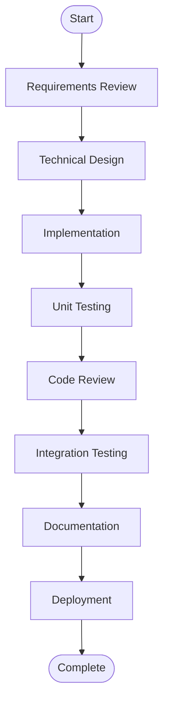
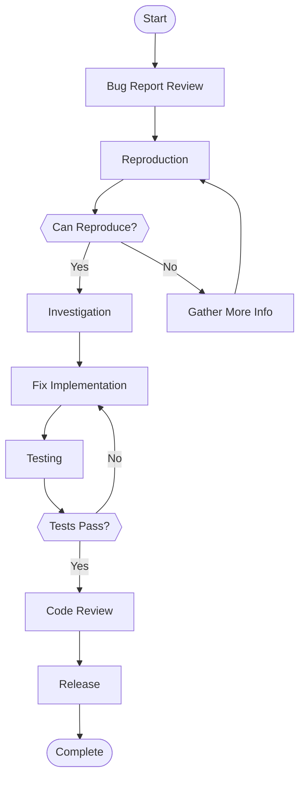
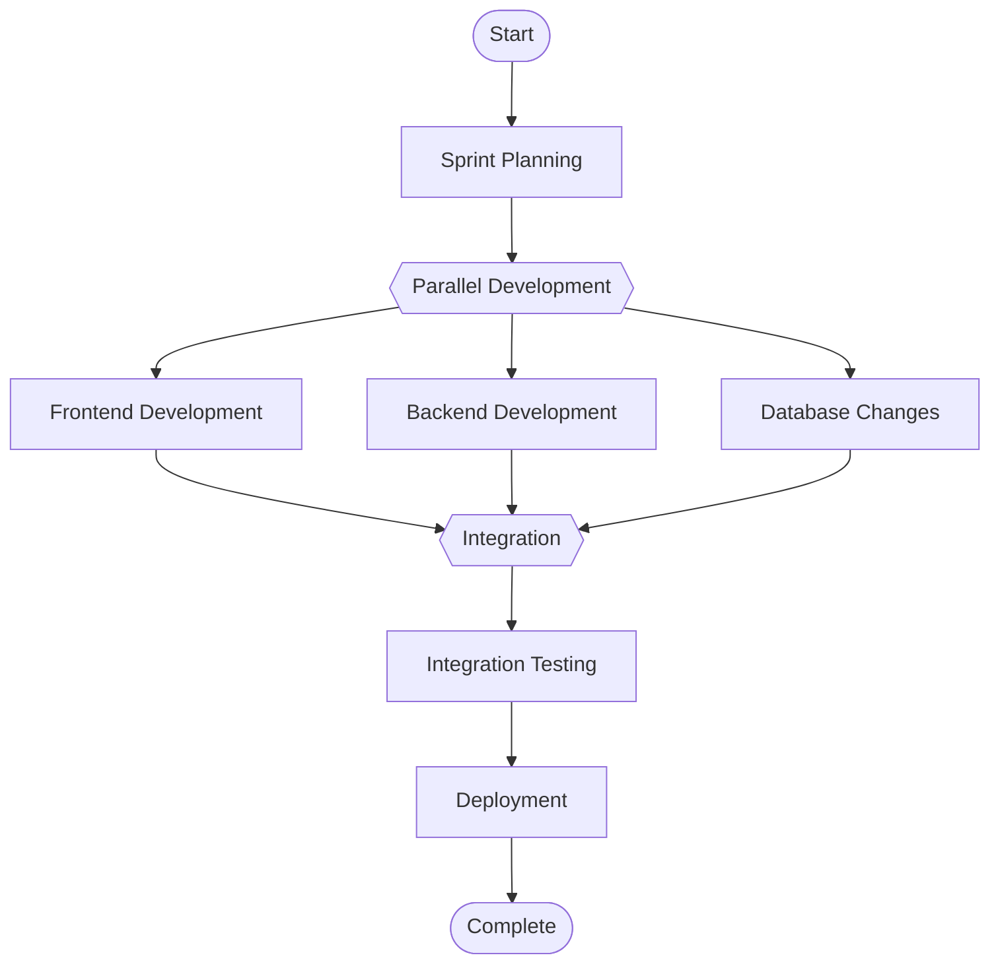
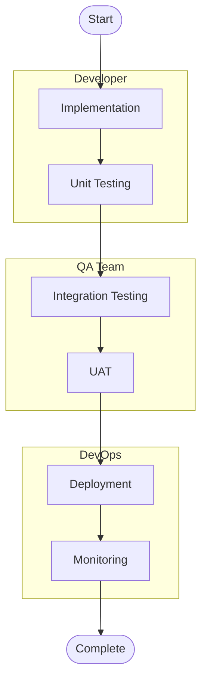
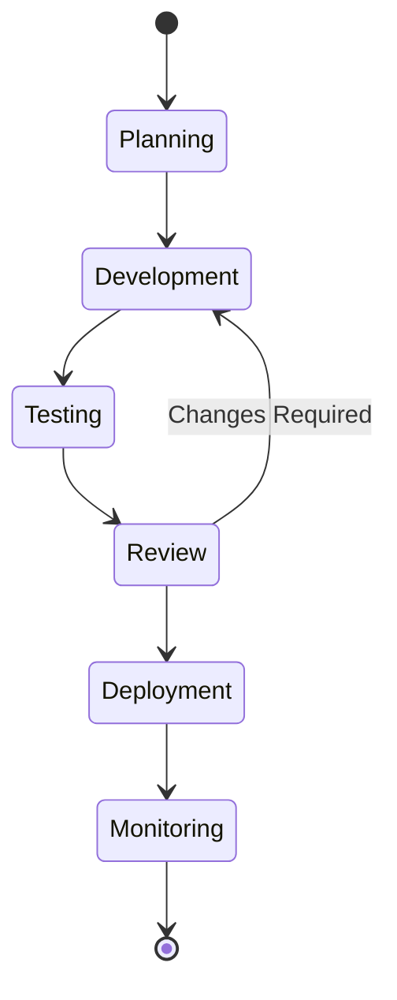
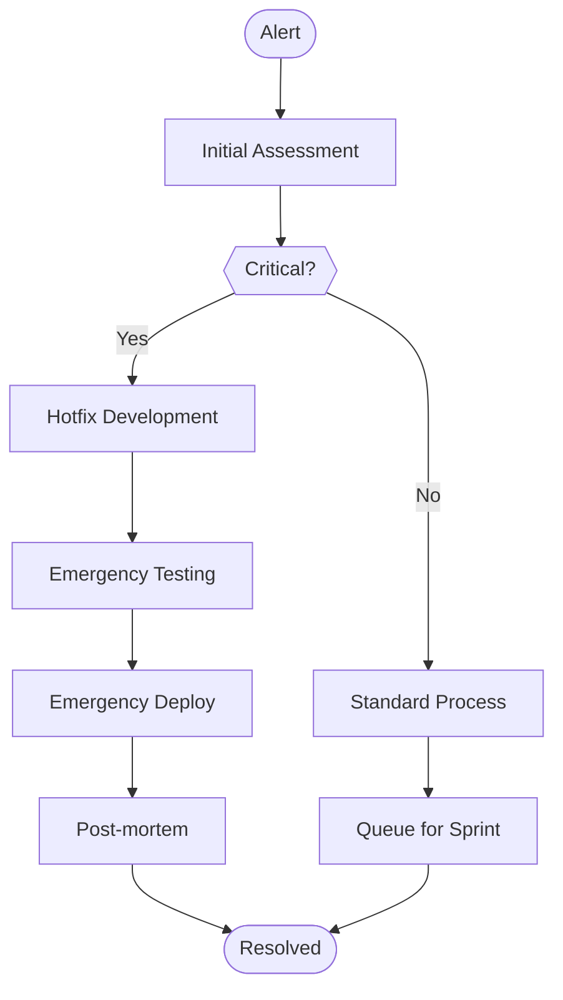
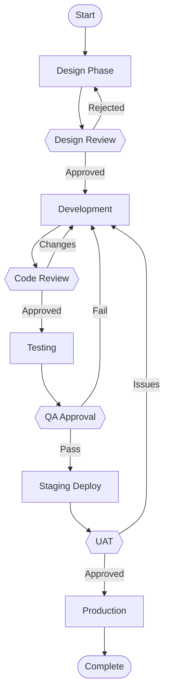
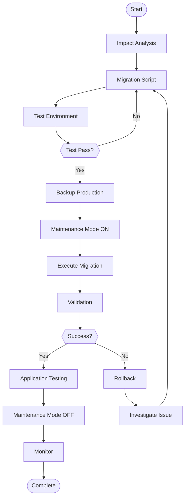
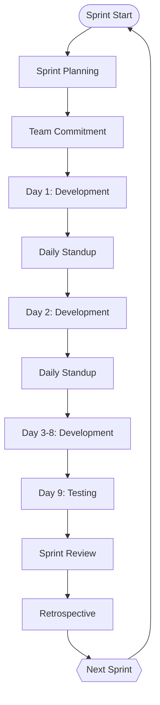

# Mermaid Workflow Examples

## Quick Reference for ClickUp Task Workflows

### 1. Basic Linear Flow


### 2. Flow with Decision Points


### 3. Parallel Processes


### 4. Swimlane Diagram


### 5. State Diagram


### 6. Critical Bug Workflow


### 7. Feature Development with Gates


### 8. Database Migration Flow


### 9. Sprint Cycle


### 10. CI/CD Pipeline

```mermaid
graph LR
    start([Code Push]) --> ci["CI Pipeline"]
    ci --> build["Build"]
    build --> unitTest["Unit Tests"]
    unitTest --> integration["Integration Tests"]
    integration --> security["Security Scan"]
    security --> quality["Code Quality"]
    quality --> artifact["Build Artifact"]
    artifact --> cd["CD Pipeline"]
    cd --> staging["Deploy Staging"]
    staging --> e2e["E2E Tests"]
    e2e --> approval{{"Approval"}}
    approval -->|Manual| production["Deploy Production"]
    approval -->|Auto| production
    production --> monitor["Monitoring"]
    monitor --> complete([Complete])
```


## Usage Examples

### JavaScript Implementation
```javascript
const generator = new MermaidWorkflowGenerator(workflowData);

// Generate basic flowchart
const diagram = generator.basicFlowchart(workflow);

// Generate with decision points
const decisionDiagram = generator.flowchartWithDecisions(workflow, [2, 4, 6]);

// Generate swimlane
const swimlane = generator.swimlaneDiagram(workflow, {
  0: 'Developer',
  1: 'Developer',
  2: 'QA',
  3: 'QA',
  4: 'DevOps'
});
```

### Python Implementation
```python
generator = MermaidWorkflowGenerator(workflow_data)

# Generate basic flowchart
diagram = generator.basic_flowchart(workflow)

# Generate with decision points
decision_diagram = generator.flowchart_with_decisions(workflow, [2, 4, 6])

# Generate swimlane
swimlane = generator.swimlane_diagram(workflow, {
  0: 'Developer',
  1: 'Developer', 
  2: 'QA',
  3: 'QA',
  4: 'DevOps'
})
```

## Customization Tips

### 1. Node Shapes
- `[Rectangle]` - Standard process
- `([Rounded])` - Start/End
- `{Diamond}` - Decision
- `{{Hexagon}}` - Preparation
- `[(Database)]` - Data store
- `[[Subroutine]]` - Predefined process

### 2. Arrow Styles
- `-->` - Standard flow
- `-.->` - Dotted line
- `==>` - Thick arrow
- `-->|Text|` - Labeled arrow

### 3. Colors & Styling
```mermaid
graph TD
    start([Start]):::startClass
    process[Process]:::processClass
    end([End]):::endClass
    
    start --> process --> end
    
    classDef startClass fill:#90EE90,stroke:#333,stroke-width:2px
    classDef processClass fill:#87CEEB,stroke:#333,stroke-width:2px
    classDef endClass fill:#FFB6C1,stroke:#333,stroke-width:2px
```

---

**Created By**: Craig (Lexicon)  
**Purpose**: Quick reference for Mermaid workflow diagrams  
**Usage**: Copy and customize these examples for your ClickUp workflows
