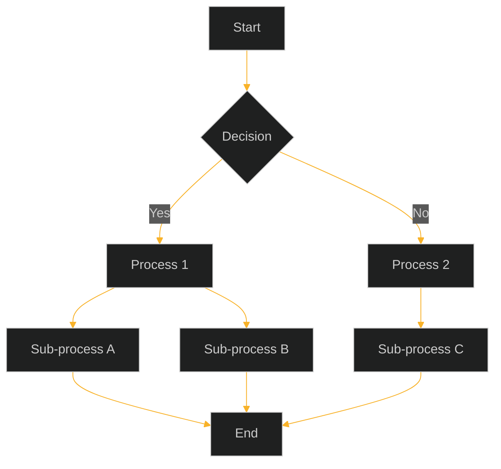
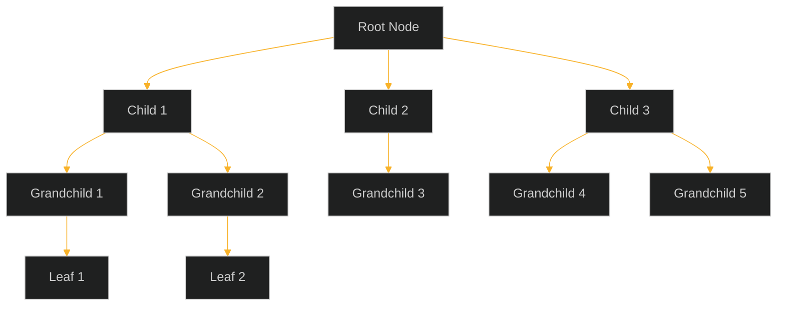
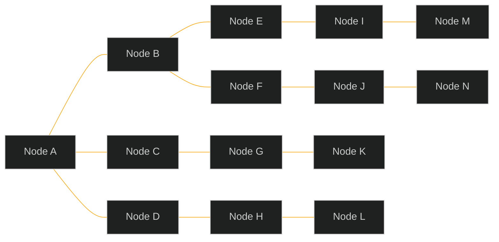
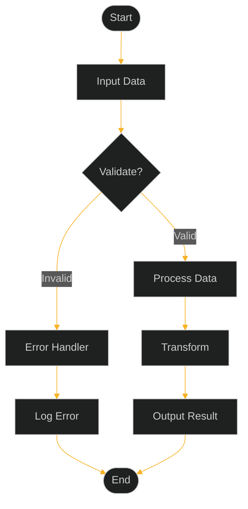

# Mermaid Layout Examples

This document demonstrates different graph layout types in Mermaid with black background.

## 1. ELK (Eclipse Layout Kernel)

ELK layout is good for hierarchical structures and complex graphs.

## 2. Tidy Tree Layout

Tidy tree is optimized for hierarchical tree structures.

## 3. Cose Bilkent Layout

Cose Bilkent is a force-directed layout good for network graphs.

## 4. Dagre Layout

Dagre creates layered/hierarchical layouts, good for flowcharts and DAGs.

## Layout Comparison

Each layout has different characteristics:
- **ELK**: Best for complex hierarchical structures
- **Tidy Tree**: Optimized for tree structures
- **Cose Bilkent**: Force-directed, good for networks
- **Dagre**: Layered layout, good for flowcharts

