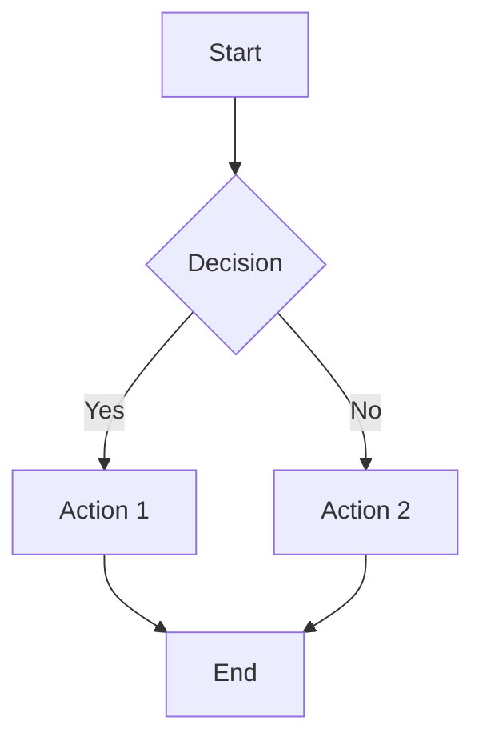
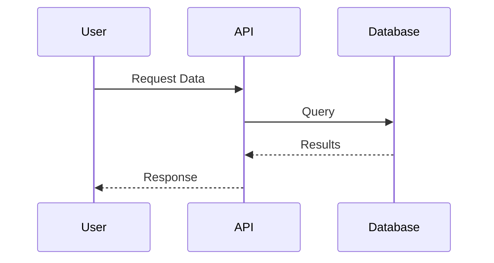
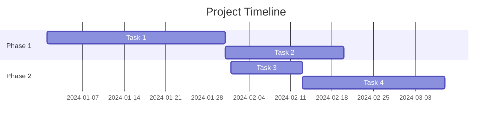
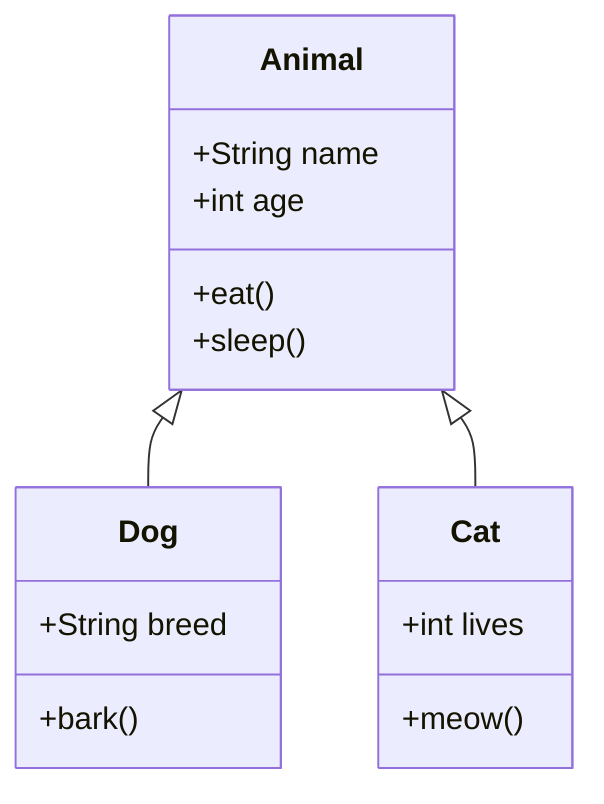
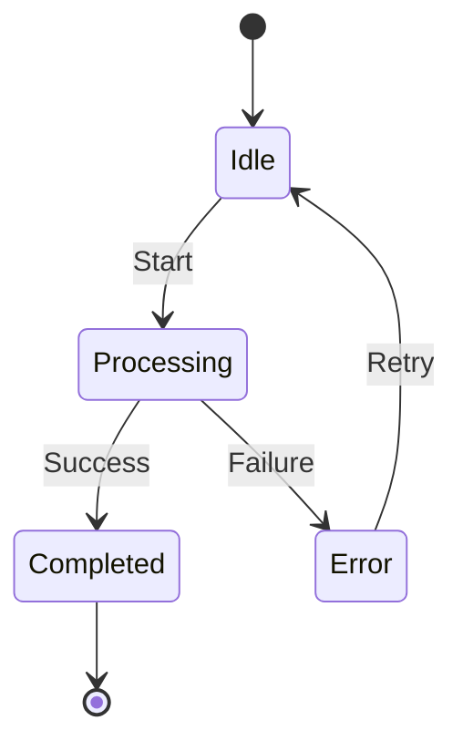
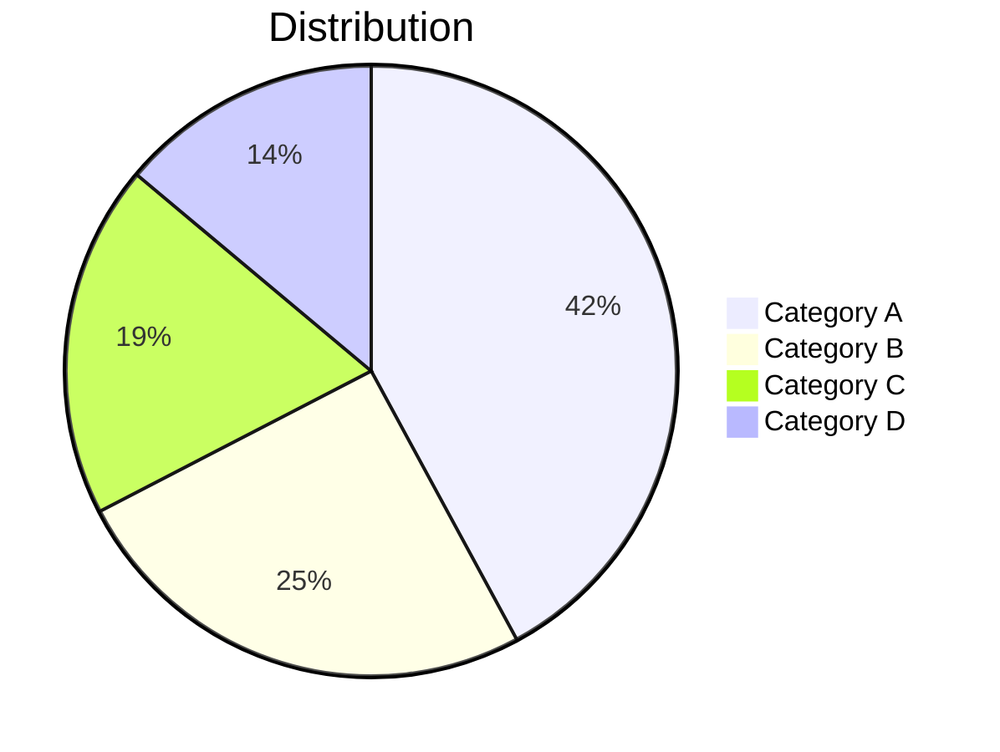

# Test Document with Mermaid Diagrams

This is a test document to verify mermaid diagram generation from markdown.

## Flowchart Example

Here's a simple flowchart:

## Sequence Diagram Example

Here's a sequence diagram:

## Gantt Chart Example

Here's a Gantt chart:

## Class Diagram Example

Here's a class diagram:

## State Diagram Example

Here's a state diagram:

## Pie Chart Example

Here's a pie chart:

## Conclusion

This document contains multiple mermaid diagram types for testing generation.

