# Mermaid Diagram Gallery

A visual reference of all major Mermaid diagram types with complex examples.

---

## 1. Flowchart - Application User Flow

Complex flowchart demonstrating decision trees, subgraphs, styling, and multiple node shapes.

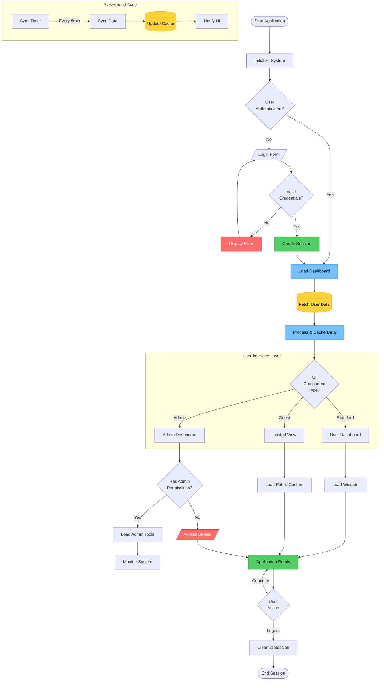

---

## 2. Sequence Diagram - Microservices Order Processing

Complex microservices interaction with loops, alternatives, and parallel execution.

```mermaid
sequenceDiagram
    autonumber
    actor User
    participant Web as Web Client
    participant API as API Gateway
    participant Auth as Auth Service
    participant Order as Order Service
    participant Inventory as Inventory Service
    participant Payment as Payment Service
    participant Queue as Message Queue
    participant Email as Email Service

    User->>+Web: Place Order
    Web->>+API: POST /api/orders

    API->>+Auth: Validate Token
    Auth-->>-API: Token Valid ✓

    rect rgb(200, 220, 250)
        note right of API: Order Processing Flow
        API->>+Order: Create Order
        Order->>Order: Generate Order ID

        par Parallel Validation
            Order->>+Inventory: Check Stock
            Inventory-->>-Order: Stock Available
        and
            Order->>+Payment: Validate Payment Method
            Payment-->>-Order: Payment Method Valid
        end

        alt Stock Available
            Order->>+Inventory: Reserve Items
            Inventory->>Inventory: Lock Inventory
            Inventory-->>-Order: Items Reserved

            Order->>+Payment: Process Payment
            Payment->>Payment: Charge Customer

            alt Payment Successful
                Payment-->>Order: Payment Confirmed
                Order->>Order: Update Order Status: CONFIRMED

                Order->>+Queue: Publish OrderConfirmed Event
                Queue-->>-Order: Event Published

                Order-->>-API: Order Created Successfully
                API-->>-Web: 201 Created {orderId}
                Web-->>-User: Order Confirmation

                Queue->>+Email: OrderConfirmed Event
                Email->>Email: Generate Confirmation Email
                Email->>User: Send Confirmation Email
                deactivate Email

            else Payment Failed
                Payment-->>Order: Payment Failed ✗
                Order->>+Inventory: Release Reserved Items
                Inventory-->>-Order: Items Released
                Order-->>-API: 402 Payment Required
                API-->>-Web: Payment Error
                Web-->>-User: Payment Failed Message
            end

        else Out of Stock
            Inventory-->>Order: Insufficient Stock
            Order-->>-API: 409 Conflict
            API-->>-Web: Out of Stock Error
            Web-->>-User: Product Unavailable
        end
    end

    loop Every 5 minutes
        Order->>Queue: Check Pending Orders
        Queue-->>Order: Pending Order List
        Order->>Order: Process Timeouts
    end

    note over User,Email: All services use distributed tracing<br/>for request monitoring
```

---

## 3. Class Diagram - E-Commerce Domain Model

Complex class hierarchy with multiple relationship types and annotations.

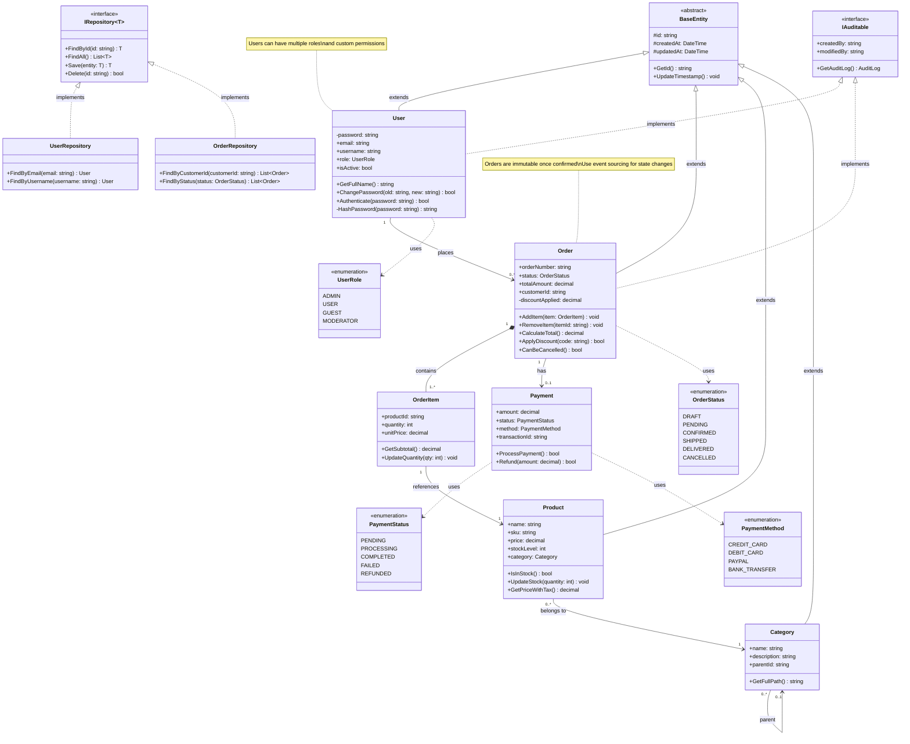

---

## 4. State Diagram - Application State Machine

Complex state machine with nested states, parallel states, and transitions.

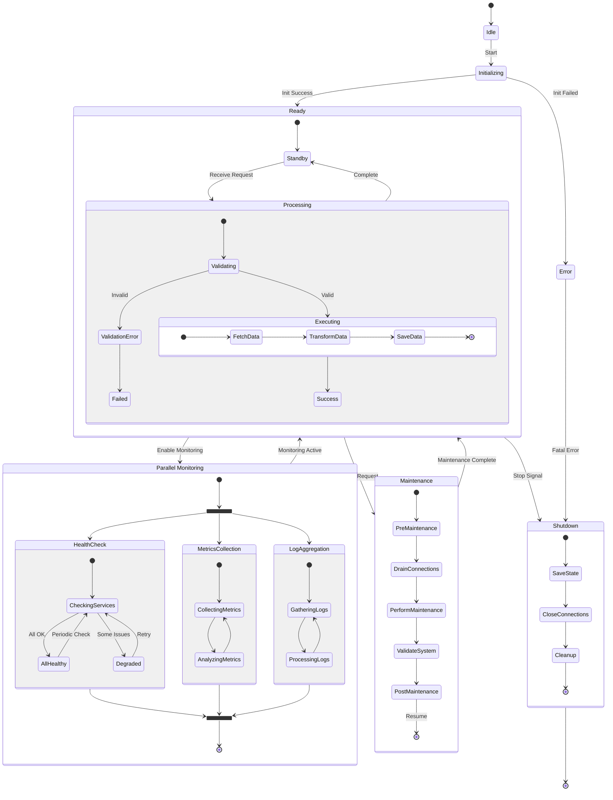

---

## 5. Entity Relationship Diagram - E-Commerce Database Schema

Comprehensive database schema with multiple relationship types and attributes.

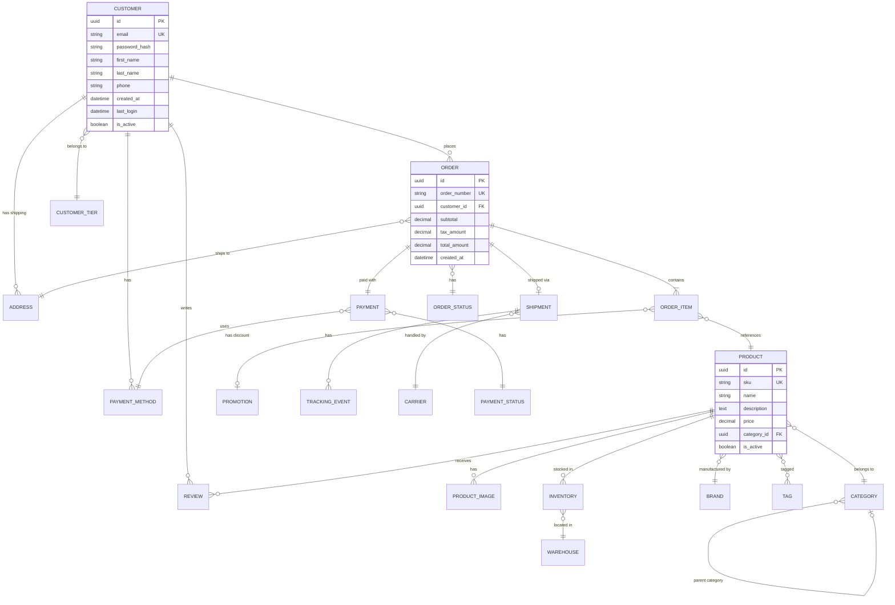

---

## 6. User Journey - Customer Purchase Experience

Complete customer journey mapping with emotional states and touchpoints.


---

## 7. Gantt Chart - Software Development Project

Complex project timeline with dependencies, milestones, and resource allocation.

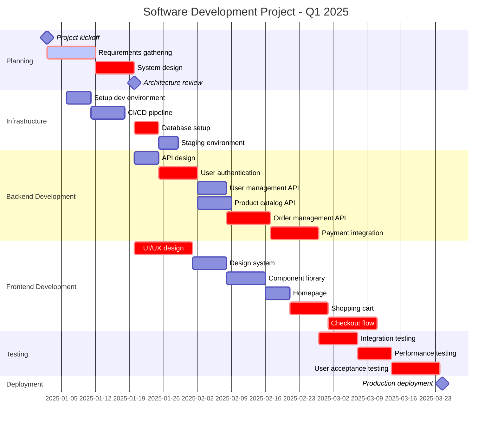

---

## 8. Pie Chart - Customer Acquisition Channels

Distribution visualization showing channel performance.

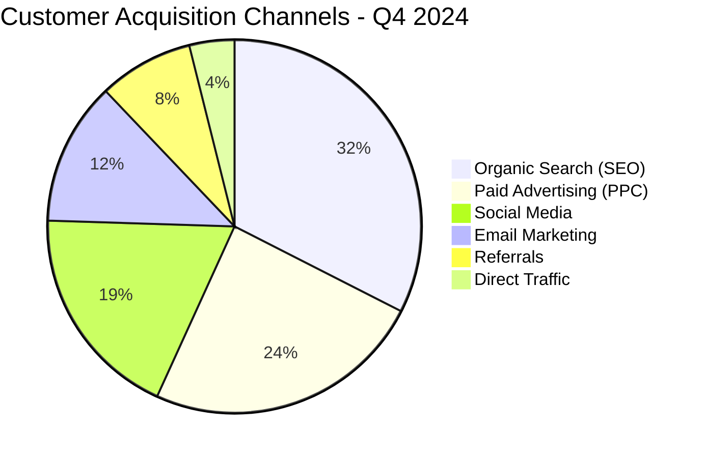

---

## 9. Quadrant Chart - Feature Prioritization

Prioritization matrix for feature development planning.

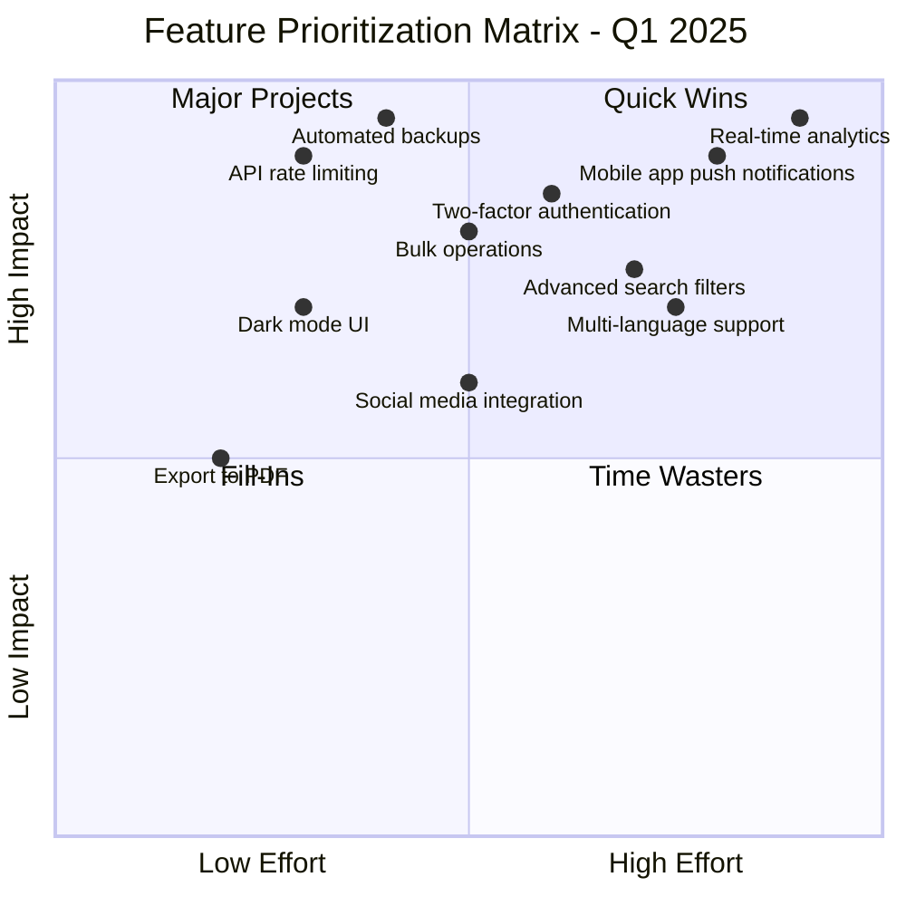

---

## 10. Requirement Diagram - System Requirements

Complex requirement relationships and traceability matrix.

```mermaid
requirementDiagram
    requirement user_auth {
        id: FR-001
        text: User Authentication System
        risk: high
        verifymethod: test
    }

    requirement two_factor {
        id: FR-002
        text: Two-Factor Authentication
        risk: medium
        verifymethod: test
    }

    requirement password_policy {
        id: FR-003
        text: Password Complexity Requirements
        risk: medium
        verifymethod: inspection
    }

    requirement data_encryption {
        id: NFR-001
        text: Data Encryption at Rest
        risk: high
        verifymethod: inspection
    }

    requirement performance {
        id: NFR-002
        text: Response Time < 200ms
        risk: medium
        verifymethod: test
    }

    requirement scalability {
        id: NFR-003
        text: Support 10,000 concurrent users
        risk: high
        verifymethod: test
    }

    element auth_service {
        type: service
        docref: docs/auth_service.md
    }

    element database {
        type: database
        docref: docs/database_schema.md
    }

    user_auth - contains -> two_factor
    user_auth - contains -> password_policy
    user_auth - satisfies -> data_encryption
    user_auth - satisfies -> performance

    auth_service - satisfies -> user_auth
    database - satisfies -> data_encryption
```

---

## 11. GitGraph - Git Branching Strategy

Complex Git workflow with releases and hotfixes.

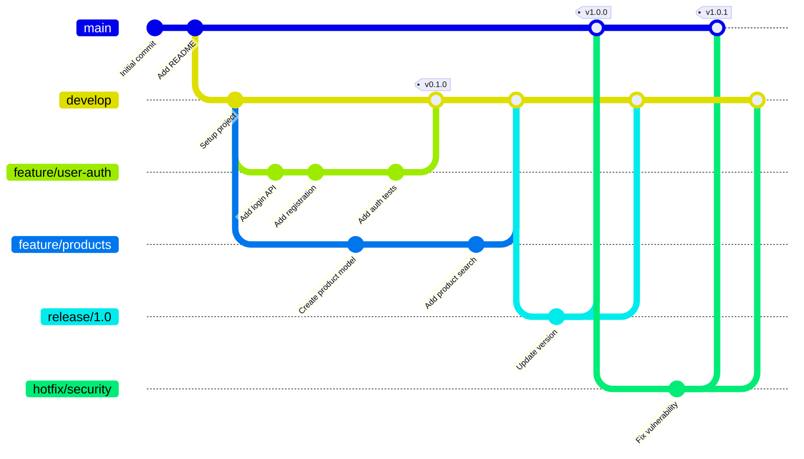

---

## 12. Mindmap - Software Architecture Overview

Hierarchical architecture knowledge mapping.

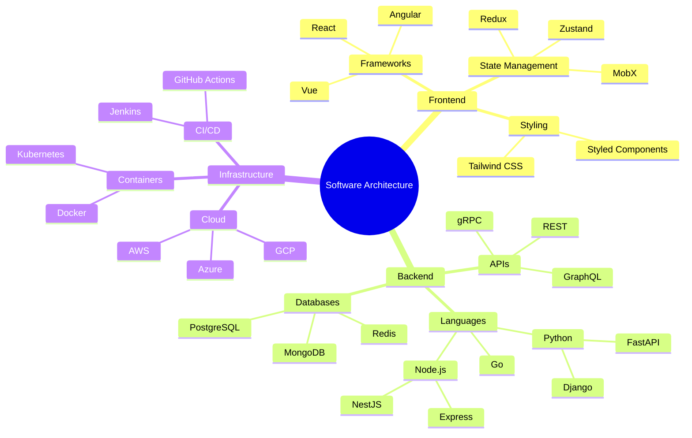

---

## 13. Timeline - Product Development History

Product development milestones and key events.

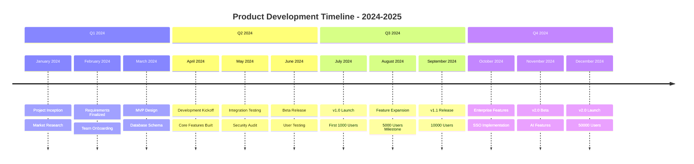

---

## 14. Sankey Diagram - Website Traffic Flow

Flow visualization showing traffic sources and conversion paths.

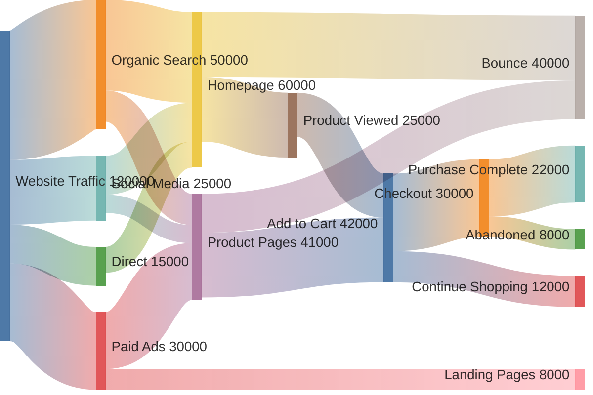

---

## 15. XY Chart - Revenue Metrics

Revenue and expense tracking over time.

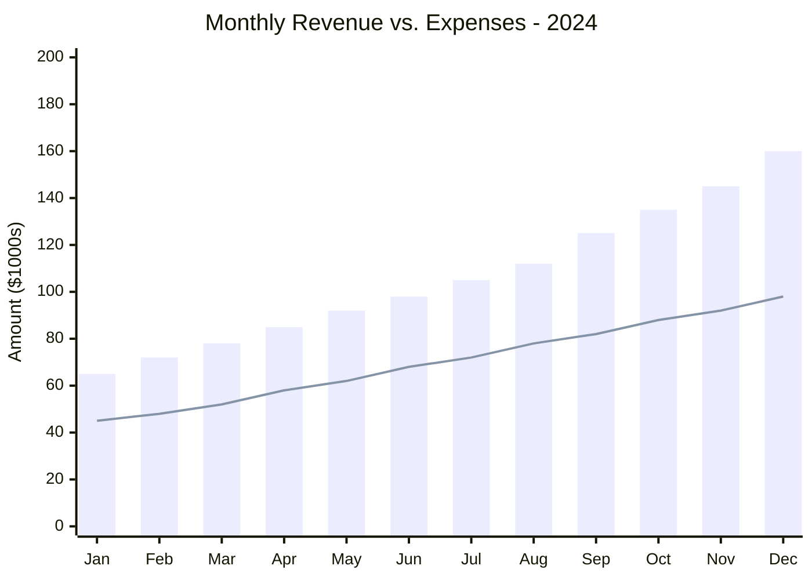

---

## 16. Block Diagram - System Architecture

Microservices architecture with component relationships.

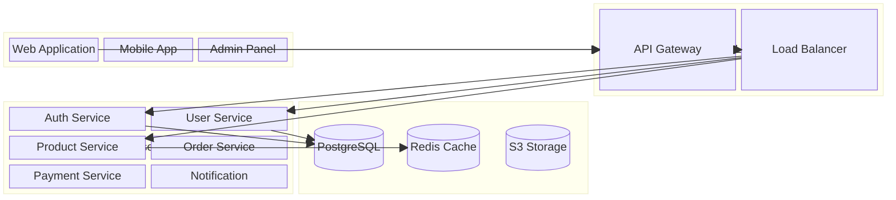

---

## Summary

This document showcases 16 different Mermaid diagram types, each demonstrating:
- Advanced syntax and features
- Real-world use cases
- Complex relationships and hierarchies
- Professional styling and layout

These diagrams were automatically converted to images and uploaded to ClickUp using the framework's built-in Mermaid processing capabilities.
