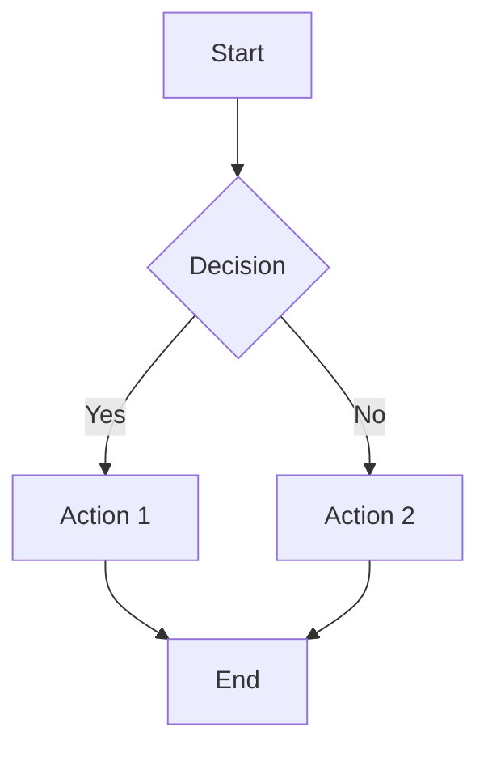
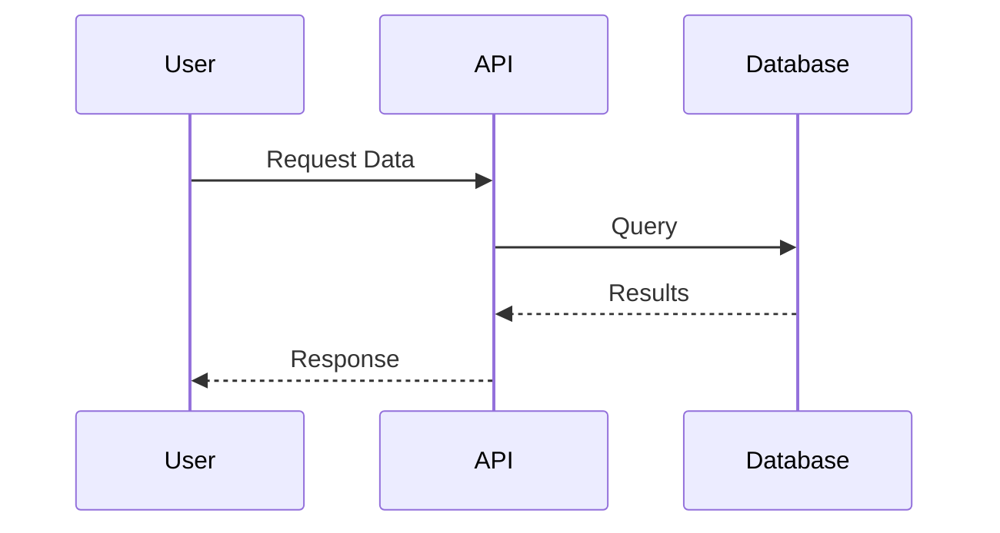
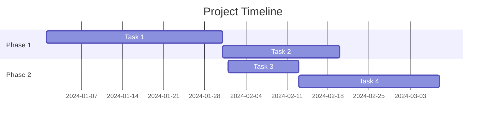
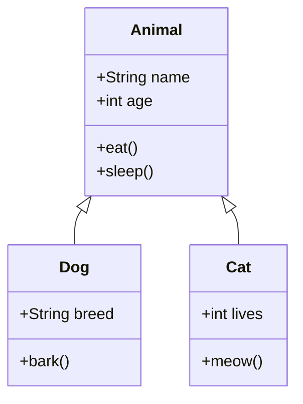
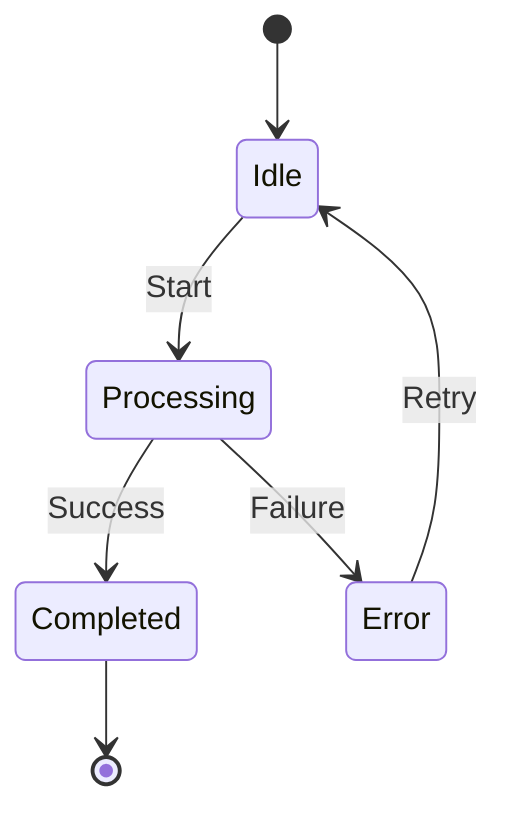
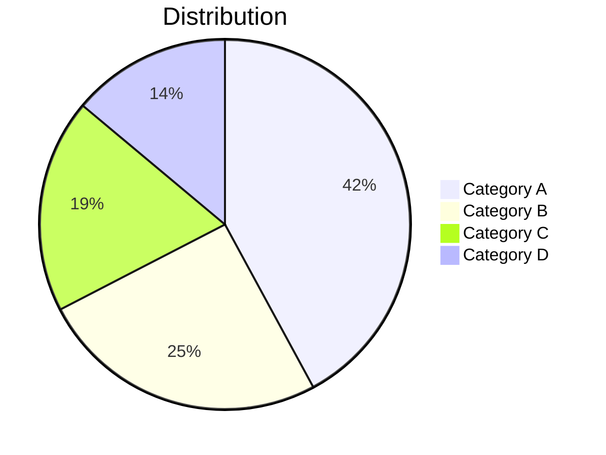

# Test Document with Mermaid Diagrams

This is a test document to verify mermaid diagram generation from markdown.

## Flowchart Example

Here's a simple flowchart:

{{image:bc85a4527f8be784a98e79fd34fc7f84388b82f95be84f9bc323e8751a23cffe}}

## Sequence Diagram Example

Here's a sequence diagram:

{{image:736c384bfc78440a3f981b50aee220d0a4d382b1ed8f8f9cbd3419564d20a374}}

## Gantt Chart Example

Here's a Gantt chart:

{{image:b2fedc13cc1a3dcc56b0e1cd8ffc98e807e609504467d6c1d0ef1557bf122e6e}}

## Class Diagram Example

Here's a class diagram:

{{image:ca3165113c3331e5252927798d7cb11fbdfc27873f767202d23a7d8266a3684b}}

## State Diagram Example

Here's a state diagram:

{{image:4e2d598e1980d49c59145e1b13b3855e805e59e2cad2a0b4544d7f4fc48f5cad}}

## Pie Chart Example

Here's a pie chart:

{{image:cdc9e64c560bc2ba9b36891043a796cc5679bccb22baaa9c55f39eb6e91c6d24}}

## Conclusion

This document contains multiple mermaid diagram types for testing generation.

