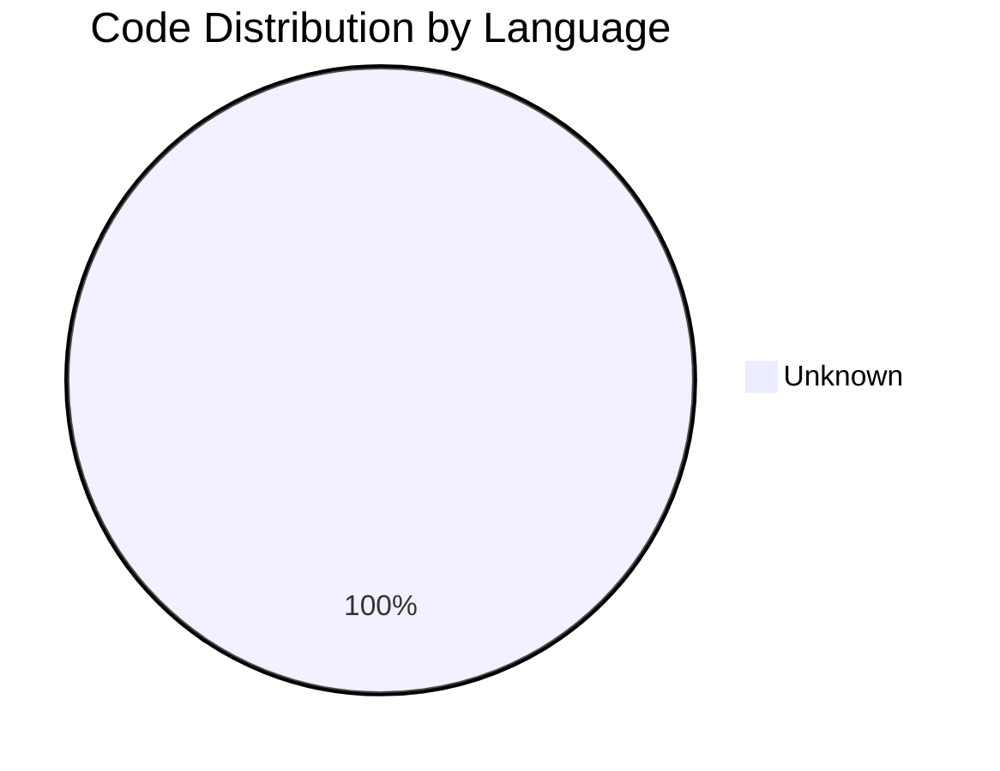

# Test-Pie

## Statistics

- **Total Symbols**: 184635
- **Files Analyzed**: 521
- **Languages**: 1

### By Language

- **Unknown**: 184635 symbols
  - array: 2277
  - boolean: 1911
  - chapter: 170
  - class: 383
  - def: 18
  - function: 708
  - hashtag: 9
  - heading1: 54
  - heading2: 66
  - heading3: 62
  - heredoc: 19
  - id: 938
  - l4subsection: 8
  - label: 3
  - member: 1887
  - namespace: 2
  - nsprefix: 138
  - null: 879
  - number: 34717
  - object: 6755
  - play: 2
  - section: 1209
  - string: 129441
  - subsection: 1929
  - subsubsection: 550
  - unknown: 6
  - variable: 494