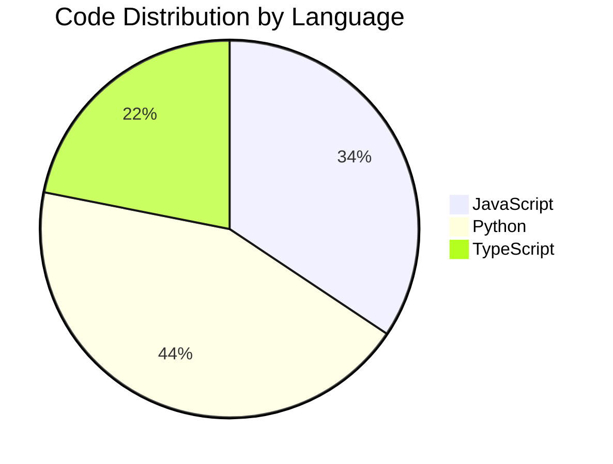

# Test Pie Generator

## Statistics

- **Total Symbols**: 150
- **Files Analyzed**: 10
- **Languages**: 3

### By Language

- **JavaScript**: 55 symbols
  - class: 15
  - function: 40
- **Python**: 70 symbols
  - class: 20
  - function: 50
- **TypeScript**: 35 symbols
  - class: 10
  - function: 25